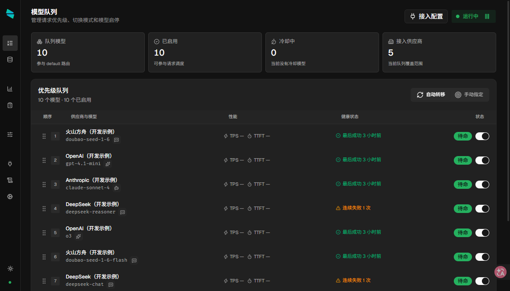
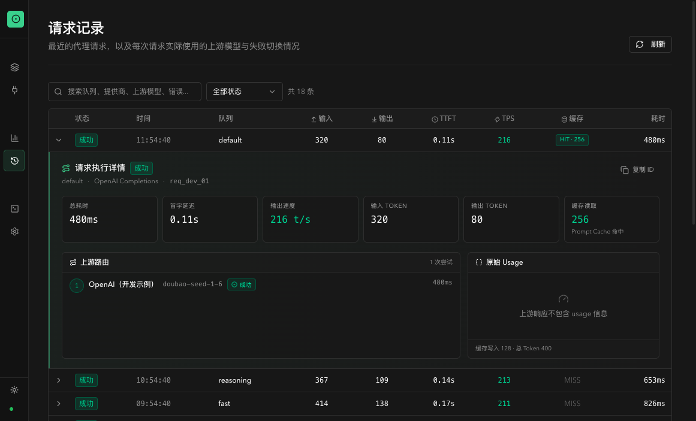
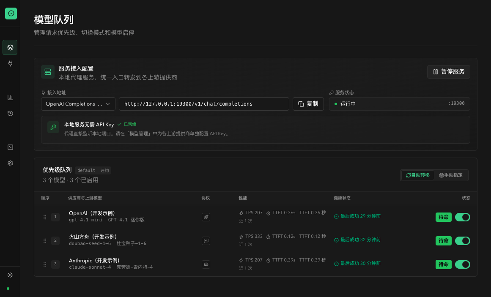

# One Switch

本地 AI API 网关，在多个模型供应商或上游模型之间自动故障转移。

只需把 AI 客户端连接到一个本地地址，One Switch 就会按队列优先级选择上游。当当前渠道遇到网络故障、超时、限流、鉴权异常或服务端错误时，请求会自动尝试下一个可用渠道。所有配置、密钥和请求记录均保留在本机。

## 为什么使用 One Switch

- **一个入口连接多个上游**：客户端只需配置一次本地 API 地址，不必反复修改不同供应商的 Base URL。
- **自动故障转移**：网络错误、超时、`401`、`403`、`408`、`429` 和 `5xx` 响应会触发队列中的下一次尝试。
- **协议感知路由**：同一个上游模型可以配置多个协议端点，请求只会进入与其协议匹配的端点。
- **统一模型名称**：客户端请求中的 `model` 会被替换为当前队列项配置的真实上游模型 ID。
- **手动切换与拖拽排序**：可以随时指定首选模型或调整优先级，不会中断已经开始的请求。
- **流式响应透传**：支持 SSE 流式输出；只要上游持续返回数据，长时间生成不会被总时长限制。
- **健康检查与冷却**：连续失败的供应商会暂时进入冷却期，恢复后重新参与路由。
- **请求修改规则**：在不写代码的前提下，按匹配条件对请求/响应 Header 与 JSON Body 做增删改写，弥补不同供应商之间的轻量兼容差异。
- **本地可观测性**：提供请求尝试记录、成功率、延迟、TTFT、Token 用量、缓存命中和失败原因统计，以及实时运行日志视图。
- **渠道诊断**：不转发请求即可直接测试队列中每个模型各协议端点是否能正常连接。
- **本地优先**：API Key 使用 Electron `safeStorage` 加密保存，配置导出默认不包含密钥。

## 界面预览

截图素材统一存放在 [`snapshot/`](./snapshot/) 目录中。







## 支持的协议

| 协议 | 本地路径 | 常见上游 |
| --- | --- | --- |
| OpenAI Chat Completions | `/v1/chat/completions` | OpenAI、DeepSeek、OpenRouter、Ollama 及其他 OpenAI 兼容服务 |
| OpenAI Responses | `/v1/responses` | OpenAI Responses API 兼容服务 |
| Anthropic Messages | `/v1/messages` | Anthropic Claude 及兼容服务 |

上述路径也兼容省略 `/v1` 的形式。`GET /v1/models` 由 One Switch 本地提供，返回统一的 `default` 模型。

> One Switch 默认优先使用与客户端协议一致的端点；对明确开启端点级协议转换的绑定，也支持部分 OpenAI 与 Anthropic 协议之间的请求、响应和流式 SSE 转换。转换属于尽力而为的兼容层，部分参数可能丢失。一次故障转移只会尝试原生匹配或已明确开启转换的队列项。Gemini 和自定义协议目前尚未在当前版本中开放。

## 工作方式

```text
AI 客户端
    │
    │  http://127.0.0.1:9300/v1/...
    ▼
One Switch
    │
    ├─ 1. 识别请求协议
    ├─ 2. 筛选支持该协议且处于健康状态的模型
    ├─ 3. 按队列顺序改写真实模型 ID 并发起请求
    └─ 4. 失败时尝试下一个候选
            ├─ Provider A / Model A
            ├─ Provider B / Model B
            └─ Provider C / Model C
```

对于流式请求，One Switch 只会在响应尚未发送给客户端时切换上游。一旦响应头或内容已经开始透传，中途断开会被记录为失败，但不会拼接另一个模型的输出，以免产生混杂响应。

## 安装

前往 [GitHub Releases](https://github.com/yinxulai/one-switch/releases) 下载适合当前平台的安装包：

- macOS：`.dmg`，支持 Apple Silicon 和 Intel
- Windows：`.exe`，支持 x64 和 ARM64
- Linux：`.AppImage`

macOS 构建目前采用 ad-hoc 签名且未公证。由于尚未使用正式的 Developer ID 签名，当前自动更新会关闭 macOS 发行者代码签名校验，下载完整性依赖更新元数据中的 SHA-512；正式签名后将恢复签名校验。若系统阻止首次打开，请在“系统设置 → 隐私与安全性”中确认打开，或在 Finder 中右键应用并选择“打开”。

## 快速开始

### 1. 添加供应商

打开 **模型管理**，新增一个供应商并填写：

- 供应商名称
- API Key
- 请求超时时间
- 该供应商支持的协议默认地址

API Key 只保存在本机加密存储中，不会出现在导出的配置文件里。

### 2. 添加上游模型

在供应商下添加真实模型 ID，例如 `gpt-4.1`、`deepseek-chat` 或 `claude-sonnet-4-20250514`，然后为它启用一个或多个协议端点。

端点可以使用供应商的默认地址，也可以为单个模型填写完整接口地址。一个模型即使支持多个协议，在故障转移队列中也只占一行。

### 3. 设置故障转移顺序

进入 **模型队列**：

1. 拖拽模型调整优先级。
2. 启用或停用不希望参与路由的模型。
3. 需要临时指定上游时，手动切换当前首选模型。
4. 使用队列测试确认各协议端点可以正常连接。

手动切换只影响后续请求，正在进行的普通或流式请求不会被中断。首选模型失败后，自动故障转移仍然生效。

### 4. 连接 AI 客户端

代理默认监听：

```text
http://127.0.0.1:9300
```

在客户端中根据其协议填写 Base URL：

| 客户端使用的协议 | Base URL 或接口地址 |
| --- | --- |
| OpenAI 兼容 | `http://127.0.0.1:9300/v1` |
| OpenAI Responses | `http://127.0.0.1:9300/v1` |
| Anthropic Messages | `http://127.0.0.1:9300` |

客户端要求填写 API Key 时，可以填写任意非空占位值；真实上游密钥由 One Switch 按供应商注入。模型名可填写 `default`，代理会自动替换为最终选中队列项的真实模型 ID。

也可以直接验证本地模型列表：

```bash
curl http://127.0.0.1:9300/v1/models
```

监听地址和端口可在 **设置** 中修改。修改后需要重启本地代理服务才能让监听配置生效。

控制台的 **接入配置** 页面会实时显示当前监听地址与各协议对应的 Base URL，并支持一键复制，方便接入客户端。

### 5. 添加请求修改规则（可选）

部分供应商或模型存在轻量的兼容差异（如需要补充 `User-Agent`、增删 Header 或改写 JSON 中的私有字段）。在 **修改规则** 页面可以创建一个或多个**可配置、可排序、可复用**的规则：

- 按**客户端协议、上游协议、路径、逻辑模型**等条件匹配；
- 在 **请求** / **响应** 阶段对 **Header**（设置、追加、移除）与 **JSON Body**（按 `$.path` 设值、删除、字符串替换，支持正则）执行修改；
- 每个模型可绑定多条规则并调整执行顺序；
- 每条规则可在编辑器中**针对测试用例**实时验证，无需真实请求。

规则默认关闭，改动不会以脚本方式执行，仅做结构化的增删改写；流式响应阶段不做 Body 重写。

## 故障转移策略

| 情况 | 行为 |
| --- | --- |
| 网络错误、连接超时、流式空闲超时 | 尝试下一个候选 |
| `401`、`403` | 尝试下一个候选，并累计供应商失败状态 |
| `408`、`429` | 尝试下一个候选 |
| `5xx` | 尝试下一个候选 |
| 其他 `4xx` | 直接返回客户端，不切换 |
| 已开始向客户端发送响应后断开 | 终止当前请求，不拼接其他上游输出 |

连续失败阈值、初始冷却时间、最大冷却时间和流式空闲超时均可在 **设置 → 故障转移** 中调整。

## 本地可观测性

- **概览/统计分析**：总请求数、成功率、平均延迟、Token 用量，以及按天请求趋势、供应商使用分布、模型使用排行、延迟分布和失败原因分类。
- **请求记录**：每个请求展示了实际命中的供应商与上游模型、协议、状态、耗时和 Token；自动切换的历史会以多次尝试（attempt）的形式呈现。
- **运行日志**：实时查看后台运行日志，支持暂停、搜索、复制、导出和清空。
- **渠道诊断**：在队列中点击测试，会对每个启用模型的各协议端点发起真实连接测试，不占用正式请求流。

## 运行方式

- 安装后默认在系统托盘常驻，可通过托盘菜单启停本地代理、查看队列状态、打开控制台或退出。
- 支持随系统开机自动启动（可在 **设置 → 常规** 中开关）。
- 控制台支持浅色 / 深色 / 跟随系统三种主题，可随时切换（快捷键或用侧栏切换按钮）。
- 配置可在 **设置 → 数据管理** 中导入、导出；导出文件不包含 API Key。

## 数据与隐私

- 代理默认监听 `127.0.0.1`，不会主动暴露到局域网。
- API Key 使用 Electron `safeStorage` 加密后保存在本地。
- 配置、运行日志和请求元数据均存储在本机应用数据目录。
- 请求记录用于展示路由结果和性能指标。正文捕获默认开启，本机会保存完整请求、响应和流式内容，包括协议转换前后的内容；可在 **设置 → 日志** 中关闭。敏感 Header 会脱敏，但正文不应视为已脱敏；关闭捕获不会自动删除已有内容，请通过日志清理功能移除历史正文。
- 为完整支持超长上下文和大体积请求，代理与正文记录不限制单次正文大小，并会在内存中完整读取请求体。极大正文可能显著增加内存和本地数据库占用，这是当前版本的明确设计取舍。
- 导出的配置不包含 API Key；重新导入后需要补充密钥。
- One Switch 不提供云同步、账号体系或远程中转服务，请求只会发往你配置的上游地址。

默认应用数据目录：

| 平台 | 路径 |
| --- | --- |
| macOS | `~/Library/Application Support/One Switch/` |
| Windows | `%APPDATA%\One Switch\` |
| Linux | `~/.config/One Switch/` |

## 本地开发

需要 Node.js 22 或更高版本，以及 pnpm 9.6：

```bash
pnpm install
pnpm run dev
```

常用命令：

```bash
pnpm run typecheck     # TypeScript 类型检查
pnpm run lint          # ESLint
pnpm run test:server   # 服务端测试
pnpm run build         # 构建当前平台安装包
pnpm run release:mac   # 构建 macOS arm64 与 x64 安装包
pnpm run release:win   # 构建 Windows arm64 与 x64 安装包
pnpm run release:linux # 构建 Linux arm64 与 x64 安装包
```

技术栈包括 Electron、React、TypeScript、Vite、Drizzle ORM 和 SQLite。更详细的设计与行为约定见 [规格文档](./product/README.md)。

## 当前边界

- 当前代理入口使用一个逻辑模型队列；客户端模型名最终映射到该队列中的上游模型。
- 协议转换默认关闭；对明确开启端点级转换的绑定，支持部分 OpenAI 与 Anthropic 协议之间的报文转换，转换可能丢弃或降级部分参数。
- 请求修改规则在**转发前**与**写回客户端前**的结构化阶段执行：不修改路由关键字段与候选队列，不执行脚本或自定义代码，流式响应阶段不做 Body 重写；仅执行配置化的 Header 与 JSON Body 操作。
- 不接管系统全局代理，需要在每个 AI 工具中单独设置 Base URL。
- 不提供团队协作、云同步、远程访问或多用户权限管理。
- Gemini、自定义协议和更多智能路由策略仍在后续规划中。

## 参与开发

欢迎通过 [Issues](https://github.com/yinxulai/one-switch/issues) 报告问题或提出建议。提交问题时，建议附上 One Switch 版本、操作系统、请求协议以及脱敏后的运行日志；请勿粘贴 API Key、完整提示词或其他敏感信息。
