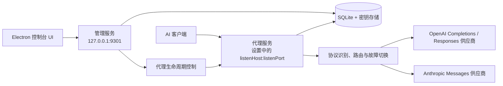

# 系统架构与核心概念

## 整体架构

管理服务与代理服务是两个独立的 HTTP 监听器。两者共享应用级配置和密钥存储，但代理可以单独启动、停止或重启，管理服务在此过程中持续可用。

## 核心概念

### Provider
一个模型服务渠道，负责稳定身份、生命周期和 Provider 级设置。

- `provider_endpoints`：Provider 的原生协议端点和默认 URL；
- `provider_settings`：Provider 级密钥引用、超时等设置；
- `provider_health`：Provider 聚合运行时健康状态。

ProviderModel 通过 `provider_model_endpoints` 绑定 ProviderEndpoint，并可为绑定配置模型专属 `url`。

### Protocol
代理自动识别的 API 协议类型，根据请求 path 匹配判定，无需客户端区分 Base URL。

| 协议 | 特征路径 |
|------|----------|
| OpenAI | `/v1/chat/completions`、`/v1/completions`、`/v1/embeddings` |
| Anthropic | `/v1/messages` |
| Custom | 当前未实现；协议枚举以 `source/common/schemas.ts` 为准 |

> `/v1/models` 不作为上游透传路径，而是代理自身提供的本地服务接口。

协议仅用于路由过滤，代理不解析任何协议的报文结构。

### Logical Model
代理内部用于选择 ProviderModel 候选池的路由模型。v0.3 只有 `default`：当客户端请求中的非空 `model` 没有匹配到其他逻辑模型时，统一由 `default` 处理；客户端无需将 `model` 显式设置为 `default`。

### ProviderModel
Provider 上的一个实际模型，是路由的最小单元。ProviderModel 不直接拥有端点数组，而是通过 `provider_model_endpoints` 绑定一个或多个 ProviderEndpoint。

ProviderModel 包含：
- 所属 Provider；
- Provider API 模型名 `modelName`；
- 一个或多个端点绑定及可选模型专属 `url`；
- 逻辑模型与 ProviderModel 绑定中的候选队列优先级；
- 启用状态。

v0.3 MVP 只有一个兜底逻辑模型 `default`，因此所有携带非空模型名的代理请求都会进入它的候选池。ProviderModel 是可复用的供应商模型实体，是否参与某个逻辑模型的调度以及具体顺序由 `scheduling_policies` 绑定行决定。每个逻辑模型都可以绑定相同的 ProviderModel，但配置不同的优先级、权重和启用状态；多逻辑模型和独立绑定池属于后续版本。

### Route
一次请求的路由决策结果，包含协议、候选 Provider 模型列表、尝试顺序、失败原因。

### Attempt
一次上游调用尝试，包含 Provider 模型、耗时、HTTP 状态、错误类型、是否流式。

### Health State
Provider 级别的健康状态，包含连续失败次数、冷却截止时间、最近成功时间。

## 协议路由与转换原则

1. 当前支持的客户端/上游协议只有 `openai-completions`、`openai-responses`、`anthropic-messages`；Gemini 尚未实现，不应写入当前能力矩阵。
2. 同协议请求只做最小请求处理：根据 path 识别协议、将请求体中的 `model` 替换为 ProviderModel 的 `modelName`、注入认证头并安全透传端到端 header。
3. 协议转换不是全协议自动互转，而是由 ProviderModel endpoint 上显式启用的 ProtocolConverter/转换绑定控制。当前注册的方向以 `source/server/proxy/protocols/registry.ts` 为准，包括 OpenAI Completions ↔ Anthropic Messages、OpenAI Responses → OpenAI Completions，以及各协议直连；未注册方向必须拒绝。
4. 已启用转换时，请求由 `conversion.ts` 改写，响应及 SSE 由 `conversion-response.ts` 处理；转换可能改变响应格式，不能概括为“始终逐块透传”。
5. 每个 `provider_endpoints` 配置 Provider 的原生协议 URL；`provider_model_endpoints.url` 非空时覆盖默认 URL。路由只考虑当前 LogicalModel 的 `scheduling_policies` 绑定、健康状态和协议原生匹配/显式转换匹配的候选。
