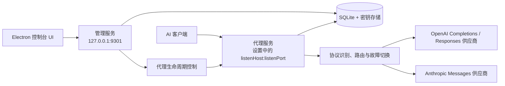

# 系统架构与核心概念

## 整体架构

管理服务与代理服务是两个独立的 HTTP 监听器。两者共享应用级配置和密钥存储，但代理可以单独启动、停止或重启，管理服务在此过程中持续可用。

两个监听器的内部模块划分与依赖方向见 [server-architecture.md](./server-architecture.md)；代理侧的分层职责见 [proxy-engine.md](./proxy-engine.md)；代理对外可见的行为契约见 [proxy.md](./proxy.md)。

## 核心概念

概念只在这里做一句话定位；定义、字段与取值范围一律以右列权威文档为准，本文不再复述。

| 概念 | 一句话定位 | 权威文档 |
|------|-----------|---------|
| Provider | 一个模型服务渠道，负责稳定身份、生命周期和 Provider 级设置 | [provider-model.md](./provider-model.md) |
| ProviderEndpoint | Provider 在某协议下的默认端点 URL（`provider_endpoints`） | [provider-model.md](./provider-model.md) |
| ProviderModel | Provider 上一个真实模型，是路由的最小单元 | [provider-model.md](./provider-model.md) |
| 端点绑定 | ProviderModel → ProviderEndpoint 的绑定，可覆盖 URL、可启用协议转换器（`provider_model_endpoints`） | [provider-model.md](./provider-model.md)、[protocol-conversion.md](./protocol-conversion.md) |
| Protocol | 由请求 path 识别的 API 协议，当前只有 `openai-completions`、`openai-responses`、`anthropic-messages` | [proxy.md](./proxy.md) |
| Logical Model | 对外暴露的路由模型；v0.3 只有兜底用的 `default` | [data-model.md](./data-model.md) |
| 调度绑定 | LogicalModel × ProviderModel 的候选池绑定，含优先级、权重、启用状态（`scheduling_policies`） | [data-model.md](./data-model.md) |
| Route | 一次请求的路由决策结果与决策依据，由工作流图算出后写进 `route` 命名空间 | [route-design.md](./route-design.md) |
| Attempt | 一次上游调用尝试：ProviderModel、耗时、HTTP 状态、错误分类、是否流式 | [data-model.md](./data-model.md)、[observability.md](./observability.md) |
| Health | Provider 与 ProviderModel 两级的运行时健康状态与冷却 | [observability.md](./observability.md)、[data-model.md](./data-model.md) |

概念之间的字段级关系见 [data-model.md](./data-model.md) 的关系概览；健康状态与冷却判定见 [observability.md](./observability.md)。

协议仅用于路由过滤，代理默认不解析任何协议的报文结构（见下方原则 2）。

## 协议路由与转换原则

1. 当前支持的客户端/上游协议只有 `openai-completions`、`openai-responses`、`anthropic-messages`，各协议的识别路径见 [proxy.md](./proxy.md) 的协议识别表；Gemini 等其它协议尚未实现，不属于当前能力。
2. 同协议请求只做最小请求处理：根据 path 识别协议、将请求体中的 `model` 替换为 ProviderModel 的 `modelName`、注入认证头并安全透传端到端 header。
3. 协议转换不是全协议自动互转，而是由 ProviderModel 端点绑定上显式启用的转换器控制。当前注册的方向以 `packages/core/source/proxy/protocols/shared/conversion-registry.ts` 与各协议的 `conversion-adapters.ts` 为准，包括 OpenAI Completions ↔ Anthropic Messages、OpenAI Responses → OpenAI Completions，以及各协议直连；未注册方向必须拒绝。转换开关、矩阵与候选过滤见 [protocol-conversion.md](./protocol-conversion.md)。
4. 已启用转换时，请求由 `packages/core/source/proxy/protocols/shared/request-conversion*.ts` 改写，响应及 SSE 由 `packages/core/source/proxy/protocols/shared/response-conversion*.ts` 处理；转换可能改变响应格式，不能概括为“始终逐块透传”。
5. 每个 `provider_endpoints` 配置 Provider 的原生协议 URL；`provider_model_endpoints.url` 非空时覆盖默认 URL。路由只考虑当前 LogicalModel 的 `scheduling_policies` 绑定、健康状态和协议原生匹配/显式转换匹配的候选。
