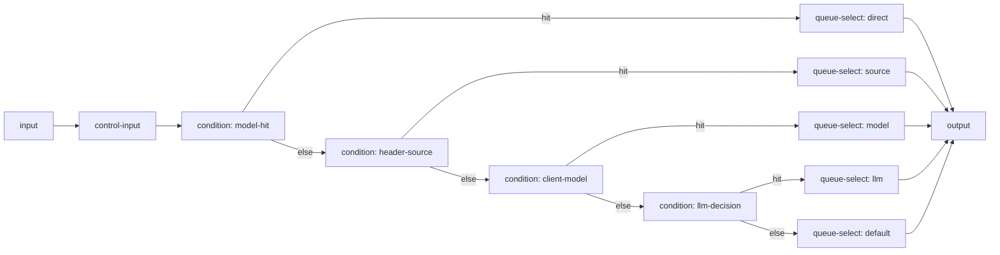

# 桌面端产品形态

## 技术栈

Electron + Node + TypeScript + React/Vite

## 主要入口

### 菜单栏 / 托盘

- **macOS**：菜单栏图标
- **Windows**：系统托盘图标
- **Linux**：系统托盘（P1 完善）

### 菜单快捷区

- 服务运行状态（运行中 / 已暂停 / 异常）
- 启动 / 停止代理
- 打开主界面
- 退出应用

菜单栏 / 托盘只提供上述基础操作，队列、供应商和监听配置统一在主界面管理。

在 macOS 上关闭主窗口不会退出应用：代理和菜单栏图标继续运行，同时隐藏 Dock 图标；从菜单栏重新打开主界面时恢复 Dock 图标。

### 图标状态

| 颜色 | 含义 |
|------|------|
| 绿色 | 全部正常 |
| 黄色 | 部分降级（部分供应商冷却或禁用） |
| 红色 | 全部不可用 |

## 控制台页面

### 概览页

- 服务状态（运行中 / 已暂停 / 异常）
- 今日请求数、失败切换次数
- **当前项**：显示当前正在使用的队列项，一键手动切换到其他队列项
- 各供应商健康状态（连续失败、冷却状态、最近成功）
- 快捷操作：复制 Base URL、暂停/恢复

> 手动切换是核心特性：切换后新请求立即使用新的 ProviderModel，正在进行的请求不中断。

### 供应商页

- Provider 列表（名称、状态、连续失败、冷却状态）
- 新增 / 编辑 / 删除 / 启用禁用 Provider
- 配置空闲超时时间（两次数据间隔，流式不超时）

### 自动切换队列页

管理自动切换队列，每个队列项是一个 ProviderModel：

- 队列列表（协议类型、远端 URL、Provider API 模型名、Provider、优先级、启用状态、ProviderModel 健康状态）
- **当前使用标识**：高亮显示当前正在使用的队列项
- 新增 / 编辑 / 删除队列项
- 拖拽调整队列顺序（优先级）
- 顶部显示队列总览：总数量 / 可用 / 冷却 / 禁用

> v0.3 MVP 只有一个名为 `default` 的兜底逻辑模型和一个全局 ProviderModel 候选池。所有未匹配的非空客户端模型名都由它处理。多逻辑模型及独立候选池属于后续版本；当前 UI 不提供逻辑模型增删改。

### 请求日志页

- 最近请求列表（时间、逻辑模型、协议、最终供应商、状态码、耗时）
- 查看某次请求的详细尝试过程（每个候选 ProviderModel 的结果）
- 查看完整客户端请求/响应和每次 Provider 尝试内容
- 有协议转换时查看转换前后的请求/响应内容
- 使用 Drawer 或 Dialog 打开详情，支持格式化、复制和折叠
- 筛选：按模型、协议、供应商、状态、时间范围

### 设置页

- 监听地址与端口
- 开机自启
- 日志保留条数和保留天数
- 按天数立即清理历史日志
- 配置导入 / 导出
- 关于

## 用户流程

### 首次使用

1. 启动应用，菜单栏/托盘出现图标
2. 引导添加第一个 Provider（名称、API Key、超时）
3. 在自动切换队列页添加队列项（选择协议、填入远端 URL 和 Provider API 模型名、选择 Provider）
4. 可继续添加多个队列项，拖拽调整顺序
5. 一键复制本地 Base URL
6. 在 AI 工具中配置 Base URL；`model` 可保留工具原有的任意非空值，代理会通过 `default` 队列处理，并在转发时替换为当前 ProviderModel 的 `modelName`
7. 发送测试请求，控制台显示尝试过程和切换路径

### 日常使用

1. 应用在后台运行，可选开机自启
2. 菜单栏图标颜色反映整体健康状态
3. 临时禁用某个供应商或调整优先级
4. 查看请求日志了解每次请求经过了哪些供应商、在哪里失败、最终由谁成功

## 路由编排产品方案（最少通用节点）

本方案目标是：用尽量少、可复用的节点表达主要业务路由能力，同时保持运营可读性和灰度可控性。

### 设计目标

- 用最少节点覆盖 5 类能力：Header 来源分流、模型信息分流、LLM 动态决策分流、控制输入开关、默认路由规则。
- 节点能力通用化，避免为每个场景新增专用节点。
- 默认行为稳定：不开启高级能力时仍可按基础规则运行。
- 可观测、可回放：每次分流决策在日志中可解释。

### 节点最小集合

固定节点（系统自动存在）：

- `input`：请求入口，负责标准化请求上下文。
- `output`：路由结果出口，输出最终队列集合和命中原因。

可配置通用节点（建议仅保留 3 类）：

- `control-input`：运行时可切换参数，不改图结构。
- `condition`：统一条件分流节点，用于 Header / model / LLM 输出等所有判定。
- `queue-select`：队列选择节点，输出一个或多个逻辑队列。

> 结论：完整能力仅需 `input + control-input + condition + queue-select + output`，不再扩展更多专用节点。

### 节点能力边界

#### 1) control-input（行为开关层）

定位：路由“策略开关面板”，支持运营快速调参，不改图。

建议首期控制项：

- `enableHeaderRouting`（bool，默认 true）：是否启用 Header 来源分流。
- `enableModelRouting`（bool，默认 true）：是否启用客户端 model 分流。
- `enableLlmRouting`（bool，默认 false）：是否启用 LLM 动态决策分流（feature）。
- `llmRoutingMode`（enum：`shadow` / `enforce`，默认 `shadow`）：LLM 决策仅观测或强制生效。
- `llmRouterQueueId`（string，默认 `default`）：执行 LLM 路由判断时使用的处理队列。
- `defaultQueueId`（string，默认 `default`）：兜底队列。

输出端口：

- 每个控制项对应一个同名输出端口（用于图上可视化关联）。
- 标准 `out` 端口用于继续主控制流。

#### 2) condition（统一规则判定层）

定位：所有“判断并分支”的唯一通用节点。

支持判定源：

- `request.header`：如 `x-client-source`、`x-team`。
- `request.model`：客户端传入模型名、前缀、标签。
- `request.context`：运行时上下文（包括 LLM 决策输出）。

支持运算符（首期）：

- `equals`
- `in`
- `contains`
- `startsWith`
- `regex`

分支语义：

- 命中第一个 case 即出分支（first-match-wins）。
- 未命中走 `else`。

#### 3) queue-select（目标队列层）

定位：将上游分支映射为一个或多个队列 ID。

行为：

- 支持多选队列输出（有序集合）。
- 去重并保持用户配置顺序。
- 如为空则自动回退到 `defaultQueueId`。

### 统一规则编排（默认优先级）

为满足你的 5 条业务诉求，推荐固定优先级如下：

1. 模型直达规则（默认 Router 规则）
2. Header 来源规则
3. 客户端 model/标签规则
4. LLM 动态决策规则（可开关，默认 shadow）
5. 默认队列回退

#### 规则 1：模型直达规则（必须内建）

规则定义：若请求中的 `modelId` 命中队列映射，则直接路由到指定队列；否则进入默认队列。

示例：

- `gpt-4o-mini` -> `fast-lane`
- `claude-sonnet-*` -> `reasoning-lane`
- 其他 -> `default`

这条规则是系统默认规则，开箱即用，并在 UI 中可编辑映射表。

#### 规则 2：Header 来源分流

目标：通过 Header 区分请求来源并分配队列。

典型字段：

- `x-client-source`（如 `web`, `sdk`, `batch`）
- `x-product-line`

示例策略：

- `x-client-source = batch` -> `low-priority-batch`
- `x-client-source in [vip-app, vip-sdk]` -> `premium-lane`

#### 规则 3：客户端 model 信息分流

目标：按客户端声明的模型、模型族或标签路由到不同渠道。

示例策略：

- `model startsWith gpt-4` -> `openai-main`
- `model contains claude` -> `anthropic-main`
- `model in [deepseek-chat, deepseek-reasoner]` -> `deepseek-main`

##### 通用自动化方案：新增渠道免改工作流

核心思路：工作流只保留一个通用的 `condition(client-model)` + `queue-select(model)`，具体“哪些 model 归属哪个渠道”不再写死在图里，而是放到可热更新的渠道注册表中。

配置层拆分：

- `channelProfiles`（渠道档案）：描述渠道能力和匹配规则。
- `modelRoutingPolicy`（分流策略）：定义冲突优先级、回退和严格模式。

`channelProfiles` 建议字段：

- `channelId`：渠道标识（如 `openai-main`）。
- `queueIds`：该渠道对应队列（可多队列）。
- `modelMatchers`：模型匹配器数组（`exact` / `prefix` / `regex` / `keyword`）。
- `capabilities`：能力标签（如 `reasoning`, `vision`, `low-cost`, `high-throughput`）。
- `priority`：渠道优先级（用于冲突决策）。
- `enabled`：开关。

`modelRoutingPolicy` 建议字段：

- `mode`：`auto` / `manual`（默认 `auto`）。
- `conflictStrategy`：`highest-priority` / `most-specific`（默认 `most-specific`）。
- `fallbackQueueId`：未命中时回退队列（默认 `default`）。
- `strict`：严格模式（true 时未命中直接按策略拒绝或告警，false 时回退）。

自动命中算法（建议）：

1. 收集所有 `enabled` 渠道中命中的 `modelMatchers`。
2. 先按匹配精度排序：`exact > prefix > keyword > regex`。
3. 同精度按 `priority` 排序。
4. 取第一名渠道输出其 `queueIds`。
5. 无命中时走 `fallbackQueueId`。

这样做的效果：新增渠道时只需新增或启用一个 `channelProfile`，无需改工作流结构、无需改节点连线。

推荐配套机制：

- 渠道模板：预置 OpenAI/Anthropic/DeepSeek 模板，一键导入常见 matcher。
- 命中预览：在配置页输入 `model` 即时显示将命中的渠道和原因。
- 灰度发布：新增渠道先 `enabled=false`，观察后再开启。
- 版本化：`channelProfiles` 变更记录版本号，可回滚。

#### 规则 4：LLM 动态决策分流（feature）

目标：让 LLM 作为通用路由决策器，不只判断复杂度，还可以输出意图、风险、任务类型和建议渠道。

执行模型指定队列：

- LLM 路由判断请求固定发往 `llmRouterQueueId` 指定队列。
- 该队列可独立于业务请求队列，便于控制成本和稳定性。
- 当 `llmRouterQueueId` 不可用时，按控制项回退到 `defaultQueueId` 或进入 `shadow` 旁路模式。

执行模式：

- `shadow`：仅记录 LLM 决策和建议队列，不实际改路由。
- `enforce`：LLM 决策参与正式分流。

LLM 动态输出（建议结构）：

- `routeIntent`：如 `qa` / `coding` / `analysis` / `agent`。
- `complexity`：`low` / `medium` / `high`。
- `riskLevel`：`low` / `medium` / `high`。
- `recommendedQueueIds`：建议队列数组（有序）。
- `reason`：决策说明（审计可读）。
- `confidence`：0-1 置信度。

示例策略：

- `routeIntent = coding` 且 `riskLevel = high` -> `secure-reasoning`
- `routeIntent = qa` 且 `complexity = low` -> `cheap-fast`
- `confidence < 0.6` -> 忽略 LLM 建议，回退常规规则

LLM 决策与静态规则冲突处理：

- `shadow` 模式下，LLM 仅产出建议，不改变静态规则结果。
- `enforce` 模式下，若 `recommendedQueueIds` 非空且 `confidence` 达阈值，优先采用 LLM 结果。
- 若 LLM 建议为空、置信度不足或包含不可用队列，回退到静态规则链（Header/model/default）。

LLM 调用失败语义：

- 超时/5xx/429：记录 `llmDecision.status=failed`，按静态规则继续，不阻塞主请求。
- 返回结构不合法：记录 `llmDecision.status=invalid_output`，按静态规则继续。
- 连续失败触发熔断：暂时关闭 `enableLlmRouting`（自动降级），由控制输入面板提示。

### 控制输入与规则联动（不改图快速切换）

通过 `control-input` 实现运营快捷控制：

- 一键关闭 Header 分流，立即回退到 model/default 路径。
- 将 LLM 决策从 `enforce` 切到 `shadow`，仅观测不生效。
- 临时切换默认队列，处理上游抖动或紧急降级。

生效语义：

- 配置变更对新请求立即生效。
- 已开始请求保持原路由。

### 建议图模板（标准化）

### 运行时数据契约（产品口径）

建议在每次请求日志中至少记录：

- `matchedRuleId`
- `matchedRuleType`（`model-hit` / `header` / `client-model` / `llm-decision` / `default`）
- `selectedQueueIds`
- `llmDecision`（若启用，记录 mode、llmRouterQueueId、intent、complexity、risk、confidence）
- `controlSnapshot`（本次请求生效的控制输入快照）

这样可以实现“为什么进这个队列”的可追溯解释。

### 管理台交互细化

路由编辑页建议拆成 3 个区域：

- 图编排区：只展示最少节点，避免画布膨胀。
- 规则配置区：按规则类型编辑条件和目标队列。
- 控制输入区：提供开关、模式和默认队列的实时切换。

运营体验目标：

- 常见调整可在控制输入区完成，不进入复杂画布编辑。
- LLM 决策规则默认 shadow，先观察命中率和成本影响再放量。

### 上线策略（产品化）

分三阶段：

1. Phase A：仅启用模型直达 + 默认回退（稳定基线）
2. Phase B：开启 Header / model 分流
3. Phase C：LLM 动态决策先 shadow，再 enforce 灰度

每阶段看板关注：

- 命中率变化
- 平均成本/延迟变化
- 错误率和降级率

### 验收标准（对应 5 项诉求）

- [ ] 支持 Header 到队列映射，并可通过开关实时启停。
- [ ] 支持客户端 model 信息到渠道映射，且可配置优先级。
- [ ] 支持 LLM 指定处理队列，并输出动态决策结果用于分流（不限于复杂度），含 shadow/enforce 两种模式。
- [ ] 支持控制输入节点在不改图情况下切换行为并立即作用于新请求。
- [ ] 系统内建默认 Router 规则：命中模型队列则直达，否则回退默认队列。
