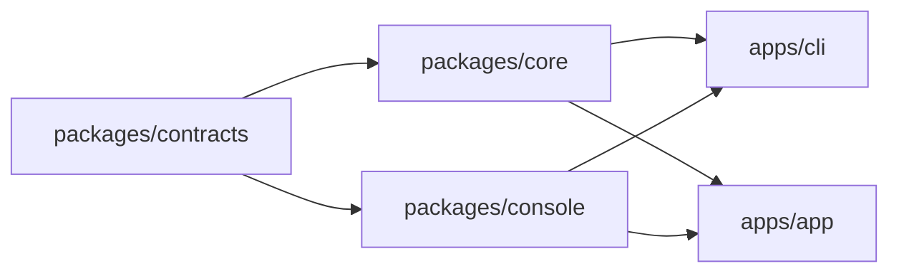

# 包结构与多形态分发

> **本文是该主题的唯一权威**：包边界、目录归属、宿主适配点、运行时配置来源、CLI 契约与迁移阶段。
> 其它文档提到同一主题时只写结论加链接，不复述细节。构建命令与打包产物清单以根 `package.json` 的 scripts、各包 `scripts/`（跨包工具在 `packages/toolkit/scripts/`）与各包 `package.json` 为准。

## 1. 目标

同一套核心能力，拆成可独立消费的包，支持两种交付形态（外加作为库直接使用）：

1. **CLI**：`one-switch start` 启动核心服务，同时托管 Web 控制台；用户用浏览器操作，也可以只用 HTTP API。
2. **App**：Electron 只做宿主封装（窗口、托盘、自动更新、系统密钥环），业务能力全部来自核心包。

核心原则：**core 不知道宿主是谁**。宿主差异（密钥存储、Web 托管、桌面能力、语言环境）全部收敛为接口注入，core 内不出现 `electron`、不出现静态文件路径假设。

## 2. 交付形态

| 形态 | 组成 | 入口 | 分发方式 |
| --- | --- | --- | --- |
| 库 | `core` + `contracts` | `import { startServer } from '@one-switch/core'` | npm |
| CLI | `core` + `contracts` + `console` 静态产物 + Node 密钥实现 + 静态托管 | `one-switch start` | npm 全局 bin / `npx` |
| App | `core` + `contracts` + `console` + Electron 壳 | 桌面图标 / 安装包 | electron-builder |

三个形态共用同一份管理 API 契约（见 [tech-architecture.md](./tech-architecture.md)「管理 API 契约」），控制台不做形态分支。

## 3. 包边界



工作区分两层，划分依据是「能不能被第三方单独消费」，不是「能不能直接执行」：

- `packages/`：可被外部依赖的库。`contracts`、`core` 是纯逻辑包，第三方可以只装这两个当库用；`console` 的静态产物也可被任意宿主托管。
- `apps/`：宿主壳。`cli` 与 `app` 只做进程生命周期、参数解析与平台能力适配，不被任何包依赖，也不作为库发布。

| 位置 | 包 | 职责 | 硬约束 |
| --- | --- | --- | --- |
| `packages/contracts` | `@one-switch/contracts` | Zod schema、协议表、错误码、i18n 语言目录与核心、`SecretStore` 接口、运行时配置类型、供应商包格式、路由契约类型 | 只描述形状；不依赖 Node 内置模块、不依赖 DOM、不依赖任何其它包 |
| `packages/core` | `@one-switch/core` | runtime / management / proxy / database / infrastructure / security | 纯 Node；**禁止 import `electron`**；不感知 Web 托管与桌面能力 |
| `packages/console` | `@one-switch/console` | React 控制台，构建为静态产物 | 不直接读 `window.electronAPI`；宿主能力统一走平台抽象层 |
| `apps/cli` | `@one-switch/cli` | 命令行入口、Node 密钥实现、静态托管 | 只做宿主适配与参数解析，不写业务逻辑 |
| `apps/app` | `@one-switch/app` | Electron 主进程与 preload | 只做宿主适配，不写业务逻辑 |

依赖方向严格单向：`core` 与 `console` **互不依赖**，二者之间只通过管理 API 通信。

> 约束由静态检查强制（`packages/toolkit/scripts/check-package-boundaries.mjs`，接入 `pnpm lint`），与 `proxy/` 分层检查同一思路：写进文档的规则只有共识价值，能失败的检查才有约束价值。

## 4. 目录结构

### 4.1 目标态

```text
one-switch/
├── packages/
│   ├── contracts/
│   │   ├── package.json
│   │   ├── tsconfig.json
│   │   └── source/
│   │       ├── index.ts
│   │       ├── schemas.ts
│   │       ├── protocols.ts
│   │       ├── errors.ts
│   │       ├── secret-store.ts        # SecretStore 接口 + key reference 生成
│   │       ├── runtime-config.ts      # RuntimeConfig 类型与默认值合并
│   │       ├── database-file.ts
│   │       ├── proxy-origin.ts
│   │       ├── provider-bundle.ts
│   │       ├── utils.ts
│   │       ├── i18n/                  # 语言目录、核心、类型
│   │       └── router/                # 路由契约类型与预设
│   │
│   ├── core/
│   │   ├── package.json
│   │   ├── drizzle/                   # 迁移基线（随包分发）
│   │   └── source/
│   │       ├── index.ts               # 生命周期入口 startServer / stopServer
│   │       ├── runtime/
│   │       ├── management/
│   │       ├── proxy/
│   │       ├── database/
│   │       ├── infrastructure/
│   │       └── security/
│   │
│   ├── console/
│   │   ├── package.json
│   │   ├── index.html
│   │   └── source/
│   │       ├── main.tsx / App.tsx / routes.tsx
│   │       ├── platform/              # 宿主能力抽象（新增）
│   │       ├── api/ features/ pages/ components/ hooks/ store/ services/ i18n/
│   │       └── lib/ infrastructure/
│   │
│   └── toolkit/                       # 跨包开发脚本：lint / test / typecheck / 包边界守卫 / 脚本运行库
│       └── scripts/
│
├── apps/
│   ├── cli/
│   │   ├── package.json               # bin: one-switch
│   │   └── source/
│   │       ├── index.ts               # argv 解析与分发
│   │       ├── commands/              # start / stop / status / config / version
│   │       ├── secret-store.ts        # EncryptedFileSecretStore
│   │       ├── static-server.ts       # 控制台静态托管
│   │       └── native-i18n.ts         # CLI 的终端语言层
│   │
│   └── app/
│       ├── package.json
│       ├── electron-builder.config.cjs
│       ├── build/                     # 应用图标与托盘图标
│       └── source/
│           ├── main/                  # index / tray-* / updater / auto-launch / secret-store / i18n
│           └── preload/
│
├── product/                           # 产品规格文档
├── turbo.json                         # 任务编排与依赖顺序
└── pnpm-workspace.yaml
```

### 4.2 S0 平移映射

S0 只做目录平移与配置同步，不含逻辑改写。实际执行结果：

| 迁移前 | 迁移后 |
| --- | --- |
| `source/common/**` | `packages/contracts/source/**` |
| `source/server/**` | `packages/core/source/**` |
| `drizzle/` | `packages/core/drizzle/` |
| `source/render/index.html` | `packages/console/index.html` |
| `source/render/source/**` | `packages/console/source/**` |
| `source/providers/**` | `packages/console/source/providers/**` |
| `source/command/**` | `apps/app/source/**` |

目录一律叫 `source/`（不用 `src/`）：全仓库源码目录同名后，glob、别名配置与守卫脚本都只有一种写法，也不用为每个包单独记一条例外。

与 §4.1 目标态只剩一处差异，属于刻意延后：`apps/app/source` 保持平铺一层（`index.ts` / `preload.ts` / `tray-*.ts` / `updater.ts` …），不拆 `main/` 与 `preload/`。拆目录会同时改变 Vite 入口、`__dirname` 推导与 preload 相对路径，与「平移零行为风险」冲突，留到 S3。

**别名沿用旧名，只重指目标**（本阶段最关键的取舍）：`@common/*` → `packages/contracts/source`，`@server/*` → `packages/core/source`，`@/*` → `packages/console/source`，`@render/*` → `packages/console`。别名定义分散在三处（`packages/console/vite.config.ts`、`apps/app/vite.shared.ts`、`vitest.config.ts`），改路径必须三处同步，否则会出现「测试能过、构建能过、跑起来才炸」的分裂状态。

理由：包内引用约 866 处、跨包引用约 316 处，一次性重写所有 specifier 既无法用类型检查分批验证，也无法在 `moduleResolution: bundler` + 纯源码（无构建产物）的工作区里靠包的 `exports` 字段解析。别名间接层是等价的替代，而且它本身就是后续「按包独立构建」的接缝。真正的 specifier 迁移放到各包开始产出构建产物时再做，届时是机械替换，可验证。

> 现状补充：`contracts` 与 `core` 目前仍以 `exports: "./source/*.ts"` 直接暴露源码，不发构建产物；也就是说别名与 `exports` 两套解析路径目前并存。等 S1 让 core 产出 ESM 产物时，二者应当只留一套。

### 4.3 根级资产的最终归属

S0 之后根目录只保留工作区级配置（`pnpm-workspace.yaml`、`turbo.json`、`tsconfig*.json`、`vitest.config.ts`、`eslint.config.js`、`package.json`）与 `product/`、`release/`。原先分散在根目录的资产（包括脚本）按「谁用谁持有」搬进了各自的包：

| 资产 | 现在的位置 | 引用方式 |
| --- | --- | --- |
| 应用图标与托盘图标 | `apps/app/build/` | 源码里用 `?url` 内联（`assetsInlineLimit: Infinity` 让图标变成 data URL，避免 asar 内多一次文件寻址）；electron-builder 的 `icon` 相对 `apps/app` 解析 |
| 打包配置 | `apps/app/electron-builder.config.cjs` | `apps/app/scripts/build.mjs` 显式 `--config`；`directories.output` 指回仓库根 `release/`，`afterPack` 为同包内 `scripts/macos-adhoc-sign.cjs` |
| 控制台静态资源 | `packages/console/public/` | Vite 的 `publicDir`，随渲染层构建拷贝进 `packages/console/dist` |
| 各包脚本 | `apps/app/scripts/`、`packages/core/scripts/`、`packages/console/scripts/` | 根 `package.json` 的 scripts 指向包内路径（`apps/app/scripts/{build,dev,version}.mjs`、`packages/core/scripts/{db,check-proxy-layers}.mjs`、`packages/console/scripts/{eslint-plugin-i18n.mjs,vitest.setup.ts}`） |
| 跨包脚本 | `packages/toolkit/scripts/` | 私有工作区包（`@one-switch/toolkit`，无运行时代码）：任务编排（lint / test / typecheck）、包边界守卫与脚本运行库。它们不属于任何单一业务包，所以独立成包而不是堆在根目录 |
| 打包产物 | `release/<version>/` | 仍在仓库根：它是构建**输出**，不属于任何包的源码 |

搬运时的三个坑：

1. **图标同时被源码级相对路径引用**。`?url` 的解析基准是源码文件而不是配置文件，所以改目录必须连带改源码里的引用，只看配置文件会漏。
2. **`__dirname` 推导需要重新核对**。产物布局是「主进程代码住 `apps/app/dist/command/`，渲染层与迁移基线由 electron-builder 抬进 asar 的 `dist/render` 与 `packages/core/drizzle`」——这三条映射是一组，动一条必须重新验算另外两条。`apps/app/electron-builder.config.cjs` 与 `apps/app/vite.shared.ts` 里各有一段注释专门记录这层约束。
3. **脚本的「仓库根」是数目录数出来的**。脚本用 `import.meta.url` 往上数目录定位仓库根，换目录必须同步改层数，否则它会在错误的 cwd 里跑（症状是「找不到 tsconfig」而不是「找不到脚本」）。同理，跨包引用运行库用相对路径时，层数也跟着目录深度变。

结论：原先「随 S3（App 回归）一起处理」的两项已经完成，不再挂账。

## 5. 宿主适配点

以下八项是 `core` 与宿主之间全部的耦合面。除这些之外，`core` 不得感知宿主存在。

### 5.1 密钥存储

现状：`packages/core/source` 只依赖 `KeychainApi` 接口（`packages/contracts/source/keychain.ts`），Electron 侧用 `safeStorage` 实现（`apps/app/source/secret-store.ts`）。接口已经就位，缺的是第二个实现。

| 宿主 | 实现 | 说明 |
| --- | --- | --- |
| App | `ElectronSecretStore` | 沿用 `safeStorage.encryptString` / `decryptString` |
| CLI | `EncryptedFileSecretStore` | 随机 32 字节主密钥存 `secrets.key`（`0600`），逐条 AES-256-GCM 加密写入 `secrets.json` |

CLI 侧的取舍要写清楚：这是**文件级加密**，防止的是备份、误传、被其它用户读到；它不防「同用户同机器上的恶意进程」——那需要系统钥匙串，会引入原生依赖，与「零原生依赖」的约束冲突。接口化之后，未来接入钥匙串只是一个新实现，不改 core。

设计要点：

- 主密钥文件缺失时自动生成；存在但不可读时**报错而非静默重建**（静默重建等于把用户已有的密钥全部作废）。
- 支持 `ONE_SWITCH_SECRET_KEY`（base64 的 32 字节）覆盖主密钥，服务于容器与 CI。
- 接口从 `KeychainApi` 更名为 `SecretStore`，`generateKeyReference` 保留。

### 5.2 Web 托管

现状：管理服务只处理 `/api` 前缀，控制台由 Electron 用 `loadFile` 以 `file://` 加载。

目标：管理服务增加静态托管能力，由宿主决定是否启用。

- CLI：`--web`（默认开启）时托管控制台产物，`/` 走 SPA fallback（未命中静态文件且不是 `/api/*` 时返回 `index.html`）。
- App：保持 `loadFile`，不启用静态托管（避免多开一个可被局域网访问的入口）。
- 静态根目录由宿主传入（App 用 asar 内路径，CLI 用包内 `dist/web`），core 不硬编码路径。

守卫必须保持：静态托管只挂在管理服务上，且沿用现有的 Host 校验（见 [security-privacy.md](./security-privacy.md)），默认只监听 `127.0.0.1`。

### 5.3 前端运行时注入

现状：`packages/console/source/api/client.ts` 里 API base 是构建期常量 `getRuntimeProfile(DEV ? 'development' : 'production').managementApiUrl`（硬编码端口）。

目标：改为运行时解析，优先级从高到低：

1. `window.__ONE_SWITCH__?.apiBase` —— 宿主注入（Electron preload 注入绝对地址；CLI 托管时注入 `/api`）。
2. `location.protocol` 为 `http:` / `https:` 时用 `${location.origin}/api` —— CLI 同源场景，无需注入也能工作。
3. 回退到内置默认端口 —— 保证 `dev:preview` 与单测不炸。

这一项是 CLI 能跑起来的前提：`file://` 下 `location.origin` 为 `null`，必须靠注入；而 CLI 同源场景则天然可用。

### 5.4 桌面能力抽象

现状：`packages/console/source/pages/runtime-settings/components/update-card.tsx` 直接读 `window.electronAPI`，并据此切换 `PreviewCard` 分支。

目标：新增 `packages/console/source/platform/`，把宿主能力收敛为一个对象：

```ts
interface PlatformCapabilities {
  name: 'electron' | 'web'
  updater: UpdaterApi | null      // web 下为 null，UI 显示「当前形态不支持」
  openExternal: (url: string) => void
  autoLaunch: AutoLaunchApi | null
}
```

判定顺序：`window.electronAPI` 存在 → `electron`；否则 → `web`。控制台只消费 `PlatformCapabilities`，不再出现 `window.electronAPI` 字面量。

「不支持」必须是**正常状态**而不是错误：沿用既有做法（同一套布局 + `—` 占位 / 明确的不可用提示），不切换成简化排版。

### 5.5 运行时配置

现状：`packages/contracts/source/runtime-profile.ts` 只有 `development` / `production` 两档预设，端口、数据目录名、管理 API 地址写死。

目标：`RuntimeConfig` 显式化，预设保留但只作为默认值来源。

```ts
interface RuntimeConfig {
  environment: 'development' | 'production'
  dataDir: string
  databaseFileName: string
  proxyHost: string
  proxyPort: number
  managementHost: string
  managementPort: number
  serveWeb: boolean
  webRoot: string | null
}
```

- `core` 只接受完整的 `RuntimeConfig`（现有 `StartServerOptions` 形状已接近，改动集中在配置来源而不是 core 内部）。
- 宿主负责构造：App 用 `app.getPath('userData')` + `app.getVersion()`；CLI 用参数 + `package.json` 版本 + 平台默认数据目录。
- CLI 参数覆盖：`--data-dir`、`--proxy-port`、`--management-port`、`--host`、`--web` / `--no-web`。

数据目录的平台默认值（CLI）：Windows `%APPDATA%\One Switch`、macOS `~/Library/Application Support/One Switch`、Linux `$XDG_CONFIG_HOME/one-switch`。与 App 保持同名目录，让两种形态可以共用同一份配置（是否共用由用户决定，默认共用）。

### 5.6 i18n 三层

现状：语言目录与核心在 `packages/contracts/source/i18n`，UI 层在 `packages/console/source/i18n`，宿主 native 层在 `apps/app/source/i18n.ts`。

目标：分层不变，归属调整。

| 层 | 归属 | 形态差异 |
| --- | --- | --- |
| 语言目录 + 核心 | `contracts` | 三种形态共用 |
| UI | `console` | 三种形态共用 |
| native | 各宿主自己 | App：托盘、菜单、原生对话框；CLI：终端输出 |

CLI 的 native 层需要一套独立文案（启动横幅、端口占用、数据目录、退出提示），放进 `apps/cli/source/native-i18n.ts`。诊断消息仍按既定契约固定英文（见 [i18n.md](./i18n.md)）。

### 5.7 数据库迁移资源定位

现状（已落地）：`getMigrationsFolder()` 从**模块目录**逐级上溯（最多 8 层）寻找 `packages/core/drizzle`，命中即返回；全链未命中才退到 `process.cwd()/packages/core/drizzle`，仍落空则返回 `moduleDirectory/packages/core/drizzle`，让上层报错直接指向一个可解释的期望位置。

为什么不用固定层数：`drizzle/` 到模块目录的相对深度在两种形态下不同——

| 形态 | 模块目录 | 到 `packages/core/drizzle` 的上溯层数 |
| --- | --- | --- |
| 开发（`pnpm dev`） | `apps/app/dist/command/` | 4 层到仓库根 |
| 打包（asar 内） | `app.asar/dist/command/` | 2 层到 asar 根（electron-builder 把 `packages/core/drizzle` 映射进去） |

固定层数必然在某一侧失效，且失效是运行期才报的。上溯查找对两端同时成立，产物布局再变也不会静默失配。

要求：

- `drizzle/` 必须随包分发（App 的 `files`、CLI 的 `files` 都要包含）。
- 不依赖 `process.cwd()`：CLI 可以在任意目录启动，cwd 探测只是开发期便利，不是唯一来源；打包后必须靠模块相对路径命中。
- **不要把这一类路径经 `process.env` 传入**：宿主构建会用 Vite，而 Vite 默认把 `process.env` 静态替换为 `{}`，传入的值读出来永远是 `undefined`（详见 §5.8）。

### 5.8 构建与测试编排

现状（已按目标落地，只剩 `cli` 未建）：

| 包 | 产物 | 工具 |
| --- | --- | --- |
| `contracts` | 不产出构建物，`exports` 直接指向 `./source/*.ts` | — |
| `core` | 同上 | — |
| `console` | 静态文件 `packages/console/dist` | `vite build`（`packages/console/vite.config.ts`） |
| `app` | `apps/app/dist/command/{index.js,preload.js}`，再交给 electron-builder | 两份 Vite 配置 + `apps/app/scripts/build.mjs` |
| `cli` | ESM `dist/index.js`（`bin`） | 待建（S2） |

编排由 Turborepo 承担（`turbo.json`）：

- `build` 依赖 `^build`，顺序只由依赖图决定：`contracts` → `core` → `console` / `app`。实测 `pnpm build` 只跑 2 个任务（只有 console 与 app 真的有构建步骤），「谁先构建」不再需要人工记忆。
- `typecheck` / `test` 同样依赖 `^build`：上游没通过时，下游的报错不参与排查。
- `lint` 无依赖、可并行，因为它不写产物。
- `dev` 标记为 `cache: false` + `persistent: true`：turbo 并行拉起而不等待依赖，跨进程顺序由宿主自己的编排脚本负责（`apps/app/scripts/dev.mjs`）。
- turbo 要求根 `package.json` 声明 `packageManager`，缺失会直接拒绝运行。

`__APP_VERSION__` 的注入点在拆分后**只剩 `console` 一处**（`packages/console/vite.config.ts` 的 `define`），`vitest.config.ts` 必须同步（历史教训：两处不同步会让任何间接 import 的测试炸掉）。

测试保持单一 workspace 配置（根 `vitest.config.ts` + `packages/console/scripts/vitest.setup.ts`，经 `packages/toolkit/scripts/test.mjs` 以 Electron 的 Node 执行，以匹配 `node:sqlite` 的 ABI），可按包过滤。两个静态守卫都必须保持通过：`packages/core/scripts/check-proxy-layers.mjs`（指向 `packages/core/source/proxy`）与 `packages/toolkit/scripts/check-package-boundaries.mjs`（已只登记 `packages/*` / `apps/*` 布局）。

宿主侧还有一条只有拆过构建才知道的约束：删掉 `vite-plugin-electron` 之后，Node 与浏览器的构建差异不再有人代为处理。`apps/app/vite.shared.ts` 现在自己负责三件事，而**三者的缺失都只在 Electron 运行期暴露、且构建全过程无警告**（分别是「入口函数不是函数」、「require 不可用」、「开发态静默按生产端口启动」）：

| 配置 | 缺失时的症状 |
| --- | --- |
| `rolldownOptions.external` 列出 `electron` 与全部 `node:` 内置模块 | `node:fs` / `node:url` 等被换成浏览器空模块，启动即 `(0, v.fileURLToPath) is not a function` |
| `rolldownOptions.platform: 'node'` | 依赖里的 `require('fs')` 不再接上 `createRequire`，运行期报「environment that doesn't expose the require function」 |
| 顶层 `define: { 'process.env': 'globalThis.process.env' }` | Vite 把 `process.env` 整体替换为 `{}`，`process.env.VITE_DEV_SERVER_URL` 恒为 `undefined`，开发态静默按生产端口启动并加载本地 `index.html` |

`define` 是 Vite 的顶层选项，放进 `build` 里会被静默忽略——写成“配置看着对、行为不对”是这一步最容易踩的坑。

S0 平移后复盘出的两类真实脆点，都属于「静态检查看不见、只有跑起来才发现」：

1. **测试内硬编码的目录路径**。`migration-chain.test.ts`（以固定层数 `import.meta.url` 推导 `drizzle/`）与 `i18n/catalogs.test.ts`（硬编码 `render` / `command` / `common` / `server` 子目录名当扫描根）都在平移后失效，typecheck 与 lint 都报不出来。任何以固定层数向上推导资源位置的地方，都应改成显式路径列表或从配置读入。
2. **HTML 入口里的模块引用**。`packages/console/index.html` 的 `<script type="module" src="/source/main.tsx">` 在文件被移动后仍指向旧路径，`pnpm typecheck`、`pnpm lint`、`pnpm test` 全绿，只有 `pnpm vite build` 会失败（`Failed to resolve /source/main.tsx`）。同理，任何 `index.html` / manifest 里的相对资源路径都应视为迁移清单的一部分，而不是「内容文件」。

## 6. CLI 契约

命令名 `one-switch`，无子命令时等价于 `start`。

| 命令 | 说明 |
| --- | --- |
| `one-switch start` | 启动代理与管理服务；`--web` 时同时托管控制台 |
| `one-switch stop` | 停止由本 CLI 启动的实例（通过数据目录下的运行时文件定位） |
| `one-switch status` | 输出运行状态、监听地址、数据目录、版本 |
| `one-switch config` | 读取或写入设置（与设置页同一份数据） |
| `one-switch version` | 输出版本号 |

行为约定：

- 前台运行，`Ctrl+C` 触发优雅退出（等价 `stopServer()`）；`--daemon` 不在首期范围内。
- 端口被占用时给出明确错误并以非零码退出，不静默换端口。
- 启动后打印访问地址、代理地址与数据目录，方便用户直接复制。
- CLI 依赖 `node:sqlite`，启动时做能力探测；不可用时给出明确的 Node 版本升级提示后退出，不做降级。

## 7. 迁移阶段

每一阶段都必须以「现有验证全绿」为前置：`pnpm typecheck`、`pnpm lint`、`pnpm test`。

### S0 骨架平移（不改逻辑）— 已完成

范围：建立 pnpm workspace 与包骨架，按 §4.2 平移目录与导入别名，**不动任何业务逻辑**。

产出：`pnpm-workspace.yaml` 增加 `packages/*` 与 `apps/*`；`packages/{contracts,core,console}` 与 `apps/app` 各自的 `package.json` / `tsconfig.json`；根目录只留工作区级配置，`drizzle.config.ts` 进 `packages/core/`、`components.json` 进 `packages/console/`、图标进 `apps/app/build/`、打包配置与打包脚本进 `apps/app/`；守卫脚本进 `packages/toolkit/scripts/` 与 `packages/core/scripts/`；根 `package.json` 的 scripts 全部改为调各包 `scripts/` 与 turbo。

验收结果：`pnpm typecheck` ✓、`pnpm lint` ✓（分层 48 文件 + 包边界 249 文件）、`pnpm test` ✓（109 文件 / 1123 测试，与平移前一致）、`pnpm build` ✓（turbo 2 个任务，console 静态产物 + 主进程/preload 两份产物齐全）。`pnpm build` 的 electron-builder 环节用 `--dir` 模式验证过：`app.asar` 内同时含 `dist/render/index.html` 与 `packages/core/drizzle/**/migration.sql`，符合 §5.7 的路径假设。

`pnpm dev` 已端到端复验：控制台 dev server 起来后才拉起 Electron，首轮构建落定后才开始监听产物，启动横幅显示 `Environment : development` 与 19300 / 19301 端口，数据库初始化、两个监听器与托盘初始化全部完成，且主进程改动恰好触发一次重启。

平移期间发现并修复：`packages/console/index.html` 的入口脚本仍写着 `/source/main.tsx`（详见 §5.8 末段）。这类问题三个静态检查全绿也发现不了，必须跑一次真实构建。

环境限制（与平移无关）：Windows 上以非管理员身份跑完整 `pnpm build`，electron-builder 解压 `winCodeSign` 缓存时需要创建符号链接的权限而失败（`Cannot create symbolic link ... libssl.dylib`）。需要开启「开发者模式」或以管理员身份执行；临时绕过可加 `-c.win.signAndEditExecutable=false`，代价是 exe 不嵌入图标。

剩余：`apps/cli` 尚未建立，留待 S2。

### S1 core 可独立运行

范围：`core` 与 `contracts` 产出独立构建产物；新增 `packages/toolkit/scripts/smoke-core.mjs` 用裸 Node 启动服务并发起一次代理请求。

验收：不安装 Electron 的 Node 进程能启动 core、能完成一次成功转发与一次失败切换，且能用 `Ctrl+C` 干净退出。

### S2 CLI 成型

范围：落地 §5.1、§5.2、§5.3、§5.4、§5.5；实现 `start` / `stop` / `status` / `version`。

验收：`node packages/cli/dist/index.js start` 之后，浏览器打开控制台，供应商配置、模型管理、日志、统计全部可用；关闭终端后端口释放。

### S3 App 回归

范围：`app` 与其内联的渲染层构建彻底解耦（`electron-builder` 配置与打包脚本已在 S0 迁入包内，只剩构建产物映射与目录细分）；`apps/app/source` 按 §4.1 目标态拆出 `main/` 与 `preload/`；托盘、自动更新、开机自启、原生对话框保持。

验收：桌面安装包端到端可用；升级路径（检查更新 → 下载 → 安装）不回归。

### S4 分发与文档

范围：CLI 发布形态（npm 全局 bin）+ `engines` 声明 + README 使用说明；`product/` 相关文档同步（`tech-architecture.md` 的项目结构与构建章节、`server-architecture.md` 的目录树、`roadmap.md` 的进度条目）。

验收：`npx one-switch` 在干净机器上可启动；文档与仓库结构一致。

## 8. 明确不做

- 不引入 HTTP 框架（沿用原生 `http`，见 [tech-architecture.md](./tech-architecture.md)）。
- 不引入原生依赖（密钥走文件加密，不走系统钥匙串；`node:sqlite` 已满足持久化）。
- 不做远程多用户、鉴权体系与 Docker 化镜像；CLI 仍是本机单用户形态。
- 不做 Electron 之外的第二种桌面壳，也不为 CLI 单独维护一套 UI。

## 9. 决策记录

| 决策 | 选择 | 备选与理由 |
| --- | --- | --- |
| 包结构 | pnpm workspace 多包 | 单包多入口无法用编译期/lint 强制边界，也没法让 core 被第三方单独消费 |
| 包命名 | `@one-switch/*` | 需要 npm org；备选 `@yinxulai/*`（个人 scope，无需建 org） |
| CLI 分发 | npm 全局 bin / `npx` | 单文件可执行（Node SEA）作为后续增量，首期不阻塞 |
| CLI 密钥 | 本地文件 AES-256-GCM | 系统钥匙串需原生依赖，与零原生依赖约束冲突 |
| 推进顺序 | 先 S0 平移 | 现有代码已事实上分层，平移零行为风险，却能立刻把边界变成约束 |
| 目录分层 | `packages/` 放库、`apps/` 放宿主壳 | 曾把 cli / app 也放进 `packages/`；但「可被第三方消费」与「可直接执行」是两件事，宿主壳不该被当作库发布 |
| S0 导入写法 | 别名重指向，不改 specifier | 直接换成 `@one-switch/*` 是一次上千处的高风险改动，无法分批验证（见 §4.2） |
| `build/` 与打包配置 | 收进 `apps/app/`（已在 S0 内完成） | 一开始顾虑三重耦合而暂留仓库根，实际按「谁用谁持有」搬完后只需同步改源码引用与 `__dirname` 推导（见 §4.3） |
| 目录名 | 统一用 `source/` 而非 `src/` | 仓库内只有一种写法，glob、别名与守卫脚本少一类例外 |
| 任务编排 | Turborepo 接管 | 自己写依赖排序会在每新增一个包时重写一次；turbo 的顺序由依赖图决定，且自带 `dev` 长驻任务语义 |
