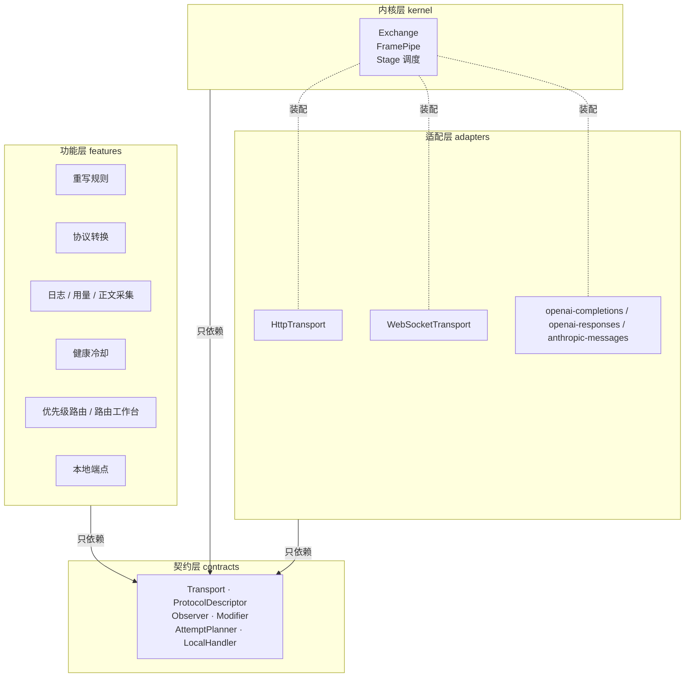
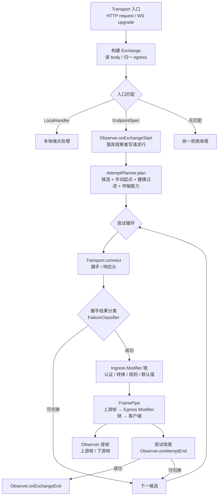

# 代理引擎设计：协议无关透传内核与扩展接口

## 定位

本文描述 `source/server/proxy` 的目标结构。核心是一套**协议无关的透传内核**：默认只搬运字节与帧，不解析任何报文；「我们自己的功能」（请求/响应重写、协议转换、日志、用量、正文采集、健康冷却、路由策略）一律以插件形式挂在**观察接口**与**修改接口**上。

传输方式（HTTP、WebSocket、未来的其他方式）与接口形态（`chat/completions`、`embeddings`、`messages`、`responses`……）都作为**数据声明**进入注册表，内核里不出现任何协议名或传输名。

与既有文档的关系：

- [proxy.md](./proxy.md) 定义当前**行为契约**（协议识别、候选路由、自动切换、流式边界）。行为契约不变，本文改的是「这些行为住在哪里」。
- [websocket-transport.md](./websocket-transport.md) 是 WS 传输的能力设计。本文的 `Transport` 抽象是它的落地载体：WS 不需要复制执行器。
- [protocol-conversion.md](./protocol-conversion.md) 的转换矩阵，在本文里退化为 `ProtocolDescriptor.conversion` 声明 + 一个 `Modifier` 实现。
- [outbound-proxy.md](./outbound-proxy.md) 不介入本文：出站代理属于 `infrastructure/network`，传输层直接复用。

## 一、现状诊断

当前实现的职责划分（`execution` / `request` / `response` / `protocols` / `observability` / `routing` / `transport`）方向是对的，但**耦合点没有被约束住**。以下每条都能在代码里指到具体位置。

### 1.1 协议矩阵被表达了六次

同一个事实「某协议支持什么」写在六个互不知情的地方，加一个协议（如 Gemini）要同时改六处，漏一处就是运行时才暴露的错误：

| # | 位置 | 表达形式 | 状态 |
| --- | --- | --- | --- |
| 1 | `protocols/openai-completions/routes.ts` 等 3 个文件 | path → 协议（`router.post(...)`） | 已收敛：S2 删掉独立 `routes.ts`，S3a 改为接口 `endpoints[].match` |
| 2 | `protocols/openai-completions/registry.ts` 等 3 个文件 | `(client, endpoint)` → adapter | 已收敛：S2 移到单一 `protocols/registry.ts` |
| 3 | `protocols/registry.ts:20` `createAuthHeaders` | `switch (protocol)` | 已收敛：S2 改为 `PROTOCOL_AUTH_PRESETS`（住在 `@common/protocols`） |
| 4 | `protocols/shared/request-conversion.ts:18` | `if/else` 方向链 | 已收敛：S2b 改为 `requestDirections` 查表 |
| 5 | `protocols/shared/response-conversion.ts:71, 94` | `if/else` 方向链（非流式 + 流式各一条） | 已收敛：S2b 改为 `responseDirections` 查表 |
| 6 | `@common/protocols` `CONVERTIBLE_PROTOCOLS` | 转换能力矩阵（**已经是声明式，且渲染进程与管理端也在读**，保留为唯一来源） | 保留，并新增与第 4/5 条的双向一致性断言 |

第 3 条尤其说明问题：认证本该是协议的属性，却被从 adapter 里拎出来单独做了一个 `switch`，于是「一个协议」的知识分裂成 adapter 类 + switch 分支两份。第 6 条则说明：协议能力一旦要跨进程共用，就必须住在 `@common`，不能住在 `proxy` 里。

### 1.2 内核知道协议与传输细节

`execution/attempt-executor.ts` 单文件 34.8KB、`attemptRequest` 一个函数约 330 行，内部同时处理：健康分类、日志定稿、重写规则、协议转换、HTTP 请求构造、TTFT、用量、取消、切换。它 import 了 `node:http`、`node:url`、`protocolAdapters`、`getSecretStore`、`getSettings`、`listRulesForProviderModel`、`ResponsePipeline`——**内核与所有功能双向耦合**，因此它无法在没有真实上游的情况下被单独测试（测试只能整链路跑 `handleProxyRequest`）。

> **进展**：S3a 已把「协议细节」从内核移出（模型读取与流式判定改为经 `ProtocolEnvelope` 在入口解析一次）；S3b 已把 HTTP 细节关进 `transports/http.ts`；S5 把帧搬运下移到 `kernel/relay.ts`（72 行，≤200 行目标达成），执行器只剩候选循环。

### 1.3 观察是终点回调，不是订阅

`observability/hooks.ts` 只暴露三个回调：`onRequestStarted` / `onAttemptRecorded` / `onContentCaptured`，且都发生在**落库之后**，载荷只有 ID。结果是：

- 观察者**无法影响任何决策**（不能补字段、不能否决、不能提前介入）；
- 观察逻辑不是订阅，而是**内联在** `attempt-executor` 里的 6 处 `finalizeAttempt({...})`，每次手写 20 个字段；
- 「回调必须在落库之后」这个约束被写在注释里、靠调用顺序保证，而不是靠接口表达。

> **进展**：S5 已完成。观察者实现分两层：`observers/attempt-observer.ts` 是只读累加器（头/字节/usage/首字节时间），落库细节在 `execution/attempt-conclusion.ts`，两者都只依赖 `contracts/observer.ts`。

### 1.4 修改是两个硬编码调用点，不是接口

`applyRequestRewriteRules` 在 `attempt-executor.ts` 里被直接调用两次（请求方向、非流式响应方向），并且规则数据由执行器自己去查库（`listRulesForProviderModel(model.id)`）。同类问题还有：`stream_options.include_usage` 注入被塞在 `protocols/*/request-defaults.ts` 里、跟着 native adapter 走。

也就是说「功能基于接口实现」目前**不成立**：重写是具体函数 + 具体 SQL + 具体调用点三件套。

> **进展**：未动。`Modifier` 契约已在 `contracts/modifier.ts` 就位，实现随 S4。

### 1.5 传输是 HTTP 专有，且类型外泄

`URL`、`http.RequestOptions`、`IncomingHttpHeaders` 出现在执行器、`response/headers.ts`、`response/response-pipeline.ts` 中。响应管线的构造参数里有 `adapter.kind === 'conversion'` 判断——**内核在按协议模式分支**。

这正是 WS 的风险点：按 [websocket-transport.md](./websocket-transport.md)，WS 需要「握手即路由、连接粒度的健康冷却、连接级观测、双向帧中继」。因为连接类型没有被抽象，这些逻辑只能**在 WS 里重写一遍**，与 HTTP 路径形成第二套执行器。

> **进展**：S3b 已把 `http.IncomingMessage` / `http.RequestOptions` 关在 `transports/http.ts` 内部，`kernel/frame-pipe.ts` 只认 `Frame`；S5 把执行器里残留的 `node:url` / `http.RequestOptions` 一并迁出。

### 1.6 流式是一个布尔量

`isStreamingRequest(requestBody)` 解析请求体、`isStreaming = 客户端要求流式 && 上游返回 SSE`，然后整个响应方向都被这个布尔量分叉：非流式才允许重写（`streaming` 时规则直接 skip）、转换器按布尔量创建。结果是**流式响应既不能被观察（无逐帧事件）也不能被修改（规则被跳过）**，而这个限制是结构造成的，不是能力造成的。

> **进展**：请求侧已解决——「这个接口会不会流式」现在是接口声明（`ProtocolEndpointSpec.envelopes[transport].resolveDelivery`），入口解析一次后作为请求级事实传递，日志写入点不再解析正文。响应侧的 `isStreaming` 布尔随 S4 删除。

#### 1.6.1 两根轴：插座 vs 交付方式（S7 后修正）

原设计里 `streamingRequest` 这个名字把两件事压成了一个布尔：**「上游用什么插座」** 与 **「字节怎么交回客户端」**。WS 支持一落地就暴露了矛盾——一条 WebSocket 交换既没有「HTTP 请求体里的 `stream` 字段」可解析，也不存在「上游是不是回了 SSE」的问题，却必须写一个 `streamingRequest: true` 才能让下游逻辑按预期走。

现在这两件事各有各的名字，且互相正交（四种组合都合法）：

| 轴 | 类型 | 位置 | 谁决定 | 含义 |
| --- | --- | --- | --- | --- |
| 上游插座 | `TransportKind` | `contracts/transport.ts` | 规划器 | `http` / `websocket`：字节怎么出去 |
| 交付方式 | `DeliveryMode` | `contracts/delivery.ts` | 接口的封装描述（`resolveDelivery`） | `buffered` / `stream`：字节怎么回来 |

两者合成出真正驱动出口行为的**第三个事实**，它不是一个独立的声明，而是算出来的：

- `isEventStreamResponse(headers)`：上游响应的分帧格式（读 `content-type: text/event-stream`）。SSE 是**格式**，不是传输，因此判定留在帧层；
- `isStreamingDelivery(delivery, headers)` = `delivery === 'stream' && isEventStreamResponse(headers)`：出口是否边收边发。

三类名字各不相同，因此不会互相顶替：

1. **客户端意图** → `DeliveryMode`（`ExchangeView.delivery`、`RequestContext.delivery`、`RequestLoggingInput.delivery`）；
2. **上游格式** → `isEventStreamResponse(headers)`，只读响应头；
3. **出口行为** → `isStreamingDelivery(...)`，合成前两者。

`Envelope.delivery` 返回**轴上的取值**而不是 `boolean`，调用方（HTTP 入口、WS 入口）不必各自把 `true` 翻译成 `'stream'`，也就不会有两处翻得不一样；WS 入口的 `'stream'` 现在是从封装描述取来的**事实陈述**，而不是入口凭印象写死的假设。

落库字段另有约定：`request_logs.streaming` / `request_attempts.streaming` 是**布尔列**，改写规则试跑接口的 `testCase.streaming` 是**已持久化的字段**（改名要迁数据）。这两处保留旧名，在**写入点**做一次显式投影（`input.delivery === 'stream'`、`incrementalDelivery: input.testCase.streaming`），不让旧名渗回模块内部。

为什么不把 SSE 做成一档传输（`http-stream` / `http-sse`）：① 它与 `http` 在建连、TLS、超时、abort、出网方式上一字不差，差别只在响应体怎么分帧——那是**封装**的属性，混进来会稀释「新增传输只需实现 `Transport`」的价值；② 客户端「要不要增量」会因此漏进路由决策（规划器据此筛候选），而客户端偏好从来不改变哪个上游端点合法。

### 1.7 入口匹配只支持 POST

`routing/router.ts` 的 `detectProtocolFromPath` 写死 `protocolRouter.match('POST', pathname)`，`HttpRouter` 用 `[path: string]: any` 的 Proxy 把 handler 当返回值用。后果：

- `GET` 形态的接口无法识别；
- WS 握手（`GET` + `Upgrade: websocket`）无法匹配；
- 本地端点（`/v1/models`）只能硬编码在 `runtime/proxy-runtime.ts` 的 `createServer` 里，无法成为可注册的插件。

> **进展**：S2c 已改为方法感知匹配 + 声明式本地端点；S3a 把匹配键扩展为 `(method, path, transport)`，并在加载期拦住重复接口/重复入口声明；S6 补上了 WS 端点声明（`GET /v1/responses` + `responses-websocket` 端点 + `shared/websocket-envelope.ts`）。

**已修（S2c）**：入口唯一匹配器是 `detectProtocolFromRequest(method, path)`，POST 专有的 `detectProtocolFromPath` 包装被删除而非留作 shim；本地端点改为声明式注册（`proxy/local/`），`createServer` 只剩「生命周期 + 边界错误处理」。WS 握手（S6）此时已具备匹配前提，握手帧的处理属于传输层。

`HttpRouter` 的 `[path: string]: any` Proxy 仍保留，但只服务于管理端路由的便捷写法；代理入口这条线上不再有代码依赖它取 handler。

### 1.8 拒绝路径重复五遍

`request-entry.ts` 里「识别不出路径 / 模型非法 / 无 default 逻辑模型 / 手动模型不可用 / 无可用候选」五条早退分支，各自手写约 20 行相同的「写错误响应 → 读 settings → 组记录 → 落库」。这段逻辑本该是「一次交换的统一收尾」。

**已修（S2c）**：五条分支各自收敛为一行 `reject(refusal, resolution)`，收尾逻辑集中在 `rejectExchange`（失败）/ `recordAbortedExchange`（中断）两个入口，二者共用 `openExchangeLogger`；请求级事实（method / path / headers / attributes / startedAt / hooks）只在 `handleProxyRequest` 里采集一次。

### 1.9 顺带发现：注释在写入时被截断

`routing/router.ts` 与 `execution/attempt-executor.ts` 共有 5 处注释被截断成非法 UTF-8（写作 `检测协议类�?` 这种形态）。仅注释、不影响运行，已在 S2 中一并修正（`grep '\uFFFD'` 现在无命中）。

## 二、目标架构

### 2.1 分层



依赖规则：**箭头单向向上**。`contracts` 不依赖任何实现；`kernel` 不 import `node:http`、不 import 任何具体协议、不 import 数据库；`features` 不互相 import。

### 2.2 核心抽象

| 抽象 | 职责 | 现有功能落位 |
| --- | --- | --- |
| `Exchange` | 一次客户端交互的全部状态（请求、响应出口、协议、候选、尝试、扩展字段） | 取代 `RequestContext` + `request-entry` 的散装状态 |
| `Frame` | 唯一的搬运单位（head / data / end / error / close） | 取代「Buffer + SSE 字符串 + 布尔 isStreaming」 |
| `Transport` | 唯一的对外出口（HTTP 单工、WS 全双工） | 取代 `response/transport.ts` + WS 待建 |
| `ProtocolDescriptor` | 协议的声明式元数据（匹配、信封、认证、用量、转换能力） | 取代 6 处协议矩阵 + `createAuthHeaders` switch |
| `EndpointSpec` | **一个接口**的声明（如 `/v1/embeddings`） | 取代 `routes.ts` + `request-defaults.ts` |
| `Observer` | 只读观察接口（逐帧、逐尝试、逐交换） | 取代 `observability/hooks.ts` |
| `Modifier` | 读写修改接口（请求方向 / 响应方向，可选逐帧） | 取代重写规则、协议转换、认证注入、默认值注入 |
| `AttemptPlanner` | 产出候选序列（含 WS 握手期路由） | 取代 `routing/router.ts` + `routing/routing.ts` |
| `LocalHandler` | 本地端点，不透传上游 | 取代 `proxy-runtime.ts` 里硬编码的 `/v1/models` |

### 2.3 两根正交轴：Protocol × Transport

整套设计只有一个形状：

```
ingress(protocol, transport) ──protocol→protocol 转换──► egress(protocol, transport)
```

**协议与传输是两根互不约束的轴**，中间只做协议到协议的转换，**没有传输到传输的转换**。

这个形状能成立，靠的是三件已经落地的事实：

1. **传输种类不进入接口身份**。`/v1/responses` 的 HTTP 与 WS 是**同一个接口**（`EndpointSpec.id = 'responses'`），只是在同一份声明里给出两个封装：`envelopes: { http, websocket }`。把传输写进 id（`responses` 与 `responses-websocket`）是错的——那会让「一个接口有两种传输方式」看起来像「两个接口」，于是每加一种传输就要复制一遍匹配、模型名位置、用量结构。
2. **传输是匹配条件，不是匹配结果**。`RouteMatcher.transport` 与规划器的 `PlannerInput.transport` 都只是筛选条件；同一个 `(method, path)` 在不同传输下命中同一个接口、拿到不同的封装。
3. **内核只搬运**。`kernel/**` 里没有任何传输概念：`pipeFrames` 拿到的只是一个 `AsyncIterable<Frame>`，双向与否只体现为「有没有 `outbound`」。

出口侧的原子不是「协议」也不是「传输」，而是**三者一起的一组事实**：`(protocol, transport, url)`。这一点在 `UpstreamTarget` 上直接可见——规划器一次产出这三个字段，执行器据此去 `transports/registry.ts` 取实现。传输对唯一决定的是**转换可行性**（`transport` 只放行原生支持该协议的候选），不决定**内容**。

因此「新增一种传输」的全部代价是：实现 `Transport` 接口 + 在 `transports/registry.ts` 里加一个分支。内核、协议、修改器、观察者、规划器都不需要改。

> 这套判断在代码里有逐字的落地说明，改之前先读：`contracts/delivery.ts`（交付方式与传输是两根轴，以及为什么 SSE 不能做成一档传输）、`contracts/route-matcher.ts`（传输是匹配条件而不是接口身份）、`contracts/transport.ts`（`outbound` 存在即双向）、`kernel/relay.ts`（双向交换复用单工尝试的收尾规则）。

## 三、契约定义

以下为 `source/server/proxy/contracts/` 应包含的全部类型。类型定义即为接口文档，实现不得扩张契约。

> 本节已随 S1/S3a 全部落地：`contracts/frame.ts`、`exchange.ts`、`transport.ts`、`modifier.ts`、`observer.ts`、`protocol.ts`、`planner.ts`、`local-handler.ts`、`route-matcher.ts`、`headers.ts`（+ `index.ts` barrel）。
> S8–S11 是「Protocol × Transport 双轴」的补齐（见 §2.3）：契约新增 `RouteMatcher.transport?`、`ExchangeView.transport`、`ModifierContext.transport`、`ModifierFrameMode` 的 `'skip'`。
> 依赖方向是硬的：实现只 import `@server/proxy/contracts`，契约层不 import 任何实现。下方代码块保留为设计原稿，字段以代码为准。

### 3.1 Frame：唯一的搬运单位

```ts
/** 传输层搬运动作的最小单位。HTTP 与 WS 都归一到这五种。 */
export type Frame =
  /** 响应头 / 握手结果。HTTP 是 status+headers，WS 是 upgrade 结果。 */
  | { kind: 'head', status: number, headers: HeaderMap }
  /** 数据。永远是字节，不做编码假设；text 仅供需要解析的 Modifier 懒解码。 */
  | { kind: 'data', body: Buffer }
  /** 正常结束。 */
  | { kind: 'end' }
  /** 传输层错误。 */
  | { kind: 'error', error: Error }
  /** 对端关闭（WS 的 close 帧）。 */
  | { kind: 'close', code?: number, reason?: string }
```

约束：

- 内核**只做** `upstream.frames → egress` 的搬运；不解析 `data.body`。
- 唯一的解析入口是 `Modifier`。没有匹配的 Modifier 时，字节原样过去——这就是「零协议转换」原则在结构上的落地。
- 二进制安全：`Buffer` 不做任何 `toString('utf8')`，避免当前实现对非文本流（图片、音频）的隐性破坏。

### 3.2 Transport：唯一的出口

```ts
export interface UpstreamTarget {
  /** 端点标识，来自 EndpointSpec。 */
  endpointId: string
  protocol: Protocol
  url: string
  transport: TransportKind          // 'http' | 'websocket'
  credentialRef: string | null
  customAuthHeader: string | null
  timeoutMilliseconds: number
}

export interface UpstreamConnection {
  /** 上游帧。HTTP 为 head/data*/end，WS 为持续的双向帧。 */
  readonly frames: AsyncIterable<Frame>
  /** 写入侧。只有双向传输提供，HTTP 不提供——「HTTP 是单工」因此是类型事实而不是约定。 */
  readonly outbound?: FrameSink
  /** 主动断开。幂等：内核保证一条连接只被 abort 一次。 */
  abort(): void
}

export interface Transport {
  readonly kind: TransportKind
  connect(target: UpstreamTarget, exchange: ExchangeView, attempt: AttemptView): Promise<UpstreamConnection>
}
```

要点：

- **`connect` 是唯一需要实现的出口**。HTTP 实现返回没有 `outbound` 的连接，WS 实现返回带 `outbound` 的连接。内核不区分两者，只按「有没有 `outbound`」决定要不要跑反向管道。
- `UpstreamTarget.transport` 是**三者一起被选出的一组事实**（§2.3）中的一元：规划器产出它，执行器用它在 `transports/registry.ts` 取实现。执行器没有权利自己选传输实现——那会把一个已声明的字段变成装饰。
- 能力声明不在 `Transport` 上：规划器判断「这个候选能不能服务这条入口」用的是 `EndpointSpec.envelopes`（声明式），不是 `Transport.duplex`（实现式）。声明与实现分离，规划因此不需要实例化任何传输。
- 出站代理（[outbound-proxy.md](./outbound-proxy.md)）、TLS、DNS、空闲超时全部收在传输实现内，内核不知道它们存在。

### 3.3 ProtocolDescriptor 与 EndpointSpec：协议是数据

```ts
export interface ProtocolDescriptor {
  readonly id: Protocol
  /** 入口路由：方法 + 路径。S2 已落地，注册表用它做协议识别。 */
  readonly routes: readonly ProtocolRoute[]
  /** 构造该协议的全部适配器。S2 已落地。 */
  createAdapters(): readonly ProtocolAdapter[]
  /**
   * 逐接口声明。S2 只用到 routes 承担入口匹配，envelope 在 S3 落地。
   * 认证与转换能力不在这里重复声明：它们必须被代理、管理端与渲染进程共用，
   * 因此住在 @common/protocols（PROTOCOL_AUTH_PRESETS / CONVERTIBLE_PROTOCOLS），
   * 注册表按 id 转发；目标形态是 auth(input) / convertibleTo / usage / failure。
   */
  readonly endpoints?: readonly EndpointSpec[]
}

/**
 * 一个接口。注意粒度是「接口」而不是「协议」：
 * /v1/chat/completions 与 /v1/embeddings 同属 openai-completions，
 * 但信封（模型名位置、流式语义、usage 结构）不同。
 */
export interface EndpointSpec {
  readonly id: string                     // 'openai-completions.chat'
  /** 入口匹配。支持方法、路径模式、必需的 header。 */
  readonly match: readonly RouteMatcher[]
  /** 该类请求的默认修改器（如 stream 请求注入 include_usage）。 */
  readonly modifiers?: readonly ModifierRef[]
  /** 该接口支持的传输及其信封。key 就是接口支持的传输种类，没有第二份能力表。 */
  readonly envelope: Readonly<Record<TransportKind, EnvelopeDescriptor>>
}

export interface RouteMatcher {
  method: HttpMethod | '*'
  path: string | RegExp
  /**
   * 这条入口路由在哪几种传输上有效。省略表示「该接口声明过的全部传输」。
   *
   * 传输是**匹配条件**，不是接口身份的一部分：`/v1/responses` 的 HTTP 与 WS 是同一个接口的
   * 两条入口路由，而不是两个接口。把传输写进接口 id 会让「一个接口有多种传输方式」看起来像
   * 「两个接口」，于是每加一种传输就要复制一遍匹配、模型名位置与用量结构。
   */
  transport?: TransportKind
  /** 额外条件，例如 WS 要求 { upgrade: 'websocket' }。 */
  headers?: Readonly<Record<string, string | RegExp>>
}

/**
 * 信封：协议与接口的差异，全部收敛到这四个问题。
 *
 * 注意这里**只有交付方式、没有「响应是否流式」**：上游响应头是帧层的事实，
 * 与协议无关，任何一个封装描述都不该重复实现一遍（原 `isStreamingResponse` 已删）。
 */
export interface EnvelopeDescriptor {
  /** 客户端想用的模型名在哪里？（body.model / path 段 / header）读不到返回 null，不等于错误。 */
  readModel(input: { headers: HeaderMap, body: Buffer, url: URL }): string | null
  /** 把模型名写回去。HTTP 写 body，Gemini 类走 path 的接口写 url。 */
  writeModel(input: { headers: HeaderMap, body: Buffer, url: URL }, modelName: string): { body: Buffer, url: URL }
  /**
   * 客户端要求的交付方式（`contracts/delivery.ts` 的 `DeliveryMode`）。
   * 返回轴上的取值而非 boolean：调用方直接把它当作请求级事实往下传。
   */
  resolveDelivery(input: { headers: HeaderMap, body: Buffer, url: URL }): DeliveryMode
  /** 报文编码。binary 的信封不允许默认值注入与 JSON 改写。 */
  readonly body: 'json' | 'sse' | 'binary'
}
```

`EnvelopeDescriptor` 是「各种接口的支持」的落点：新增一个接口 = 新增一个 `EndpointSpec`（声明匹配、模型名位置、交付方式解析），不需要动内核，也不需要改其他协议。

### 3.4 Observer：观察接口

```ts
export interface Observer {
  readonly id: string
  /** 执行顺序，小的先。落库型观察者用小值，依赖落库结果的观察者用大值。 */
  readonly order?: number

  onExchangeStart?(event: { exchange: ExchangeView }): void | Promise<void>
  onAttemptStart?(event: { exchange: ExchangeView, attempt: AttemptView }): void | Promise<void>
  onUpstreamFrame?(event: { exchange: ExchangeView, attempt: AttemptView, frame: Frame }): void | Promise<void>
  onDownstreamFrame?(event: { exchange: ExchangeView, attempt: AttemptView, frame: Frame }): void | Promise<void>
  onAttemptEnd?(event: { exchange: ExchangeView, attempt: AttemptView, result: AttemptResult }): void | Promise<void>
  onExchangeEnd?(event: { exchange: ExchangeView, result: ExchangeResult }): void | Promise<void>
}
```

契约（必须由内核强制，不能靠约定）：

1. **只读**。载荷里的 `ExchangeView` / `AttemptView` 是冻结视图，不含可变的 headers 与 body 引用。观察者想改内容必须去写 `Modifier`，从类型上就区分开。
2. **错误隔离**。观察者抛错只记 `console.error`，绝不改变请求结果。观察能力失效不能导致代理不可用。
3. **不阻塞主链**。`onUpstreamFrame` / `onDownstreamFrame` 的返回值不与数据流背压挂钩；需要保证「已落库」的消费者用 `order` 排在落库观察者之后。
4. **落库责任自持**。当前「回调必须在落库之后」这一条由 `LoggingObserver.onExchangeStart` 自己保证：它先写请求行，再把 ID 放进 `exchange.state`，后续观察者读 `state` 而不是再回查数据库是否存在。

现有观察能力的落位：`observers/request-log.ts`（请求行）、`observers/attempt-log.ts`（尝试行）、`observers/content-capture.ts`（正文）、`observers/usage.ts`（用量）、`observers/health.ts`（成功/失败计数）、`observers/live-tail.ts`（管理端实时订阅）。

### 3.5 Modifier：修改接口

```ts
export type ModifierDirection = 'ingress' | 'egress'

/** 修改器在数据流上的工作方式。它决定了内核是否为它缓冲。 */
export type ModifierFrameMode =
  /** 只处理完整报文。内核会把流缓冲成一个 Buffer 再交给它。 */
  | 'buffered'
  /** 逐帧处理。真正支持流式改写的方式。 */
  | 'frame'
  /**
   * 本传输/接口下不参与。
   *
   * 这是**声明性**的：内核按它排除该修改器，观察者据此记「本规则在本传输下未生效」。
   * 它与「`match` 返回 false」的区别在语义而不在效果——前者说「这里根本没有它能做的事」，
   * 后者说「这次请求不满足它的条件」。
   */
  | 'skip'

export interface Modifier {
  readonly id: string
  readonly direction: ModifierDirection
  readonly frameMode: ModifierFrameMode
  readonly order?: number

  match(ctx: ModifierContext): boolean

  /** frameMode === 'buffered' 时调用。返回 null 表示不改。 */
  applyBuffered?(ctx: ModifierContext, payload: BufferedPayload): BufferedPayload | null | Promise<BufferedPayload | null>

  /** frameMode === 'frame' 时调用。返回 null 表示丢弃该帧，返回数组表示展开。 */
  applyFrame?(ctx: ModifierContext, frame: Frame): Frame | readonly Frame[] | null | Promise<Frame | readonly Frame[] | null>
}

export interface ModifierContext {
  exchange: ExchangeView
  attempt: AttemptView
  direction: ModifierDirection
  /**
   * 本次交换的客户端传输。修改器不必自己从别处猜「我现在跑在哪条传输上」：
   * 同一个修改器可能在 HTTP 上 buffered、在 WS 上 skip，判断依据就来自这里。
   */
  transport: TransportKind
  /** 本次修改器负责的协议对。协议转换器用得到，普通修改器可忽略。 */
  protocols: { client: Protocol, upstream: Protocol }
}
```

设计要点：

1. **`frameMode` 决定是否缓冲**。内核的策略是：只有当「有匹配的 `buffered` 修改器」时才把流收成一个 Buffer。没有匹配者时数据**逐帧透传**，不做任何聚合——这直接继承了 `proxy.md` 的「流式不缓冲」原则，并且把当前「流式一律 skip 规则」的硬限制变成了**每个规则自己声明能力**。
2. **`frame` 是流式改写与流式转换的统一形式**。当前 `StreamConverter { push, flush, finish }` 增量解析 SSE 的做法，落位为一个 `frameMode: 'frame'` 的转换修改器，内部状态由它自己持有。
3. **失败语义显式**。修改器抛错 → 内核产出带 `modifierId` 的 `ModifierError`；由 `AttemptPlanner` / 切换策略决定「本次尝试失败并切换」还是「直接回客户端 4xx」。当前 `RequestRewriteError` 被硬编码成 422 的分支（`attempt-executor.ts` 的 `onError`），就是这个语义被写死在内核里的后果。
4. **`skip` 必须显式声明而不是静默跳过**。观察者需要知道「本规则在本传输下未生效」，才能如实写日志。

现有修改能力的落位：`modifiers/auth.ts`（认证头注入）、`modifiers/endpoint-defaults.ts`（`include_usage` 等接口默认值）、`modifiers/protocol-conversion.ts`（协议转换，一对 ingress/egress）、`modifiers/rewrite-rules.ts`（请求重写规则，`buffered` 或 `frame`）。

### 3.6 AttemptPlanner 与 LocalHandler：两个装配点

```ts
export interface AttemptPlanner {
  readonly id: string
  plan(input: {
    exchange: ExchangeView
    logicalModelId: string
    /** 本次交换需要的传输能力。WS 握手期为 'websocket'，HTTP 为 'http'。 */
    transport: TransportKind
    /** 允许的协议对：客户端协议 + 可转换到的协议。 */
    acceptedProtocols: readonly Protocol[]
  }): Promise<PlanResult>
}

export interface PlanResult {
  targets: readonly UpstreamTarget[]
  /** 无法成行时的原因，用于生成客户端错误信息，不再靠调用方拼字符串。 */
  rejection?: { code: string, message: string }
}
```

- 今天的 `resolveProxyTargets`（优先级排序 + 手动切换 + 健康过滤）成为 `planners/target-planner.ts`。
- 冷却状态不再由 planner 之外的观察者回写数据库后靠下一次 `getAvailableModels` 读到，而是 `planners/target-planner` 查询 + `observers/health` 记录，两者通过 `health-store` 解耦。（**未做**：健康冷却仍由 `routing/router` 读、`upstream/health` 写，规划器只消费 `getAvailableModels` 的结果。）
- [route-design.md](./route-design.md) / [workflow-engine.md](./workflow-engine.md) 的路由工作台成为 `planners/workflow-planner.ts`，**不 fork 引擎**。

**已落（S7，形态比上面的草案更窄）**：上面那版 `plan({ exchange, acceptedProtocols })` 是 S1 之前的设想，实际落地为：

```ts
export interface PlannerInput {
  readonly logicalModelId: string
  readonly clientProtocol: Protocol
  readonly manualModelId: string | null
  /** WS 只接受原生支持该协议的上游；HTTP 可以接受协议转换的候选。 */
  readonly transport: TransportKind
}

export interface PlanResult {
  readonly targets: readonly UpstreamTarget[]
  readonly reason: 'none' | 'model-not-configured' | 'manual-model-unavailable' | 'no-available-provider'
  /** 候选为空时的用户可见说明；入口用它拼错误信息，不再自己猜原因。 */
  readonly detail?: string
}
```

- 传入 `manualModelId` 而不是让入口先去 `routing/router` 过滤：手动锁定是路由决策，不是请求解析。
- 传入 `transport` 而不是让 WS 入口自己再 `find(findEndpoint)` 一遍：WS 因此顺带获得了「尊重手动锁定」的语义（之前没有）。
- `detail` 让「为什么没有候选」的措辞只有一处（入口原来自己拼 `configuredProtocols` 那段）。
- 执行器不再接触 `ProviderModel/Provider`：`attempt-executor.ts` / `request-finalizer.ts` 全部改为消费 `UpstreamTarget`，`resolveAttemptSnapshot`（每次尝试投影）与 `resolveEndpointId`（模型端点标识）分别迁入 `observability/attempt-log-collector.ts` 的 `toAttemptSnapshot()` 与规划器。
- `resolveUpstreamUrl` 从 `request/request.ts` 迁到 `routing/upstream-url.ts`；`routing/routing.ts` 与 `request/request.ts` 整体删除。
- `buildUpstreamTarget()` 对外开第二个口：设置页的「测试连接」只有一个模型要测、没有候选可排，与批量规划共用同一处字段映射。
- **同批修正（§1.6.1）**：`ExchangeView.streamingRequest: boolean` → `ExchangeView.delivery: DeliveryMode`。规划器看不见也不需要看见 `stream: true`，因此「客户端偏好」的取值绝不能变成路由输入；把它做成一根显式命名的轴（而非布尔），是让这件事从字面上就能看出来。

```ts
export interface LocalHandler {
  readonly id: string
  readonly match: readonly RouteMatcher[]
  handle(exchange: ExchangeView, egress: EgressWriter): Promise<void>
}
```

- `/v1/models` 成为 `local-handlers/models.ts`；未来的 `/healthz`、`/metrics`、`/v1/live` 同样注册即可。
- 内核的入口匹配一次做完：先匹配 `LocalHandler`，再匹配 `EndpointSpec`，都不中才回 404（且走统一的拒绝收尾）。

**已修（S2c，缩小形态）**：本地端点已按「声明式注册」落地为 `proxy/local/` 的 `LocalEndpoint { method, path, handle(input) }`，`/v1/models` 是它的第一个用户，`runtime/proxy-runtime.ts` 不再出现任何路径字面量。上面那版 `LocalHandler`（`match: RouteMatcher[]` + `ExchangeView/EgressWriter`）是 S3 之后的目标形态：等 `Exchange` 与 `EgressWriter` 真的存在，`LocalEndpoint.handle` 的入参从 `{ request, response }` 换成它们即可，声明与匹配部分不需要再动。

## 四、一次请求的执行流



与当前实现的关键差异：

| 关注点 | 当前 | 目标 |
| --- | --- | --- |
| 缓冲决策 | 全局 `isStreaming` 布尔，流式一律不改 | 由匹配的 `Modifier.frameMode` 决定，逐帧透传是默认 |
| 协议分叉 | `adapter.kind === 'conversion'` 判断渗透到响应管线 | 内核无协议分支；转换只是一个 Modifier |
| 观察时机 | 仅在终点，且只在落库后 | 交换开始 / 尝试开始 / 每帧 / 尝试结束 / 交换结束 |
| 拒绝收尾 | 入口 5 处 + 执行器 3 处手写 | 一个 `finalizeExchange(exchange, outcome)` |
| WS | 需要在执行器之外重写一套搬运 | 换 `Transport`（`outbound` 存在即双向）+ 候选按 `transport` 过滤；**搬运**共用内核，**编排**各有一条 |

WS 与 HTTP 的对照（说明「同一内核」而不是「两套代码」）：

| 环节 | HTTP | WS |
| --- | --- | --- |
| 入口匹配 | `POST /v1/responses` | `GET /v1/responses`（同一 `EndpointSpec`，`transport: 'websocket'`） |
| 握手 | 上游响应头 | 上游 upgrade 结果 |
| 帧 | `data*` → `end` | 双向持续，`close` 终止（连接有 `outbound`，内核自动跑反向管道） |
| 候选解析时机 | 每次请求 | 每次连接（重连即重新规划） |
| 失败切换粒度 | 单次尝试，候选序列由规划器给出 | 连接级，尝试数恒为 1；失败即回 426 让客户端重连/降级 |
| 编排者 | `execution/attempt-executor.ts` | `request/websocket-entry.ts` |
| 搬运 | `kernel/relay.ts` 的 `relayAttempt` | `kernel/relay.ts` 的 `relayConnected`（同一份收尾规则） |
| 修改器 | 全部注册 | **内核已支持两个方向**（请求方向走 `inbound.modifiers`）；P1 入口不挂任何修改器，因为 P1 不解析帧内容 |
| 观测 | 请求行 / 尝试行 / 正文 / 用量 | P1 只有连接级运行日志，不挂 `Observer`、不落库（见 [websocket-transport.md](./websocket-transport.md)） |

**两条编排者共用内核是这套结构的重点**：收尾规则（谁先结束、上游只断一次、反向不挂观察者）只有一个实现。编排不同不是「两套代码」，而是「两种交换形态」——HTTP 是「候选序列上的单工尝试」，WS 是「一条连接上的双向交换」，把它们塞进同一个循环只会让两边都变形。

## 五、迁移计划

原则：**每阶段独立可发布、可回滚、测试全绿**，不留双读双写与兼容 facade（遵循 [server-architecture.md](./server-architecture.md) 的「不保留兼容出口」）。

### 实现进度

| 阶段 | 状态 | 说明 |
| --- | --- | --- |
| S1 | 完成 | `proxy/contracts/` 已按 §3.1–3.6 落地为纯类型（10 个文件 + barrel）：`Frame`/`FrameSink`、`Transport`/`UpstreamTarget`/`UpstreamConnection`、`ProtocolDescriptor`/`ProtocolEndpointSpec`/`ProtocolEnvelope`、`Observer`、`Modifier`、`AttemptPlanner`、`LocalHandler`、`RouteMatcher`。所有实现只依赖 `@server/proxy/contracts`，契约层不依赖任何实现 |
| S2 | 完成 | 协议矩阵 6 → 1；认证规则移入 `@common/protocols`，管理端不再 import 代理内部 |
| S2b | 完成 | `request-conversion.ts` / `response-conversion.ts` 的方向 `if/else` 收敛为 `protocols/shared/conversion-registry.ts`，并新增「注册表 ⇔ 可转换矩阵」一致性断言（§1.1 第 4、5 行） |
| S2c | 完成 | 入口匹配改为方法感知（§1.7）；拒绝路径收敛为一次交换的统一收尾（§1.8）；`/v1/models` 从 `createServer` 硬编码改为声明式本地端点（§1.7 第三条推论） |
| S3a | 完成 | 协议从「代码」变成「数据 + 声明」：描述符改为 `endpoints: ProtocolEndpointSpec[]`，每个接口按传输声明 `envelopes`；注册表改为 `(method, path, transport) → { protocol, endpointId, envelope }`；模型读取与流式判定从 `request.ts` 移入 `ProtocolEnvelope`（§1.2、§1.6 前半） |
| S3b | 部分完成 | 传输层与搬运循环已落地（`transports/http.ts`、`kernel/frame-pipe.ts`，含 15 个新测试）。执行器改用帧循环、`response-pipeline.ts` 改造为 Modifier 链这一步与 S4 不可分割，合并为下一步（见下方说明） |
| S4 | 完成 | 六个修改器 + 观察者 + 执行器重写；`adapter.kind === 'conversion'` 分支与 `request-defaults.ts` 的适配器内嵌删除 |
| S5 | 完成 | 观察能力落位为 Observer（`observers/`）；帧搬运下移到 `kernel/relay.ts`（72 行），`attempt-executor.ts` 瘦身到 269 行且只剩「逐个候选编排 + 收尾」（见下方偏差说明） |
| S6 | 完成 | WS 传输落地：`transports/websocket.ts`（上游）、`transports/websocket-server-socket.ts`（客户端侧零依赖 RFC 6455）、`request/websocket-entry.ts`（升级入口）、`GET /v1/responses` 端点声明。内核零改动，验收见 [websocket-transport.md](./websocket-transport.md) |
| S7 | 完成 | 路由决策集中到唯一的 `planners/target-planner.ts`：入口只传「逻辑模型 + 客户端协议 + 手动锁定 + 传输」，拿回有序 `UpstreamTarget[]` 与「为什么没有候选」的 `reason`/`detail`。执行器、收尾器、观测与传输层从此只见 `UpstreamTarget`，不再回查端点。`resolveProxyTargets` / `resolveAttemptSnapshot` / `resolveEndpointId` 三个旧出口全部消失 |
| S8 | 完成 | 接口身份与传输解耦：`RouteMatcher.transport?` 成为匹配条件，注册表按 `(method, path, transport)` 匹配并给出「该入口路由在哪几种传输上有效」；`openai-responses` 的 `responses` 与 `responses-websocket` 两个 endpoint **合并为一个** `responses`，声明 `envelopes: { http, websocket }`。声明了没有对应封装的传输会在加载期报错（§2.3 第 1 条） |
| S9 | 完成 | 客户端传输成为显式的一等事实：`ExchangeView.transport`、`ModifierContext.transport`、`RequestContext.transport`，两个入口各自写入 `'http'` / `'websocket'`。修改器不必再从别处推断自己跑在哪条传输上（§2.3 第 3 条的反向补全） |
| S10 | 完成 | 双向搬运收进唯一内核：`kernel/relay.ts` 提供 `relayAttempt`（单工尝试）与 `relayConnected`（已建连的双向交换），后者统一处理「谁先结束」（`firstEnded`）、反向摘要（`inbound`）与「上游只断一次」不变式。`websocket-entry.ts` 删掉自己的搬运循环与收尾判断，改为调用 `relayConnected` |
| S11 | 完成 | 「传输种类 → 传输实现」收敛到唯一一处 `transports/registry.ts` 的 `resolveTransport`；执行器不再写死 `createHttpTransport`，而是按 `target.transport` 取实现。新增传输的代价因此固定为「实现 `Transport` + 加一个分支」（§2.3 末段） |

#### S5 的两处偏差

验收标准里写的「`attempt-executor.ts` 删除，`kernel/relay.ts` ≤200 行」只完成了后半句，且这是刻意的：

- **`kernel/relay.ts` 只负责一次 attempt**（建连 → 请求侧修改器 → `pipeFrames` → 结果归类），不知道候选、不知道重试。它放在 `kernel/` 是因为它就是「搬运」本身，不持有任何协议/传输知识。
- **`attempt-executor.ts` 保留为编排层**（循环候选、调用传输、接入观察者与落库），放在 `execution/`。它的 269 行里绝大部分是“让下一次尝试发生”的判断（哪些错误能切换、何时该停下来）；把这些塞进 `kernel/` 反而会把候选决策漏进内核，与 _S7 要把候选决策集中到 `AttemptPlanner`_ 的方向相反。

#### S3b 为什么与 S4 合并

`attempt-executor.ts` 现在把上游响应喂给 `ResponsePipeline`，而 `ResponsePipeline` 同时承担两件事：**协议转换**（`adapter.kind === 'conversion'` 分支）与**缓冲/转发**。
只把传输换成帧循环、留下 `ResponsePipeline`，等于在帧管道的下游又接回一个协议相关的黑盒，`isStreaming` 布尔也删不掉——搬运层变了，但「谁解析报文」没变，等于白改一遍。
因此下一步是**一次性**把 `response-pipeline.ts` 拆成：

- `buffered` 请求侧 Modifier：认证注入、模型改写、请求重写、接口默认值（现 `request-defaults.ts` 的适配器内嵌）
- `buffered` / `frame` 响应侧 Modifier：响应重写、协议转换（SSE 流转换器与整包转换都落在这里）

然后 `attempt-executor.ts` 的尝试循环改为：`transport.connect()` → 跑完请求侧 buffered Modifier → `pipeFrames(connection.frames, sink, { modifiers })`。
回归网是 `request-entry.test.ts`（63KB，40+ 调用点，逐字断言透传保真度与落库内容）。

S2 的实际改动（`pnpm typecheck` / `pnpm lint` / 79 files 602 tests / `vite build` 全绿）：

| 变化 | 位置 |
| --- | --- |
| 新增 `ProtocolDescriptor` / `ProtocolRoute` | `protocols/descriptor.ts` |
| 新增 3 个协议描述符（id + routes + createAdapters） | `protocols/<p>/descriptor.ts` |
| 注册表改为描述符驱动，同时提供 `resolve` / `getProtocolDescriptor` / `listProtocolRoutes` / `detectProtocolFromRequest` | `protocols/registry.ts` |
| 删除每协议的 `registry.ts` / `routes.ts` / `upstream.ts` / `index.ts`（共 12 个） | `protocols/<p>/` |
| 入口路由不再在 `routing/router.ts` 硬编码注册；`routing/router.ts` 只保留 POST 语义的薄包装 | `routing/router.ts` |
| 认证规则收敛为 `PROTOCOL_AUTH_PRESETS` + `createProtocolAuthHeaders` | `@common/protocols` |
| 管理端模型列表获取不再 import 代理内部 | `management/routes/diagnostics/provider-models-fetch.ts` |
| 新增「转换能力声明 ⇔ 适配器存在」同步断言，防止两张表再次漂移 | `protocols/registry.test.ts` |
| 认证规则测试随实现迁移到 common | `common/protocols.test.ts` |

S2b 的实际改动（`protocols/shared` 8 files 100 tests 全绿）：

| 变化 | 位置 |
| --- | --- |
| 新增转换方向注册表：`requestDirections` / `responseDirections` + `directionKey` / `findRequestDirection` / `findResponseDirection` / `listConversionDirections` | `protocols/shared/conversion-registry.ts` |
| 两条方向 `if/else` 链退化为一次查表（未声明方向抛 `不支持的协议转换方向` / `不支持的响应转换方向`） | `protocols/shared/request-conversion.ts`、`response-conversion.ts` |
| 新增「注册表 ⇔ `CONVERTIBLE_PROTOCOLS`」双向一致性断言 | `protocols/shared/conversion-registry.test.ts` |

S3a 的实际改动（`source/server/proxy` 30 files 315 tests 全绿）：

| 变化 | 位置 |
| --- | --- |
| 新契约层：`HeaderMap`（全仓唯一定义点）、`Frame`/`FrameSink`、`ExchangeView`/`AttemptView`、`Transport`、`Modifier`、`Observer`、`RouteMatcher`、`LocalHandler`、`ProtocolEnvelope`/`ProtocolEndpointSpec`、`AttemptPlanner` | `proxy/contracts/*` |
| `ProtocolRoute` 删除；描述符改为 `endpoints`，每个接口按传输声明 `envelopes` | `protocols/descriptor.ts`、`protocols/<p>/descriptor.ts` |
| 新增 JSON 封装实现：`readJsonModel` / `writeJsonModel` / `createJsonEnvelope({ streamingField })` | `protocols/shared/json-envelope.ts` |
| 注册表改为 `(method, path, transport)` 匹配，并在加载期拦截重复接口 / 重复入口声明 | `protocols/registry.ts` |
| `validateLogicalModel` / `rewriteRequestModel` / `isStreamingRequest` 从请求工具中删除，只由入口经 `ProtocolEnvelope` 解析一次 | `request/request.ts`、`request/request-entry.ts` |
| `streamingRequest` 成为请求级事实，随 `RequestContext` 与 `RequestLoggingInput` 传递，日志写入点不再解析正文（S7 后改名为 `delivery: DeliveryMode`，见 §1.6.1） | `request/request-context.ts`、`observability/logging-types.ts`、`observability/request-log-collector.ts` |
| `HTTP_METHODS` 与 `normalizePathname` 从 server 路由器导出，供注册表展开 `'*'` | `source/server/http-router.ts` |

S3b 已落地的部分（`source/server/proxy` 32 files 330 tests 全绿）：

| 变化 | 位置 |
| --- | --- |
| 新增 HTTP 传输：`createHttpTransport({ resolveIdleTimeoutMilliseconds })`，把上游响应切成 `head`/`data`/`end`/`error` 帧；`content-length` 强制与真实字节数一致；消费者提前退出即销毁上游；空闲超时内化；用暂停上游流实现背压 | `proxy/transports/http.ts` |
| 新增帧管道：`pipeFrames({ frames, sink, context, modifiers })`，自己按 `direction`/`frameMode`/`match` 过滤并按 `order` 排序，返回 `head`/`frameCount`/`byteCount`/`error`/`ended`/`stopped` | `proxy/kernel/frame-pipe.ts` |

S2c 的实际改动（`pnpm typecheck` / `pnpm lint` / 80 files 617 tests / `vite build` 全绿）：

| 变化 | 位置 |
| --- | --- |
| 入口匹配改为 `detectProtocolFromRequest(method, path)`；注销 POST 专有包装 `detectProtocolFromPath` | `protocols/registry.ts`、`routing/router.ts` |
| 路径断言从 `router.test.ts` 迁到 `registry.test.ts`，并补上「同名路径按方法区分」的用例（`GET /v1/messages` 不匹配、`POST /v1/messages` 匹配） | `protocols/registry.test.ts`、`routing/router.test.ts` |
| 五条拒绝分支收敛为 `reject()` / `abort()` 闭包 + `rejectExchange` / `recordAbortedExchange` / `openExchangeLogger`；请求级事实只采集一次 | `request/request-entry.ts` |
| 本地端点契约 `LocalEndpoint` 与声明式注册表 | `local/local-endpoint.ts`、`local/registry.ts` |
| `/v1/models` 从 `createServer` 挪出为 `modelsEndpoint` | `local/models-endpoint.ts` |
| `createServer` 只剩「本地端点匹配 → 代理转发 → 边界错误」 | `runtime/proxy-runtime.ts` |
| 新增本地端点匹配测试（方法感知、路径归一化、应答内容） | `local/registry.test.ts` |

| 阶段 | 内容 | 验收 |
| --- | --- | --- |
| S1 | 新建 `proxy/contracts/`：`Frame`、`Transport`、`ProtocolDescriptor`、`EndpointSpec`、`EnvelopeDescriptor`、`Observer`、`Modifier`、`AttemptPlanner`、`LocalHandler`。纯类型，零行为改动 | `pnpm typecheck` |
| S2 | 协议矩阵收敛：把 6 处矩阵改写成 `protocols/*/descriptor.ts` + 单一 `registry.ts`，`routes.ts`、`createAuthHeaders` switch、`isConvertible` 都改为读注册表 | `registry.test.ts`、各协议 `adapters.test.ts`、`auth.test.ts` 全绿 |
| S3 | 抽出 `kernel/frame-pipe.ts` 与 `transports/http.ts`；把 `response-pipeline.ts` 改造为帧上的 Modifier 链；内核里删除 `isStreaming` 布尔 | `response-pipeline.test.ts`、`transport.test.ts`、`response.test.ts` 全绿 |
| S4 | 重写规则、协议转换、认证注入、接口默认值分别落位为 Modifier；删除 `adapter.kind` 分支与 `request-defaults.ts` 的适配器内嵌 | `conversion.test.ts`、`request-rewrite-engine.test.ts` 全绿 |
| S5 | 观察能力落位为 Observer；`attempt-executor.ts` 瘦身为 `kernel/relay.ts`（目标 ≤200 行）；`request-entry.ts` 收敛为 `kernel/exchange-factory.ts` + 统一收尾 | `request-entry.test.ts`（63KB 回归网）全绿 |
| S6 | 接入 `transports/websocket.ts` 与 `openai-responses` 的 WS 能力，复用全部 Modifier/Observer | [websocket-transport.md](./websocket-transport.md) 验收清单 |
| S7 | 路由工作台落位为 `AttemptPlanner`（`/v1/models` 已在 S2c 落位为本地端点） | 管理 API 测试 + 现有测试 |

分层约束的可执行校验：`scripts/check-proxy-layers.mjs`（已实现，并挂在 `pnpm lint` 里）用静态 import 检查（而非 ESLint 规则，避免与 `peculiar/*` 规则纠缠）断言：

- `proxy/contracts/**` 不 import 任何 `proxy` 内部实现，也不 import `server` 其他模块；
- `proxy/kernel/**` 不 import `node:http` / `node:https` / `proxy/protocols/**` / `server/database/**`；
- `proxy/transports/**` 不 import `proxy/observability/**`、`proxy/modifiers/**`、`proxy/planners/**`；
- `proxy/protocols/**` 不 import `proxy/kernel/**`、`server/database/**`；
- `proxy/planners/**` 不 import `proxy/transports/**` / `observability/**` / `modifiers/**` / `kernel/**` / `protocols/**` / `adapters/**` / `execution/**` / `request/**` / `response/**`（规划是决策，不是执行）。

脚本会把相对导入（`../planners/x`）解析成 `@server/...` 后再匹配：否则一个相对写法就能绕开全部规则（这正是 S7 给 `request-entry.ts` 接规划器时暴露出来的缺口）。

> 写这个脚本时它自己就抓到了一处真越界：`contracts/route-matcher.ts` 为了拿方法词表 `import type { HttpMethod } from '@server/http-router'`，把「最内层」又挂回了 server。修法是词表在两边各写一份，再用 `contracts/route-matcher.test.ts` 的双向可赋值断言钉住一致（测试文件不受分层约束，正好能同时看两边）。

## 六、验收标准

> 标记含义：[x] 已由自动化测试或 `pnpm lint` / `pnpm typecheck` 门控覆盖；[ ] 未完成。

- [x] `proxy/contracts/` 只含类型，`proxy/kernel/` 无 `node:http`、无协议名、无数据库依赖，`scripts/check-proxy-layers.mjs` 通过
- [x] 新增一个协议只需新增 `protocols/<id>/descriptor.ts` 一个文件，不改内核、不改其他协议
- [x] 新增一个接口只需在已有协议目录里新增一个 `EndpointSpec`（S6 的 `GET /v1/responses` 就是这条路）
- [x] 新增一个传输只需实现 `Transport` 接口 + 在 `transports/registry.ts` 加一个分支，不改内核、不改任何 Modifier/Observer（S6 的 WS 就是这条路，`proxy/kernel/**` 零改动；S11 之前执行器还写死 HTTP，现已改为按 `target.transport` 取实现）
- [x] 新增一个观察能力只需注册 `Observer`，不改内核；观察者抛错不影响请求结果（`frame-pipe.test.ts` 覆盖）
- [x] 新增一个修改能力只需注册 `Modifier`，不改内核；未匹配修改器时字节逐帧透传
- [x] 无匹配的 `buffered` 修改器时，流式响应不做任何缓冲（与当前 `proxy.md` 行为一致）
- [ ] `attempt-executor.ts` 删除——**判定为不再追求**：它保留为候选循环编排，帧搬运在 `kernel/relay.ts`，理由见 §5 的「S5 的两处偏差」
- [x] HTTP 路径（`chat/completions`、`completions`、`embeddings`、`messages`、`responses`）行为与当前完全一致
- [x] 一个接口可以有多种传输，而身份仍是一个：`openai-responses` 只有 `responses` 一个 endpoint，同一声明里的两个入口路由按 `transport` 区分（`registry.test.ts` 断言「一个接口两种传输」而不是「两个接口」）
- [x] 传输是匹配条件：未声明该传输的入口路由不会被命中，且拒绝原因可与「路径不存在」区分（`matchProtocolEndpoint` 先匹配再判传输）
- [x] 客户端传输是显式事实：`ExchangeView.transport` / `ModifierContext.transport` 由入口写入，HTTP 与 WS 各一条路径都断言过
- [x] 双向交换与单工尝试共用同一份搬运与收尾：`relayAttempt` 与 `relayConnected` 共用 `runRelay`，上游只断一次是内核不变式（`websocket-entry.test.ts` 断言 abort 次数为 1）
- [x] WS P1 在不修改 `proxy/kernel/**` 的前提下完成 [websocket-transport.md](./websocket-transport.md) 的验收清单
- [x] `/v1/models` 由 `LocalHandler` 提供，`proxy-runtime.ts` 不再包含任何业务分支
- [x] 路由决策只有一处：`planners/target-planner.ts` 是 `AttemptPlanner` 的唯一实现，入口只把规划结果翻成拒绝码；执行器与传输层只见 `UpstreamTarget`（`target-planner.test.ts` 14 例覆盖原生优先、HTTP 转换候选、WS 仅原生、三种空候选原因、字段映射与坏 URL 不下传抛错）
- [x] 分层约束可执行：`scripts/check-proxy-layers.mjs` 通过（51 files，挂在 `pnpm lint` 里）

### 未兑现的声明（诚实清单）

- **WS 不挂 `Observer`、不落库、不跑修改器**：`request/websocket-entry.ts` 传给 `relayConnected` 的 `modifiers` 与 `observers` 都是空数组。前者是 P1 的刻意取舍（不解析帧内容 ⇒ 没有匹配的修改器 ⇒ 原样透传）；后者意味着 WS 流量在日志页不可见，属于已知能力缺口，不是双轴结构的缺陷——内核两个方向都已支持修改器与观察者，填上的入口是按 `target.transport` 取编排器，而不是再写一套搬运。
- **WS 没有候选循环**：一条连接只试第一个候选，失败即回 426。这是设计（连接内切换会破坏 `previous_response_id` 链式语义），不是未做完。

## 七、开放问题

1. **认证固定头与自定义头的组合**：当前行为是「配置了自定义认证头就只发该头，连 Anthropic 的 `anthropic-version` 固定头也不发」。S2 保持了行为不变并加了注释，但看起来是个真实缺陷：指向 Anthropic 兼容网关并自定义认证头名时会缺版本头。需要确认是否修正。
2. **修改器冲突语义**：两个同方向修改器改同一个字段时，是靠 `order` 后者胜，还是内核检测冲突并报错？倾向后者（显式），但需要确认重写规则与协议转换必然同时命中的场景。
3. **`frame` 修改器的背压**：改写是否允许改变帧的节奏（如把 1 个上游帧展开成多个下游帧）？会直接影响 SSE 客户端的解析假设。
4. **Exchange 状态的类型化**：观察者之间共享数据（如「请求行 ID」）用字符串键 `Map` 还是声明式扩展点？后者更安全但需要在契约里做泛型装配。
5. **WS 帧级观测的粒度**：P1 只记连接级（见 [websocket-transport.md](./websocket-transport.md)）；连接内的 `response.create` / `response.completed` 切分是否需要现在就预留 Observer 事件位。
6. **`EndpointSpec` 的粒度上限**：`embeddings`、`images`、`audio` 是否需要各自的 `usage` / `failure` 语义，还是统一走协议级默认。
