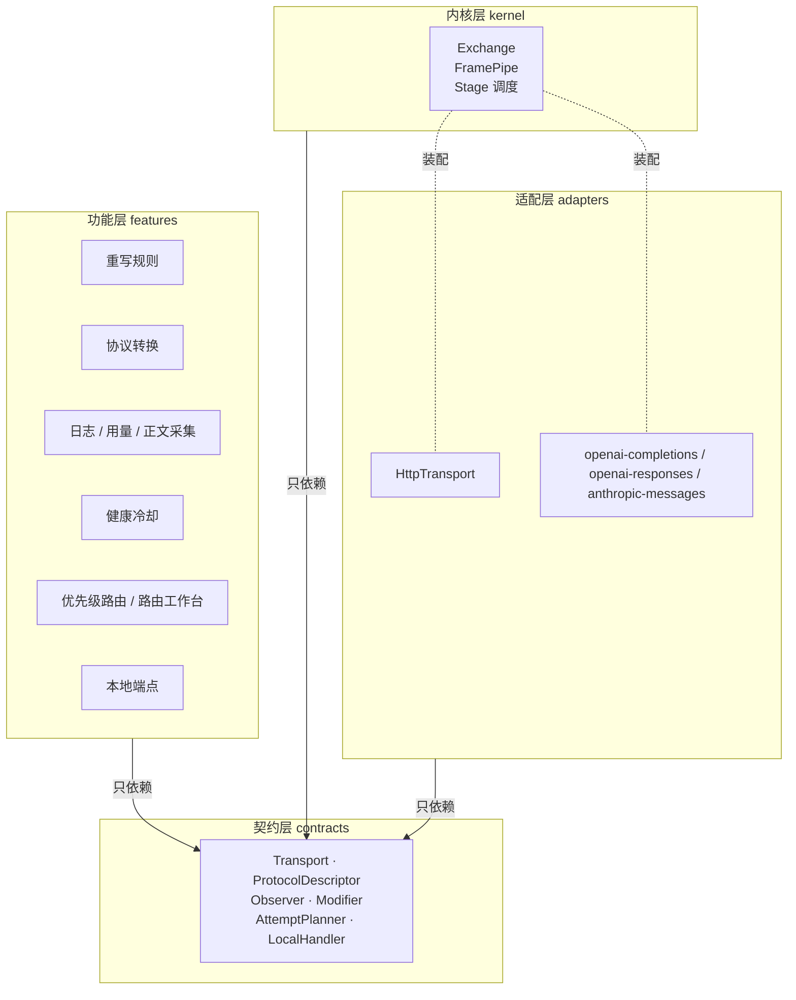
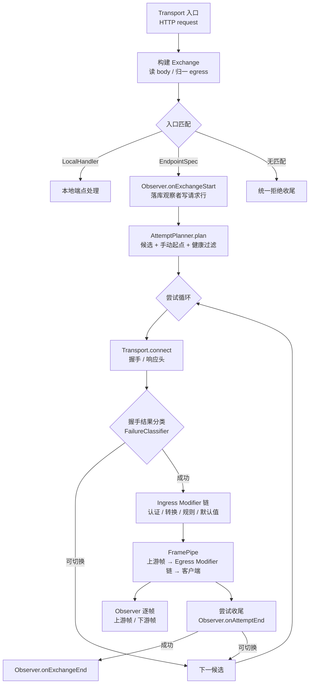

# 代理引擎设计：协议无关透传内核与扩展接口

## 定位

本文描述 `source/server/proxy` 的目标结构。核心是一套**协议无关的透传内核**：默认只搬运字节与帧，不解析任何报文；「我们自己的功能」（请求/响应重写、协议转换、日志、用量、正文采集、健康冷却、路由策略）一律以插件形式挂在**观察接口**与**修改接口**上。

传输方式（HTTP、未来的其他方式）与接口形态（`chat/completions`、`embeddings`、`messages`、`responses`……）都作为**数据声明**进入注册表，内核里不出现任何协议名或传输名。

### 不变式：忠诚转发，不自适应

代理对上游只做一件事——把客户端的请求原样转过去；对客户端只做一件事——**按客户端跳声明的传输形态**把响应转回去。它不替上游兜底，也不替客户端补足。

因此「上游回的和我预期的形状不一样」只能有一个结论：**上游违约**。它应当作为一次失败被记录、按切换策略处理，而不是被就地改造成一个看起来能用的响应。**唯一**允许解析并改写报文的例外是显式协议转换器，而它的介入由规划期的 `(clientProtocol, upstreamProtocol)` 决定，与上游实际回了什么无关。

这条约束的理由不是「实现不了」，而是**一旦允许自适应，转发路径就不再可判定**：同一个客户端请求会因为它被发到哪台机器而得到不同的报文语义、不同的改写结果、不同的落库字段。自适应把「代理的行为」变成了「上游的实现细节」的函数，于是所有基于代理行为的推理——缓存、重放、审计、规则试跑、回放对比——都不再成立。

与既有文档的关系：

- [proxy.md](./proxy.md) 定义当前**行为契约**（协议识别、候选路由、自动切换、流式边界）。行为契约不变，本文改的是「这些行为住在哪里」。
- [protocol-conversion.md](./protocol-conversion.md) 的转换矩阵，在本文里退化为 `ProtocolDescriptor.conversion` 声明 + 一个 `Modifier` 实现。
- [outbound-proxy.md](./outbound-proxy.md) 不介入本文：出站代理属于 `infrastructure/network`，传输层直接复用。

## 一、现状诊断

当前实现的职责划分（`execution` / `request` / `response` / `protocols` / `observability` / `routing` / `transports`）方向是对的，但**耦合点没有被约束住**。以下每条都能在代码里指到具体位置。

### 1.1 协议矩阵被表达了六次

同一个事实「某协议支持什么」写在六个互不知情的地方，加一个协议（如 Gemini）要同时改六处，漏一处就是运行时才暴露的错误：

| # | 位置 | 表达形式 | 状态 |
| --- | --- | --- | --- |
| 1 | `protocols/openai-completions/routes.ts` 等 3 个文件 | path → 协议（`router.post(...)`） | 已收敛：S2 删掉独立 `routes.ts`，S3a 改为接口 `endpoints[].match` |
| 2 | `protocols/openai-completions/registry.ts` 等 3 个文件 | `(client, endpoint)` → adapter | 已收敛：S2 移到单一 `protocols/registry.ts` |
| 3 | `protocols/registry.ts:20` `createAuthHeaders` | `switch (protocol)` | 已收敛：S2 改为 `PROTOCOL_AUTH_PRESETS`（住在 `@common/protocols`） |
| 4 | `protocols/shared/request-conversion.ts:18` | `if/else` 方向链 | 已收敛：S2b 改为 `requestDirections` 查表 |
| 5 | `protocols/shared/response-conversion.ts:71, 94` | `if/else` 方向链（非流式 + 流式各一条） | 已收敛：S2b 改为 `responseDirections` 查表 |
| 6 | `@common/protocols` `CONVERTIBLE_PROTOCOLS` | 转换能力矩阵（**已经是声明式，且渲染进程与管理端也在读**，保留为唯一来源） | 保留，并新增与第 4/5 条的双向一致性断言 |

第 3 条尤其说明问题：认证本该是协议的属性，却被从 adapter 里拎出来单独做了一个 `switch`，于是「一个协议」的知识分裂成 adapter 类 + switch 分支两份。第 6 条则说明：协议能力一旦要跨进程共用，就必须住在 `@common`，不能住在 `proxy` 里。

### 1.2 内核知道协议与传输细节

`execution/attempt-executor.ts` 单文件 34.8KB、`attemptRequest` 一个函数约 330 行，内部同时处理：健康分类、日志定稿、重写规则、协议转换、HTTP 请求构造、TTFT、用量、取消、切换。它 import 了 `node:http`、`node:url`、`protocolAdapters`、`getSecretStore`、`getSettings`、`listRulesForProviderModel`、`ResponsePipeline`——**内核与所有功能双向耦合**，因此它无法在没有真实上游的情况下被单独测试（测试只能整链路跑 `handleProxyRequest`）。

> **进展**：S3a 已把「协议细节」从内核移出（模型读取与传输形态解析改为经 `ProtocolEnvelope` 在入口解析一次）；S3b 已把 HTTP 细节关进 `transports/http.ts`；S5 把帧搬运下移到 `kernel/relay.ts`（72 行，≤200 行目标达成），执行器只剩候选循环。

### 1.3 观察是终点回调，不是订阅

`observability/hooks.ts` 只暴露三个回调：`onRequestStarted` / `onAttemptRecorded` / `onContentCaptured`，且都发生在**落库之后**，载荷只有 ID。结果是：

- 观察者**无法影响任何决策**（不能补字段、不能否决、不能提前介入）；
- 观察逻辑不是订阅，而是**内联在** `attempt-executor` 里的 6 处 `finalizeAttempt({...})`，每次手写 20 个字段；
- 「回调必须在落库之后」这个约束被写在注释里、靠调用顺序保证，而不是靠接口表达。

> **进展**：S5 已完成。观察者实现分两层：`observers/attempt-observer.ts` 是只读累加器（头/字节/usage/首字节时间），落库细节在 `execution/attempt-conclusion.ts`，两者都只依赖 `contracts/observer.ts`。

### 1.4 修改是两个硬编码调用点，不是接口

`applyRequestRewriteRules` 在 `attempt-executor.ts` 里被直接调用两次（请求方向、非流式响应方向），并且规则数据由执行器自己去查库（`listRulesForProviderModel(model.id)`）。同类问题还有：`stream_options.include_usage` 注入被塞在 `protocols/*/request-defaults.ts` 里、跟着 native adapter 走。

也就是说「功能基于接口实现」目前**不成立**：重写是具体函数 + 具体 SQL + 具体调用点三件套。

> **进展**：未动。`Modifier` 契约已在 `contracts/modifier.ts` 就位，实现随 S4。

### 1.5 传输是 HTTP 专有，且类型外泄

`URL`、`http.RequestOptions`、`IncomingHttpHeaders` 出现在执行器、`response/headers.ts`、`response/response-pipeline.ts` 中。响应管线的构造参数里有 `adapter.kind === 'conversion'` 判断——**内核在按协议模式分支**。

这正是双向传输的风险点：握手即路由、连接粒度的健康冷却、连接级观测、双向帧中继——如果连接类型没有被抽象，这些逻辑只能**在传输实现里重写一遍**，与 HTTP 路径形成第二套执行器。

> **进展**：S3b 已把 `http.IncomingMessage` / `http.RequestOptions` 关在 `transports/http.ts` 内部，`kernel/frame-pipe.ts` 只认 `Frame`；S5 把执行器里残留的 `node:url` / `http.RequestOptions` 一并迁出。

### 1.6 流式是一个布尔量

`isStreamingRequest(requestBody)` 解析请求体、`isStreaming = 客户端要求流式 && 上游返回 SSE`，然后整个响应方向都被这个布尔量分叉：非流式才允许重写（`streaming` 时规则直接 skip）、转换器按布尔量创建。结果是**流式响应既不能被观察（无逐帧事件）也不能被修改（规则被跳过）**，而这个限制是结构造成的，不是能力造成的。

> 上面这段描述的是**修改前**的形态：`isStreamingRequest` 与 `isStreaming` 这两个名字已从代码中删除（`grep isStreamingRequest` 现在只命中本文的历史叙述）。保留下文是为了说明「一个布尔量兼两个事实」为什么会派生出接下来这一节。

> **进展**：请求侧已解决——「这个接口会不会逐帧」现在是接口声明（`ProtocolEndpointSpec.envelope.resolveTransport`），入口解析一次后作为请求级事实传递，日志写入点不再解析正文。响应侧的 `isStreaming` 布尔随 S4 删除。

#### 1.6.1 一根轴：传输形态（2026-09-12 修正）

原设计里 `streamingRequest` 这个名字把两件事压成了一个布尔：**「这一跳用什么连接」** 与 **「客户端要不要边收边发」**。双向传输一旦出现就暴露了矛盾——一条长连接上既没有「HTTP 请求体里的 `stream` 字段」可解析，也不存在「上游是不是回了 SSE」的问题，却必须写一个 `streamingRequest: true` 才能让下游逻辑按预期走。

**第一次修正**（同日）把这两件事拆成了三个词：**载体**（`CarrierKind`：`http` / `websocket`，每一跳一个）、**交付方式**（`DeliveryMode`：`buffered` / `stream`，只在客户端跳）与 **传输**（`TransportKind`：`http` / `http-stream` / `websocket`，由 `resolveTransport(载体, 交付方式)` 现算的投影）。**那个三分法本身就是一次将就改造**，五处证据后来都指向「中间那一层没有内容」：

1. `routing/route-resolver.ts` 算出的 `RouteResolution.transport` **没有读者**——投影算完了没人要；
2. `contracts/modifier.ts` 的 `ModifierScope.carriers` 写了三段注释、**零处使用**；唯一真实的声明是 `response-modifiers.ts` 的 `scope: { deliveries: ['buffered'] }`，而它要表达的只是「整包才改写」；
3. 四个端点声明里 `envelopes` **各只有一个键**（`http`）——把一个单例写成了 map，只为了给一条还未存在的轴留位置；
4. `protocols/openai-responses/descriptor.ts` 的 `match` 里写了 `carrier: 'http'`，还配了一段注释为「未来的载体」辩护——匹配条件的取值是恒真的；
5. `contracts/delivery.ts` 整个文件就是 `export type { DeliveryMode }` 加 25 行论证「为什么 SSE 不能当载体」——一个只靠散文存在的契约。

**现在只有一根轴。** 「连接方式」不再是一个领域概念：它就是 **URL scheme**（`wss://` 就是 WebSocket），不需要一个跟着每一跳复制的枚举。

| 词 | 类型 | 取值 | 含义 | 从哪读出来 |
| --- | --- | --- | --- | --- |
| **协议** | `Protocol` | `openai-completions` / `openai-responses` / `anthropic-messages` | 报文怎么读 | 端点匹配（method + path） |
| **传输形态** | `TransportKind` | `http` / `http-stream` / `websocket` | 这一跳的字节在线上长什么样 | 客户端跳：封装描述；上游跳：URL scheme |

`TransportKind` 是**每一跳各自一个**的事实，两跳的读法不同但都不需要猜：

- **客户端跳**：入口认路径选出端点声明之后，读该端点的**唯一封装** `ProtocolEnvelope.resolveTransport(input)` —— 对 JSON 封装就是看请求体里的 `stream` 字段（`stream: true` → `http-stream`，否则 `http`）。它是**事实陈述**，不是凭印象写死的假设；返回取值而不是 `boolean`，调用方不必自己把 `true` 翻译成 `'http-stream'`，也就不会有两处翻得不一样。
- **上游跳**：`routing/upstream-url.ts` 的 `resolveUpstreamTransport(url, 客户端形态)` —— `wss://` / `ws://` 得 `websocket`，否则**镜像客户端跳**。镜像不是「客户端偏好决定上游」，而是**忠实转发**：我们原样把 `stream` 字段转发过去（`native-adapter.ts` 的 `prepareRequest` 只重写模型名），客户端要什么形态就发什么形态，上游该回什么由它自己那份请求决定。

**实现层怎么表达「连接方式」**：传输实现自己声明它服务哪几档——`transports/http.ts` 写 `transports: ['http', 'http-stream']`。这两档在建连、TLS、超时、abort、出网方式上**一字不差**（该文件全文不读响应头），差别只在响应体怎么分帧，而那是**封装**的属性。因此同一条 HTTP 实现天然覆盖两档，不需要两套执行器，也不存在「把增量需求漏进连接层」的机会。

`'websocket'` 是词表里**唯一一个「已声明但未实现」**的取值，所有拒绝点都收敛到传输注册表：`transports/registry.ts` 抛错（WebSocket 传输尚未实现，规划器不应产出 websocket 候选）、`runtime/proxy-runtime.ts` 回 `TRANSPORT_NOT_IMPLEMENTED`、`target-planner.ts` 用 `isWebSocketEndpoint()` 拒绝跨形态转换。保留它不为了兼容，而是为了**让拒绝有地方发生**——把不支持的形态写进词表，比让它以「解析失败」的形式出现更好查。

**两条硬约束**：

1. **客户端跳的形态不能喂给规划器**。客户端偏好从不改变哪个上游端点合法，客户端跳的取值只该留在客户端跳。这条曾经被违反过：`route.transport` 一路流进 `PlannerInput.transport` → `selectEndpoint` / `UpstreamTarget` 的形态字段，是一处**耦合缺陷**，已于 2026-09-12 断开——`PlannerInput` 不再有任何传输字段，`UpstreamTarget` 也只剩地址，上游形态在每次尝试前用 `resolveUpstreamTransport(target.url, context.transport)` 现算。
2. **响应头只能校验，不能决定做什么**。见 §1.6.2。

**预期与事实仍然分持**，只是各自的名字换了：

- `TransportKind`（客户端跳的 `exchange.transport`）：**预期**。客户端要整包还是增量，入口解析请求体时就已经定下；
- `isEventStreamResponse(headers)`：**事实**。上游响应的分帧格式（读 `content-type: text/event-stream`）。SSE 是**格式**，不是一种传输，因此判定留在帧层；
- **两者是否一致** → 一个**比较**的结果，而不是一个可被反复读取、可以常驻的合成量。

三类名字各不相同，因此不会互相顶替：

1. **客户端意图** → `TransportKind`（`ExchangeView.transport`、`RequestContext.transport`、`RequestLoggingInput.transport`）；
2. **上游格式** → `isEventStreamResponse(headers)`，只读响应头；
3. **两者是否一致** → `attempt-executor.ts` 里那一次比较（`context.transport === 'http-stream' && upstreamTransport !== 'http-stream'`），用完即弃。

**落库字段也按原本的名字落库**，不做投影、不留兼容别名（见 [data-model.md](./data-model.md)）：

- `request_logs.transport`：客户端跳的形态，即**预期**，原值落库，不再压成布尔；
- `request_attempts.upstreamTransport`：上游这一跳实际是什么形态，即**事实**，没拿到响应时为 `null`——因此「上游没回」与「上游回了整包」在库里是两件事。

改写规则试跑接口的 `testCase.transport` 同样是轴上的取值。旧字段（`request_logs.streaming` / `testCase.streaming`，以及随后短暂存在过的 `delivery` 一系）**直接删除，不迁数据**：`assertDatabaseIsSupported` 会拒绝任何带未知迁移记录的库，这是 preview 阶段的既定策略（见 [server-architecture.md](./server-architecture.md) 的「不保留兼容出口」）——比留一段一次性映射更省事，也更容易验证。

> **2026-09-12 修正**：本节早期版本把 `http-stream` 一概说成「不合法」，那是把几个词混成了一个。准确的说法是——`http-stream` 是这条**唯一**的轴上的一档合法且必要的取值（客户端可见，见上表第二行），但它不能当**规划器**的输入（上游形态由端点地址与客户端跳现算）。
>
> **已落地（2026-09-12，第二次）**：① `@common/schemas` 只保留 `TransportKind` / `ALL_TRANSPORT_KINDS`，`CarrierKind` / `DeliveryMode` / `ALL_CARRIER_KINDS` / `ALL_DELIVERY_MODES` / `resolveTransport` / `resolveDelivery` 全部删除；② `contracts/delivery.ts` 删除，`ProtocolEndpointSpec.envelopes`（一个 map）塌缩成单个 `envelope`，`RouteMatcher.carrier` 与 `Transport.carrier` / `UpstreamTarget.carrier` 一并删除，`Transport.transports` 取而代之；③ `ModifierScope.carriers` 换成 `transports`，内核的结构化 scope 直接排除不该跑的规则。

#### 1.6.2 预期与事实：响应头不能决定「做什么」（2026-09-12）

修正前，「客户端要 `stream` 而上游回了整包 JSON」不会报错，而是**被就地改造成一个看起来能用的响应**：转换修改器改走另一条分支（`accumulateWholeBody`），响应改写规则也跟着从「跳过」变成「介入」（判定里含 `isStreamingDelivery`）。也就是说，**同一个客户端请求会不会被改写规则改写，取决于上游回了什么**。

按「定位」里的不变式，这里只能有一个结论：上游违约，报错并按切换策略处理。理由不是「实现不了合成事件流」，而是**我们不该合成它**。

**已落地（2026-09-12）**：合成量 `isStreamingDelivery(delivery, headers)` **已从代码库删除**（不是降级成告警）。出口的分派依据只剩客户端跳的 `transport`（预期），响应头只用来选解析器与**校验**预期；两者不一致时该次尝试记 `transportMismatch` → 按切换策略换下一个候选，并打一条 `[proxy] transport mismatch …` 的告警。详见下面两处（调用点表与 §6 第 9 条）。

**为什么预期不是响应期才知道的。** 「客户端要整包还是增量」只在客户端跳存在，而上游跳根本没有这个声明——上游只会收到一个请求体。关键在于：我们**自己把 `stream` 字段转发过去**（`native-adapter.ts:13` 的 `prepareRequest` 只重写模型名，`stream` 原样透传），并且当我们转发 `stream: false` 时上游看到的就是 `stream: false`。因此：

| 客户端 `transport` | 我们转发给上游的 | 上游**应当**回的 | 上游回了另一个 |
| --- | --- | --- | --- |
| `http-stream` | `stream: true` | SSE 分帧 | 上游违约 |
| `http` | `stream: false` | 整包 JSON | 上游违约 |

两行对称：上游回了另一个，都是它没有按我们转发的请求作答。**没有哪一行需要代它兜底。** 于是：

- **预期**在规划期就定了（客户端 `transport` + 接口封装描述）；
- **事实**在响应期得到（`isEventStreamResponse(headers)`）；
- 响应头的唯一用途是**校验预期**，不是**决定做什么**。

**因此 `isStreamingDelivery(delivery, headers)` 在设计上就不该作为分派依据。** 它在每一个调用点上，正确的输入都是它的**某一个半边**，从来不是合成结果：

| 调用点 | 需要的其实 | 修正后的输入 |
| --- | --- | --- |
| `http-response-sink.ts` 出口是否边收边发 | 预期（客户端跳 `transport`） | 构造时传入的 `transport` ✅ |
| `attempt-observer.ts` 正文快照存什么形状 | 预期（客户端跳 `transport`） | `exchange.transport` ✅ |
| `downstream-head` 要不要删 `content-length` | 预期（客户端跳 `transport`） | `context.exchange.transport` ✅ |
| `response-rewrite` 规则要不要跳过 | 预期（客户端跳 `transport`） | 声明 `scope.transports: ['http']`，内核直接排除 ✅ |
| `protocol-conversion` 用哪个解析器 | 事实（`isEventStreamResponse`） | `isEventStreamResponse(head.headers)` ✅ |
| `request_attempts.upstreamTransport` 落库 | 事实（`isEventStreamResponse`） | `isEventStreamResponse(head.headers)` ✅ |

「预期落空」本身成了一个显式的失败状态：响应是 2xx、客户端声明 `http-stream`、而响应头不是 SSE 时，执行器记 `transportMismatch`，按 failover 换下一个候选，并按 `provider-model` 记一次健康失败（上游违约是上游的事，不该算成客户端的错，也不该算成这个模型「健康但没用」）。

于是「合成值唯一的用处是两者不一致时报错」这句话也可以收紧了：那个报错判定是**一次比较**，用完即弃，不需要有任何常驻的合成量。这也解释了 §6 第 6–8 条那三个症状（同一事实三个名字、被反例推翻的「永远同形」、格式函数叫行为名）为何集中出现：它们都是「用一个合成量代替两个可分辨的事实」的派生物。

### 1.7 入口匹配只支持 POST

`routing/router.ts` 的 `detectProtocolFromPath` 写死 `protocolRouter.match('POST', pathname)`，`HttpRouter` 用 `[path: string]: any` 的 Proxy 把 handler 当返回值用。后果：

- `GET` 形态的接口无法识别；
- WS 握手（`GET` + `Upgrade: websocket`）无法匹配；
- 本地端点（`/v1/models`）只能硬编码在 `runtime/proxy-runtime.ts` 的 `createServer` 里，无法成为可注册的插件。

> **进展**：S2c 已改为方法感知匹配 + 声明式本地端点；S3a 把匹配键扩展为声明式的接口条目，并在加载期拦住重复接口/重复入口声明。

**已修（S2c）**：入口唯一匹配器是 `detectProtocolFromRequest(method, path)`，POST 专有的 `detectProtocolFromPath` 包装被删除而非留作 shim；本地端点改为声明式注册（`proxy/local/`），`createServer` 只剩「生命周期 + 边界错误处理」。升级类入口（`GET` + `Upgrade`）此时已具备匹配前提；当前没有这样的入口落地。

`HttpRouter` 的 `[path: string]: any` Proxy 仍保留，但只服务于管理端路由的便捷写法；代理入口这条线上不再有代码依赖它取 handler。

### 1.8 拒绝路径重复五遍

`request-entry.ts` 里「识别不出路径 / 模型非法 / 无 default 逻辑模型 / 手动模型不可用 / 无可用候选」五条早退分支，各自手写约 20 行相同的「写错误响应 → 读 settings → 组记录 → 落库」。这段逻辑本该是「一次交换的统一收尾」。

**已修（S2c）**：五条分支各自收敛为一行 `reject(refusal, resolution)`，收尾逻辑集中在 `rejectExchange`（失败）/ `recordAbortedExchange`（中断）两个入口，二者共用 `openExchangeLogger`；请求级事实（method / path / headers / attributes / startedAt / hooks）只在 `handleProxyRequest` 里采集一次。

### 1.9 顺带发现：注释在写入时被截断

`routing/router.ts` 与 `execution/attempt-executor.ts` 共有 5 处注释被截断成非法 UTF-8（写作 `检测协议类\uFFFD` 这种形态，本文用转义而不是字符本身，否则这句话自己就会命中它）。仅注释、不影响运行，已在 S2 中一并修正：现在代码与文档里都搜不到该字符。

## 二、目标架构

### 2.1 分层



依赖规则：**箭头单向向上**。`contracts` 不依赖任何实现；`kernel` 不 import `node:http`、不 import 任何具体协议、不 import 数据库；`features` 不互相 import。

### 2.2 核心抽象

| 抽象 | 职责 | 现有功能落位 |
| --- | --- | --- |
| `Exchange` | 一次客户端交互的全部状态（请求、响应出口、协议、候选、尝试、扩展字段） | 取代 `RequestContext` + `request-entry` 的散装状态 |
| `Frame` | 唯一的搬运单位（head / data / end / error / close） | 取代「Buffer + SSE 字符串 + 布尔 isStreaming」 |
| `Transport` | 唯一的对外出口（HTTP 单工；双向由 `UpstreamConnection.outbound` 表达） | 取代 `response/transport.ts` |
| `ProtocolDescriptor` | 协议的声明式元数据（匹配、信封、认证、用量、转换能力） | 取代 6 处协议矩阵 + `createAuthHeaders` switch |
| `EndpointSpec` | **一个接口**的声明（如 `/v1/embeddings`） | 取代 `routes.ts` + `request-defaults.ts` |
| `Observer` | 只读观察接口（逐帧、逐尝试、逐交换） | 取代 `observability/hooks.ts` |
| `Modifier` | 读写修改接口（请求方向 / 响应方向，可选逐帧） | 取代重写规则、协议转换、认证注入、默认值注入 |
| `AttemptPlanner` | 产出候选序列（按上游端点的协议与地址筛选） | 取代 `routing/router.ts` + `routing/routing.ts` |
| `LocalHandler` | 本地端点，不透传上游 | 取代 `proxy-runtime.ts` 里硬编码的 `/v1/models` |

### 2.3 两根正交轴：Protocol × 传输形态

整套设计只有一个形状：

```
ingress(protocol, 客户端跳形态) ──protocol→protocol 转换──► egress(protocol, 上游跳形态)
```

**协议与传输形态是两根互不约束的轴**，中间只做协议到协议的转换，**没有形态到形态的转换**——上游地址是 `wss://` 就是 WebSocket，是 `https://` 就照客户端跳的形态转发；没有任何一步会把「增量」变成「整包」或反过来（那正是 §1.6.2 禁止的兜底行为）。

这个形状能成立，靠的是三件已经落地的事实：

1. **形态不进入接口身份**。一个接口声明的是一份封装（`EndpointSpec.envelope`），`EndpointSpec.id` 不随形态变。曾经想过用 `envelopes` 这个 map 让「一个接口在多种载体下各有一套封装」，并把载体写进 id（`responses` vs `responses-websocket`）——两个方向都是错的：四大接口**各自只声明了一份封装**，而把载体写进 id 会让「一个接口有两种载体」看起来像「两个接口」，每加一种载体就要复制一遍匹配、模型名位置、用量结构。map 已经塌缩成单值。
2. **形态不是匹配条件**（2026-09-12 修正）。`RouteMatcher` 只有 `(method, path)`。原因不是「入口拿不到形态」，而是**入口不需要它**：形态是它**读出来**的结果（`Envelope.resolveTransport` 读请求体），不是它用来筛接口的条件。同一个 `(method, path)` 上要收两种形态时，形态的差异由封装自己表达，不需要写两条规则。曾经把载体当匹配条件（`RouteMatcher.carrier`）的代价是：每个接口都要为「未来的载体」留一份恒真的声明，而**没有任何接口声明过 `http` 以外的载体**。
3. **内核只搬运**。`kernel/**` 里没有任何形态概念：`pipeFrames` 拿到的只是一个 `AsyncIterable<Frame>`，双向与否只体现为「有没有 `outbound`」。

#### 2.3.1 两跳各算各的形态（2026-09-12）

形态是**每一跳各自的事实**，两跳各有各的来源：

- **客户端跳**：入口认路径选出 `EndpointSpec` 之后，读它的封装 `resolveTransport(input)`（JSON 封装看请求体里的 `stream`）；
- **上游跳**：`resolveUpstreamTransport(target.url, 客户端跳形态)`——`wss://` 得 `websocket`，否则镜像客户端跳。

**上游目标上不存形态。** `UpstreamTarget` 只有地址，没有形态字段：形态是每次尝试前现算的，存一份只会多一个会漂移的副本。规划器唯一需要知道的形态事实是「这个端点的地址是不是 WS」（`isWebSocketEndpoint`），用来拒绝跨形态的协议转换。

**曾经有一条客户端→上游的取值链，值得记下来**：

```
route.transport（客户端跳）
  → planLandingTargets
  → PlannerInput.transport
  → selectEndpoint / UpstreamTarget 的形态字段（上游跳）
```

它的症状是「同一件事两个来源」的典型：调用方在路由上下文里声明了非 HTTP 的形态，上游侧就跟着变成那一档——规划器拒掉所有非原生候选，原生候选产出一个 WS 目标，接着 `transports/registry.ts` 抛「WebSocket 传输尚未实现」。**错误信息指向规划器，值却来自客户端。**

**已修（2026-09-12）**：修法不是加一层校验，而是把这个字段从输入端删掉——`PlannerInput` 现在只有 `logicalModelId` / `clientProtocol` / `manualModelId`，上游形态由端点**自己配置的地址**与客户端跳现算。客户端偏好从此在类型上就没有到达上游侧的路。

出口侧的原子不是「协议」也不是「形态」，而是**地址与协议这一组事实**：`(protocol, url)`。这一点在 `UpstreamTarget` 上直接可见——规划器产出这两个字段，执行器据此去 `transports/registry.ts` 取实现。协议唯一决定的是**转换可行性**（只放行原生支持该协议的候选），不决定**内容**。

因此「新增一种传输形态」的全部代价是：扩展 `@common/schemas` 的词表 + 实现 `Transport` 接口（用 `transports: [...]` 声明它服务哪几档）+ 在 `transports/registry.ts` 里加一个分支。内核、协议、修改器、观察者都不需要改。

> 这套判断在代码里有逐字的落地说明，改之前先读：`contracts/transport.ts`（`outbound` 存在即双向、`transports` 是能力声明）、`contracts/route-matcher.ts`（为什么形态不是匹配条件）、`kernel/relay.ts`（双向交换复用单工尝试的收尾规则）。

## 三、契约定义

以下为 `source/server/proxy/contracts/` 应包含的全部类型。类型定义即为接口文档，实现不得扩张契约。

> 本节已随 S1/S3a 全部落地：`contracts/frame.ts`、`exchange.ts`、`transport.ts`、`modifier.ts`、`observer.ts`、`protocol.ts`、`planner.ts`、`local-handler.ts`、`route-matcher.ts`、`headers.ts`（+ `index.ts` barrel）。
> S8–S11 补齐了「协议身份与连接形态解耦、客户端跳形态成为一等事实、形态→实现唯一映射」这三件事，并顺手补齐了 `ModifierScope` 与 `ModifierFrameMode` 的 `'skip'`。
> **2026-09-12 两次修正**：第一次把混用的 `TransportKind` 拆成载体 / 交付方式 / 传输三根轴，并为此新增了一个 `contracts/delivery.ts`；第二次把三根轴并回**一根** `TransportKind` 并删掉 `contracts/delivery.ts`（§1.6.1）。因此契约名单里**不再有 `delivery.ts`**，`ExchangeView.transport` 就是客户端跳的传输形态，也是全仓唯一的传输字段名。
> 依赖方向是硬的：实现只 import `@server/proxy/contracts`，契约层不 import 任何实现。下方代码块保留为设计原稿，字段以代码为准。

### 3.1 Frame：唯一的搬运单位

```ts
/** 传输层搬运动作的最小单位。HTTP 与 WS 都归一到这五种。 */
export type Frame =
  /** 响应头 / 握手结果。HTTP 是 status+headers，WS 是 upgrade 结果。 */
  | { kind: 'head', status: number, headers: HeaderMap }
  /** 数据。永远是字节，不做编码假设；text 仅供需要解析的 Modifier 懒解码。 */
  | { kind: 'data', body: Buffer }
  /** 正常结束。 */
  | { kind: 'end' }
  /** 传输层错误。 */
  | { kind: 'error', error: Error }
  /** 对端关闭（WS 的 close 帧）。 */
  | { kind: 'close', code?: number, reason?: string }
```

约束：

- 内核**只做** `upstream.frames → egress` 的搬运；不解析 `data.body`。
- 唯一的解析入口是 `Modifier`。没有匹配的 Modifier 时，字节原样过去——这就是「零协议转换」原则在结构上的落地。
- 二进制安全：`Buffer` 不做任何 `toString('utf8')`，避免当前实现对非文本流（图片、音频）的隐性破坏。

### 3.2 Transport：唯一的出口

```ts
export interface UpstreamTarget {
  /** 端点标识，来自 EndpointSpec。 */
  endpointId: string
  protocol: Protocol
  url: string                       // 上游形态由地址 scheme 与客户端跳现算，不存在这里
  credentialRef: string | null
  customAuthHeader: string | null
  timeoutMilliseconds: number
}

export interface UpstreamConnection {
  /** 上游帧。HTTP 为 head/data*/end，WS 为持续的双向帧。 */
  readonly frames: AsyncIterable<Frame>
  /** 写入侧。只有双向传输提供，HTTP 不提供——「HTTP 是单工」因此是类型事实而不是约定。 */
  readonly outbound?: FrameSink
  /** 主动断开。幂等：内核保证一条连接只被 abort 一次。 */
  abort(): void
}

export interface Transport {
  /** 这个实现服务哪几档传输形态。分支的唯一处是 `transports/registry.ts`。 */
  readonly transports: readonly TransportKind[]
  connect(target: UpstreamTarget, exchange: ExchangeView, attempt: AttemptView): Promise<UpstreamConnection>
}
```

要点：

- **`connect` 是唯一需要实现的出口**。HTTP 实现返回没有 `outbound` 的连接；双向传输（当前未实现）返回带 `outbound` 的连接。内核不区分两者，只按「有没有 `outbound`」决定要不要跑反向管道。
- **`UpstreamTarget` 上不存形态**：形态是每次尝试前用 `resolveUpstreamTransport(target.url, 客户端跳形态)` 现算的，存一份只会多一个会漂移的副本。执行器据此去 `transports/registry.ts` 取实现（`resolveTransportImplementation`）——它没有权利自己选传输实现，那会把一个已声明的字段变成装饰。
- **一个实现可以服务多档**：`transports/http.ts` 写 `transports: ['http', 'http-stream']`，因为这两档在建连、TLS、超时、abort、出网方式上一字不差（实现全文不读响应头）。能力写在类型上，注册表不必再去比对一次。
- 能力声明不在 `Transport` 上：规划器判断「这个候选能不能服务这条入口」用的是 `EndpointSpec.envelope` 与 `resolveUpstreamTransport`，不是传输实现的字段。声明与实现分离，规划因此不需要实例化任何传输。
- 出站代理（[outbound-proxy.md](./outbound-proxy.md)）、TLS、DNS、空闲超时全部收在传输实现内，内核不知道它们存在。

### 3.3 ProtocolDescriptor 与 EndpointSpec：协议是数据

```ts
export interface ProtocolDescriptor {
  readonly id: Protocol
  /** 入口路由：方法 + 路径。S2 已落地，注册表用它做协议识别。 */
  readonly routes: readonly ProtocolRoute[]
  /** 构造该协议的全部适配器。S2 已落地。 */
  createAdapters(): readonly ProtocolAdapter[]
  /**
   * 逐接口声明。S2 只用到 routes 承担入口匹配，envelope 在 S3 落地。
   * 认证与转换能力不在这里重复声明：它们必须被代理、管理端与渲染进程共用，
   * 因此住在 @common/protocols（PROTOCOL_AUTH_PRESETS / CONVERTIBLE_PROTOCOLS），
   * 注册表按 id 转发；目标形态是 auth(input) / convertibleTo / usage / failure。
   */
  readonly endpoints?: readonly EndpointSpec[]
}

/**
 * 一个接口。注意粒度是「接口」而不是「协议」：
 * /v1/chat/completions 与 /v1/embeddings 同属 openai-completions，
 * 但信封（模型名位置、流式语义、usage 结构）不同。
 */
export interface EndpointSpec {
  readonly id: string                     // 'openai-completions.chat'
  /** 入口匹配。支持方法、路径模式、必需的 header。 */
  readonly match: readonly RouteMatcher[]
  /** 该类请求的默认修改器（如 stream 请求注入 include_usage）。 */
  readonly modifiers?: readonly ModifierRef[]
  /** 该接口的请求封装。一对一，不是 map：形态的差别在响应体怎么分帧，不在请求封装。 */
  readonly envelope: ProtocolEnvelope
}

export interface RouteMatcher {
  method: HttpMethod | '*'
  path: string | RegExp
  /**
   * 额外条件（如必需的 header）。
   *
   * **没有形态字段**：入口不需要用它筛接口——形态是入口读出来的结果
   * （`Envelope.resolveTransport`），不是筛选条件。同一个 `(method, path)` 上要收两种
   * 形态时，差异由封装自己表达，不需要写两条规则。
   */
  headers?: Readonly<Record<string, string | RegExp>>
}

/**
 * 封装：协议与接口的差异，全部收敛到这三个问题。
 *
 * 注意这里**只有请求侧的形态、没有「响应是否流式」**：上游响应分帧是帧层的事实，
 * 与协议无关，任何一个封装描述都不该重复实现一遍（原 `isStreamingResponse` 已删）。
 */
export interface ProtocolEnvelope {
  /** 报文编码。binary 的封装不允许默认值注入与 JSON 改写。 */
  readonly body: 'json' | 'binary'
  /** 客户端想用的模型名在哪里？（body.model / path 段 / header）读不到返回失败原因，而不是 null。 */
  readModel(input: EnvelopeInput): ProtocolModelReadResult
  /** 把模型名写回去。HTTP 写 body，Gemini 类走 path 的接口写 url。 */
  writeModel(input: EnvelopeInput, modelName: string): EnvelopeWriteResult
  /**
   * 本次请求在**客户端跳**的传输形态（`TransportKind`）。
   * 返回轴上的取值而非 boolean：调用方直接把它当作请求级事实往下传。
   */
  resolveTransport(input: EnvelopeInput): TransportKind
}
```

`ProtocolEnvelope` 是「各种接口的支持」的落点：新增一个接口 = 新增一个 `EndpointSpec`（声明匹配、模型名位置、形态解析），不需要动内核，也不需要改其他协议。

### 3.4 Observer：观察接口

```ts
export interface Observer {
  readonly id: string
  /** 执行顺序，小的先。落库型观察者用小值，依赖落库结果的观察者用大值。 */
  readonly order?: number

  onExchangeStart?(event: { exchange: ExchangeView }): void | Promise<void>
  onAttemptStart?(event: { exchange: ExchangeView, attempt: AttemptView }): void | Promise<void>
  onUpstreamFrame?(event: { exchange: ExchangeView, attempt: AttemptView, frame: Frame }): void | Promise<void>
  onDownstreamFrame?(event: { exchange: ExchangeView, attempt: AttemptView, frame: Frame }): void | Promise<void>
  onAttemptEnd?(event: { exchange: ExchangeView, attempt: AttemptView, result: AttemptResult }): void | Promise<void>
  onExchangeEnd?(event: { exchange: ExchangeView, result: ExchangeResult }): void | Promise<void>
}
```

契约（必须由内核强制，不能靠约定）：

1. **只读**。载荷里的 `ExchangeView` / `AttemptView` 是冻结视图，不含可变的 headers 与 body 引用。观察者想改内容必须去写 `Modifier`，从类型上就区分开。
2. **错误隔离**。观察者抛错只记 `console.error`，绝不改变请求结果。观察能力失效不能导致代理不可用。
3. **不阻塞主链**。`onUpstreamFrame` / `onDownstreamFrame` 的返回值不与数据流背压挂钩；需要保证「已落库」的消费者用 `order` 排在落库观察者之后。
4. **落库责任自持**。当前「回调必须在落库之后」这一条由 `LoggingObserver.onExchangeStart` 自己保证：它先写请求行，再把 ID 放进 `exchange.state`，后续观察者读 `state` 而不是再回查数据库是否存在。

现有观察能力的落位：`observers/request-log.ts`（请求行）、`observers/attempt-log.ts`（尝试行）、`observers/content-capture.ts`（正文）、`observers/usage.ts`（用量）、`observers/health.ts`（成功/失败计数）、`observers/live-tail.ts`（管理端实时订阅）。

### 3.5 Modifier：修改接口

```ts
export type ModifierDirection = 'ingress' | 'egress'

/** 修改器在数据流上的工作方式。它决定了内核是否为它缓冲。 */
export type ModifierFrameMode =
  /** 只处理完整报文。内核会把流缓冲成一个 Buffer 再交给它。 */
  | 'buffered'
  /** 逐帧处理。真正支持流式改写的方式。 */
  | 'frame'
  /**
   * 本传输/接口下不参与。
   *
   * 这是**声明性**的：内核按它排除该修改器，观察者据此记「本规则在本传输下未生效」。
   * 它与「`match` 返回 false」的区别在语义而不在效果——前者说「这里根本没有它能做的事」，
   * 后者说「这次请求不满足它的条件」。
   */
  | 'skip'

export interface Modifier {
  readonly id: string
  readonly direction: ModifierDirection
  readonly frameMode: ModifierFrameMode
  readonly order?: number

  match(ctx: ModifierContext): boolean

  /** frameMode === 'buffered' 时调用。返回 null 表示不改。 */
  applyBuffered?(ctx: ModifierContext, payload: BufferedPayload): BufferedPayload | null | Promise<BufferedPayload | null>

  /** frameMode === 'frame' 时调用。返回 null 表示丢弃该帧，返回数组表示展开。 */
  applyFrame?(ctx: ModifierContext, frame: Frame): Frame | readonly Frame[] | null | Promise<Frame | readonly Frame[] | null>
}

export interface ModifierContext {
  exchange: ExchangeView
  attempt: AttemptView
  direction: ModifierDirection
  /** 上游响应头。null 表示还没拿到响应。它只用来选解析器与校验预期（§1.6.2）。 */
  upstreamHead: HeadFrame | null
  /** 本次修改器负责的协议对。协议转换器用得到，普通修改器可忽略。 */
  protocols: { client: Protocol, upstream: Protocol }
}

/** 修改器声明的适用范围。声明式：内核按它排除，修改器自己不必再判断。 */
export interface ModifierScope {
  /** **客户端跳**的传输形态。省略表示不限。 */
  readonly transports?: readonly TransportKind[]
}
```

设计要点：

1. **`frameMode` 决定是否缓冲**。内核的策略是：只有当「有匹配的 `buffered` 修改器」时才把流收成一个 Buffer。没有匹配者时数据**逐帧透传**，不做任何聚合——这直接继承了 `proxy.md` 的「流式不缓冲」原则，并且把当前「流式一律 skip 规则」的硬限制变成了**每个规则自己声明能力**。
2. **`frame` 是流式改写与流式转换的统一形式**。当前 `StreamConverter { push, flush, finish }` 增量解析 SSE 的做法，落位为一个 `frameMode: 'frame'` 的转换修改器，内部状态由它自己持有。
3. **失败语义显式**。修改器抛错 → 内核产出带 `modifierId` 的 `ModifierError`；由 `AttemptPlanner` / 切换策略决定「本次尝试失败并切换」还是「直接回客户端 4xx」。当前 `RequestRewriteError` 被硬编码成 422 的分支（`attempt-executor.ts` 的 `onError`），就是这个语义被写死在内核里的后果。
4. **`skip` 必须显式声明而不是静默跳过**。观察者需要知道「本规则在本形态下未生效」，才能如实写日志。
5. **修改器不得用上游响应头决定「做什么」**。响应头只能用来选**解析器**（手里这堆字节是 SSE 还是整包 JSON），不能用来决定形态、能不能改写、要不要跳过。一旦允许，改写规则是否生效就变成了上游实现细节的函数——同一条规则、同一个请求，换台机器结果不同（见 §1.6.2）。需要按形态分流时读 `context.exchange.transport`（**预期**），需要确认上游是否兑现时读 `context.upstreamHead`（**事实**），两者不一致是失败，不是分支。
6. **能排除的形态是声明出来的**。`ModifierScope.transports` 是静态能力声明：内核在选候选时就按它排除，修改器自己不必再判断这根轴——这正是「hooks 基于 protocol 与 transport 处理数据，且不需要自己去判断」的落地方式。它与 `match` 的分工是语义而不是效果：前者说「这种形态下根本没有它能做的事」（结论要进日志），后者说「这一条请求不满足它的条件」。今天只有 `response-rewrite` 声明了 `scope: { transports: ['http'] }`——说的就是「只有整包那一档才有它能做的事」；请求侧的三个修改器都不声明，因为形态说的是响应怎么回来，而请求总是整份读完再发，没有哪个形态能让他们无事可做。
现有修改能力的落位：`modifiers/auth.ts`（认证头注入）、`modifiers/endpoint-defaults.ts`（`include_usage` 等接口默认值）、`modifiers/protocol-conversion.ts`（协议转换，一对 ingress/egress）、`modifiers/rewrite-rules.ts`（请求重写规则，`buffered` 或 `frame`）。

### 3.6 AttemptPlanner 与 LocalHandler：两个装配点

```ts
export interface AttemptPlanner {
  readonly id: string
  plan(input: {
    exchange: ExchangeView
    logicalModelId: string
    /** 本次交换的客户端跳形态（§1.6.1）。上游形态由端点地址与它现算，不在这里。 */
    transport: TransportKind
    /** 允许的协议对：客户端协议 + 可转换到的协议。 */
    acceptedProtocols: readonly Protocol[]
  }): Promise<PlanResult>
}

export interface PlanResult {
  targets: readonly UpstreamTarget[]
  /** 无法成行时的原因，用于生成客户端错误信息，不再靠调用方拼字符串。 */
  rejection?: { code: string, message: string }
}
```

- 今天的 `resolveProxyTargets`（优先级排序 + 手动切换 + 健康过滤）成为 `planners/target-planner.ts`。
- 冷却状态不再由 planner 之外的观察者回写数据库后靠下一次 `getAvailableModels` 读到，而是 `planners/target-planner` 查询 + `observers/health` 记录，两者通过 `health-store` 解耦。（**未做**：健康冷却仍由 `routing/router` 读、`upstream/health` 写，规划器只消费 `getAvailableModels` 的结果。）
- [route-design.md](./route-design.md) / [workflow-engine.md](./workflow-engine.md) 的路由工作台成为 `planners/workflow-planner.ts`，**不 fork 引擎**。

**已落（S7，形态比上面的草案更窄）**：上面那版 `plan({ exchange, acceptedProtocols })` 是 S1 之前的设想，实际落地为：

```ts
export interface PlannerInput {
  readonly logicalModelId: string
  readonly clientProtocol: Protocol
  readonly manualModelId: string | null
}

export interface PlanResult {
  readonly targets: readonly UpstreamTarget[]
  readonly reason: 'none' | 'model-not-configured' | 'manual-model-unavailable' | 'no-available-provider'
  /** 候选为空时的用户可见说明；入口用它拼错误信息，不再自己猜原因。 */
  readonly detail?: string
}
```

- 传入 `manualModelId` 而不是让入口先去 `routing/router` 过滤：手动锁定是路由决策，不是请求解析。
- 传入 `clientProtocol` 而不是让入口自己先筛一遍端点：入口因此不必知道「哪种协议下哪些端点合法」——那是注册表与规划器的职责，规划器只消费结论。「可转换端点不能指向 WS 地址」这一条也留在规划器里（`isWebSocketEndpoint`），因为那是上游侧的事实，入口没有资格替它决定。WS 与「可转换」不相容的原因不是能力不足，而是**跨形态转换不在支持范围内**：我们只做协议→协议的转换，不做形态→形态的转换。
- `detail` 让「为什么没有候选」的措辞只有一处（入口原来自己拼 `configuredProtocols` 那段）。
- 执行器不再接触 `ProviderModel/Provider`：`attempt-executor.ts` / `request-finalizer.ts` 全部改为消费 `UpstreamTarget`，`resolveAttemptSnapshot`（每次尝试投影）与 `resolveEndpointId`（模型端点标识）分别迁入 `observability/attempt-log-collector.ts` 的 `toAttemptSnapshot()` 与规划器。
- `resolveUpstreamUrl` 从 `request/request.ts` 迁到 `routing/upstream-url.ts`；`routing/routing.ts` 与 `request/request.ts` 整体删除。
- `buildUpstreamTarget()` 对外开第二个口：设置页的「测试连接」只有一个模型要测、没有候选可排，与批量规划共用同一处字段映射。
- **同批修正（§1.6.1）**：`ExchangeView.streamingRequest: boolean` → `ExchangeView.transport`。规划器看不见也不需要看见 `stream: true`，因此「客户端偏好」的取值绝不能变成路由输入；把它做成一根显式命名的轴（而非布尔），是让这件事从字面上就能看出来。注意它**只在客户端跳**：上游跳的形态由 `resolveUpstreamTransport` 从地址现算，不进 `PlannerInput`（§2.3.1）。

```ts
export interface LocalHandler {
  readonly id: string
  readonly match: readonly RouteMatcher[]
  handle(exchange: ExchangeView, egress: EgressWriter): Promise<void>
}
```

- `/v1/models` 成为 `local-handlers/models.ts`；未来的 `/healthz`、`/metrics`、`/v1/live` 同样注册即可。
- 内核的入口匹配一次做完：先匹配 `LocalHandler`，再匹配 `EndpointSpec`，都不中才回 404（且走统一的拒绝收尾）。

**已修（S2c，缩小形态）**：本地端点已按「声明式注册」落地为 `proxy/local/` 的 `LocalEndpoint { method, path, handle(input) }`，`/v1/models` 是它的第一个用户，`runtime/proxy-runtime.ts` 不再出现任何路径字面量。上面那版 `LocalHandler`（`match: RouteMatcher[]` + `ExchangeView/EgressWriter`）是 S3 之后的目标形态：等 `Exchange` 与 `EgressWriter` 真的存在，`LocalEndpoint.handle` 的入参从 `{ request, response }` 换成它们即可，声明与匹配部分不需要再动。

## 四、一次请求的执行流



这次重构消除的关键差异（全部已落地，保留作回溯）：

| 关注点 | 重构前 | 重构后 |
| --- | --- | --- |
| 缓冲决策 | 全局 `isStreaming` 布尔，流式一律不改 | 由匹配的 `Modifier.frameMode` 与 `ModifierScope` 决定，逐帧透传是默认 |
| 协议分叉 | `adapter.kind === 'conversion'` 判断渗透到响应管线 | 内核无协议分支；转换只是一个 Modifier |
| 观察时机 | 仅在终点，且只在落库后 | 交换开始 / 尝试开始 / 每帧 / 尝试结束 / 交换结束 |
| 拒绝收尾 | 入口 5 处 + 执行器 3 处手写 | 一个 `finalizeExchange(exchange, outcome)` |
| 双向传输（如 WS） | 需要在执行器之外重写一套搬运 | 换 `Transport`（`outbound` 存在即双向）；**搬运**共用内核，同一条入口链可复用 |

双向传输的能力仍预留在内核里，但**没有实现，也不在当前计划内**：

| 预留点 | 位置 | 说明 |
| --- | --- | --- |
| 词表取值 | `@common/schemas` 的 `TransportKind` | `'websocket'` 是已声明的取值，但没有任何传输实现声明服务它 |
| 双向插座 | `contracts/transport.ts` 的 `UpstreamConnection.outbound` | 存在即双向；HTTP 不提供，所以「HTTP 是单工」是类型事实而不是约定 |
| 双向搬运与收尾 | `kernel/relay.ts` 的 `relayConnected` | 与单工的 `relayAttempt` 共用 `runRelay`，统一处理「谁先结束」（`firstEnded`）、反向摘要（`inbound`）与「上游只断一次」；当前没有生产调用者（测试在 `kernel/relay.test.ts`） |
| 未实现传输的显式拒绝 | `transports/registry.ts` | 没有实现声明服务 `'websocket'` 时直接抛错，不静默回退到 HTTP——静默回退会拿一个 WS 地址去发 HTTP 请求 |
| 升级请求的显式拒绝 | `runtime/proxy-runtime.ts` | `server.on('upgrade')` 回 501 `TRANSPORT_NOT_IMPLEMENTED`（`UNSUPPORTED_TRANSPORT_RESPONSE`）；不注册监听器会让 Node 直接销毁 socket，客户端只能看到「连接失败」 |

保留这五处的代价只有注释与一个永不触发的分支；收益是将来真要加一条双向传输时，`proxy/kernel/**` 不需要改写搬运与收尾规则。

## 五、迁移计划

原则：**每阶段独立可发布、可回滚、测试全绿**，不留双读双写与兼容 facade（遵循 [server-architecture.md](./server-architecture.md) 的「不保留兼容出口」）。

### 实现进度

| 阶段 | 状态 | 说明 |
| --- | --- | --- |
| S1 | 完成 | `proxy/contracts/` 已按 §3.1–3.6 落地为纯类型（10 个文件 + barrel）：`Frame`/`FrameSink`、`Transport`/`UpstreamTarget`/`UpstreamConnection`、`ProtocolDescriptor`/`ProtocolEndpointSpec`/`ProtocolEnvelope`、`Observer`、`Modifier`、`AttemptPlanner`、`LocalHandler`、`RouteMatcher`。所有实现只依赖 `@server/proxy/contracts`，契约层不依赖任何实现 |
| S2 | 完成 | 协议矩阵 6 → 1；认证规则移入 `@common/protocols`，管理端不再 import 代理内部 |
| S2b | 完成 | `request-conversion.ts` / `response-conversion.ts` 的方向 `if/else` 收敛为 `protocols/shared/conversion-registry.ts`，并新增「注册表 ⇔ 可转换矩阵」一致性断言（§1.1 第 4、5 行） |
| S2c | 完成 | 入口匹配改为方法感知（§1.7）；拒绝路径收敛为一次交换的统一收尾（§1.8）；`/v1/models` 从 `createServer` 硬编码改为声明式本地端点（§1.7 第三条推论） |
| S3a | 完成 | 协议从「代码」变成「数据 + 声明」：描述符改为 `endpoints: ProtocolEndpointSpec[]`，每个接口声明一份 `envelope`；注册表改为 `(method, path) → { protocol, endpointId, envelope }`；模型读取与形态解析从 `request.ts` 移入 `ProtocolEnvelope`（§1.2、§1.6 前半）。**2026-09-12 复述**：本条原文写的是「每个接口按载体声明 `envelopes`」与「注册表键含 `carrier`」，那两根载体轴已删除 |
| S3b | 完成（与 S4 合并交付） | 传输层与搬运循环已落地（`transports/http.ts`、`kernel/frame-pipe.ts`，含 15 个新测试）；原 `response/response-pipeline.ts` 已拆成请求侧与响应侧 Modifier 链，`isStreaming` 布尔随 S4 一并删除 |
| S4 | 完成 | 六个修改器 + 观察者 + 执行器重写；`adapter.kind === 'conversion'` 分支与 `request-defaults.ts` 的适配器内嵌删除 |
| S5 | 完成 | 观察能力落位为 Observer（`observers/`）；帧搬运下移到 `kernel/relay.ts`（72 行），`attempt-executor.ts` 瘦身到 269 行且只剩「逐个候选编排 + 收尾」（见下方偏差说明） |
| S6 | 已取消 | ~~WS 传输落地~~——当前不计划实现 Responses API 的 WS 接口，其入口与传输实现（`transports/websocket.ts`、`transports/websocket-server-socket.ts`、`request/websocket-entry.ts`、`protocols/shared/websocket-envelope.ts`）已从代码库移除。内核侧的传输轴与双向搬运能力保留（见 §四末表） |
| S7 | 完成 | 路由决策集中到唯一的 `planners/target-planner.ts`：入口只传「逻辑模型 + 客户端协议 + 手动锁定」，拿回有序 `UpstreamTarget[]` 与「为什么没有候选」的 `reason`/`detail`。执行器、收尾器、观测与传输层从此只见 `UpstreamTarget`，不再回查端点。`resolveProxyTargets` / `resolveAttemptSnapshot` / `resolveEndpointId` 三个旧出口全部消失 |
| S8 | 完成 | 接口身份与「连接形态」解耦：同一个路径上的多种形态**合并为一个** interface——`openai-responses` 的 `responses` 与 `responses-websocket` 两个 endpoint 合并为一个 `responses`。**2026-09-12 复述**：当时用的手段是在 `RouteMatcher` 上摆一个 `carrier?` 匹配条件，并让注册表按 `(method, path, carrier)` 匹配；那根载体轴已删除（§2.3 第 2 条），接口身份与形态解耦这个结论不变 |
| S9 | 完成 | 客户端跳的形态成为显式的一等事实：`ExchangeView.transport`、`RequestContext.transport`，入口从封装描述写入。修改器不必再从别处推断自己跑在哪一档形态上。**2026-09-12 复述**：这条事实当时的名字是 `transport`，轴拆开后曾改叫 `carrier`，并回退到 `transport`；`ModifierContext` 不再带一份副本，修改器读 `context.exchange.transport` |
| S10 | 完成（能力保留） | 双向搬运收进唯一内核：`kernel/relay.ts` 提供 `relayAttempt`（单工尝试）与 `relayConnected`（已建连的双向交换），后者统一处理「谁先结束」（`firstEnded`）、反向摘要（`inbound`）与「上游只断一次」不变式。WS 入口移除后 `relayConnected` 暂无生产调用者，作为未来的双向传输能力保留 |
| S11 | 完成 | 「传输形态 → 传输实现」收敛到唯一一处 `transports/registry.ts` 的 `resolveTransportImplementation`；执行器不再写死 `createHttpTransport`，而是按 `resolveUpstreamTransport(target.url, exchange.transport)` 取实现。新增形态的代价因此固定为「扩展词表 + 实现 `Transport`（用 `transports: [...]` 声明服务哪几档）+ 加一个分支」（§2.3 末段） |

#### S5 的两处偏差

验收标准里写的「`attempt-executor.ts` 删除，`kernel/relay.ts` ≤200 行」只完成了后半句，且这是刻意的：

- **`kernel/relay.ts` 只负责一次 attempt**（建连 → 请求侧修改器 → `pipeFrames` → 结果归类），不知道候选、不知道重试。它放在 `kernel/` 是因为它就是「搬运」本身，不持有任何协议/传输知识。
- **`attempt-executor.ts` 保留为编排层**（循环候选、调用传输、接入观察者与落库），放在 `execution/`。它的 269 行里绝大部分是“让下一次尝试发生”的判断（哪些错误能切换、何时该停下来）；把这些塞进 `kernel/` 反而会把候选决策漏进内核，与 _S7 要把候选决策集中到 `AttemptPlanner`_ 的方向相反。

#### S3b 为什么与 S4 合并交付（回溯）

合并交付前，`attempt-executor.ts` 把上游响应喂给 `ResponsePipeline`，而 `ResponsePipeline` 同时承担两件事：**协议转换**（`adapter.kind === 'conversion'` 分支）与**缓冲/转发**。
只把传输换成帧循环、留下 `ResponsePipeline`，等于在帧管道的下游又接回一个协议相关的黑盒，`isStreaming` 布尔也删不掉——搬运层变了，但「谁解析报文」没变，等于白改一遍。
因此当时的选择是**一次性**把 `response-pipeline.ts` 拆成：

- `buffered` 请求侧 Modifier：认证注入、模型改写、请求重写、接口默认值（现 `request-defaults.ts` 的适配器内嵌）
- `buffered` / `frame` 响应侧 Modifier：响应重写、协议转换（SSE 流转换器与整包转换都落在这里）

然后执行器的尝试循环改为：`transport.connect()` → 跑完请求侧 buffered Modifier → `pipeFrames(connection.frames, sink, { modifiers })`。
回归网是 `request-entry.test.ts`（63KB，40+ 调用点，逐字断言透传保真度与落库内容）。

S2 的实际改动（`pnpm typecheck` / `pnpm lint` / 79 files 602 tests / `vite build` 全绿）：

| 变化 | 位置 |
| --- | --- |
| 新增 `ProtocolDescriptor` / `ProtocolRoute` | `protocols/descriptor.ts` |
| 新增 3 个协议描述符（id + routes + createAdapters） | `protocols/<p>/descriptor.ts` |
| 注册表改为描述符驱动，同时提供 `resolve` / `getProtocolDescriptor` / `listProtocolRoutes` / `detectProtocolFromRequest` | `protocols/registry.ts` |
| 删除每协议的 `registry.ts` / `routes.ts` / `upstream.ts` / `index.ts`（共 12 个） | `protocols/<p>/` |
| 入口路由不再在 `routing/router.ts` 硬编码注册；`routing/router.ts` 只保留 POST 语义的薄包装 | `routing/router.ts` |
| 认证规则收敛为 `PROTOCOL_AUTH_PRESETS` + `createProtocolAuthHeaders` | `@common/protocols` |
| 管理端模型列表获取不再 import 代理内部 | `management/routes/diagnostics/provider-models-fetch.ts` |
| 新增「转换能力声明 ⇔ 适配器存在」同步断言，防止两张表再次漂移 | `protocols/registry.test.ts` |
| 认证规则测试随实现迁移到 common | `common/protocols.test.ts` |

S2b 的实际改动（`protocols/shared` 8 files 100 tests 全绿）：

| 变化 | 位置 |
| --- | --- |
| 新增转换方向注册表：`requestDirections` / `responseDirections` + `directionKey` / `findRequestDirection` / `findResponseDirection` / `listConversionDirections` | `protocols/shared/conversion-registry.ts` |
| 两条方向 `if/else` 链退化为一次查表（未声明方向抛 `不支持的协议转换方向` / `不支持的响应转换方向`） | `protocols/shared/request-conversion.ts`、`response-conversion.ts` |
| 新增「注册表 ⇔ `CONVERTIBLE_PROTOCOLS`」双向一致性断言 | `protocols/shared/conversion-registry.test.ts` |

S3a 的实际改动（`source/server/proxy` 30 files 315 tests 全绿）：

| 变化 | 位置 |
| --- | --- |
| 新契约层：`HeaderMap`（全仓唯一定义点）、`Frame`/`FrameSink`、`ExchangeView`/`AttemptView`、`Transport`、`Modifier`、`Observer`、`RouteMatcher`、`LocalHandler`、`ProtocolEnvelope`/`ProtocolEndpointSpec`、`AttemptPlanner` | `proxy/contracts/*` |
| `ProtocolRoute` 删除；描述符改为 `endpoints`，每个接口声明一份 `envelope` | `protocols/descriptor.ts`、`protocols/<p>/descriptor.ts` |
| 新增 JSON 封装实现：`readJsonModel` / `writeJsonModel` / `createJsonEnvelope({ streamingField })` | `protocols/shared/json-envelope.ts` |
| 注册表改为 `(method, path)` 匹配，并在加载期拦截重复接口 / 重复入口声明 | `protocols/registry.ts` |
| `validateLogicalModel` / `rewriteRequestModel` / `isStreamingRequest` 从请求工具中删除，只由入口经 `ProtocolEnvelope` 解析一次 | `request/request.ts`、`request/request-entry.ts` |
| 形态成为请求级事实，随 `RequestContext` 与 `RequestLoggingInput` 传递，日志写入点不再解析正文（S7 后定名为 `transport: TransportKind`，见 §1.6.1） | `request/request-context.ts`、`observability/logging-types.ts`、`observability/request-log-collector.ts` |
| `HTTP_METHODS` 与 `normalizePathname` 从 server 路由器导出，供注册表展开 `'*'` | `source/server/http-router.ts` |

S3b 已落地的部分（`source/server/proxy` 32 files 330 tests 全绿）：

| 变化 | 位置 |
| --- | --- |
| 新增 HTTP 传输：`createHttpTransport({ resolveIdleTimeoutMilliseconds })`，把上游响应切成 `head`/`data`/`end`/`error` 帧；`content-length` 强制与真实字节数一致；消费者提前退出即销毁上游；空闲超时内化；用暂停上游流实现背压 | `proxy/transports/http.ts` |
| 新增帧管道：`pipeFrames({ frames, sink, context, modifiers })`，自己按 `direction`/`frameMode`/`scope`/`match` 过滤并按 `order` 排序，返回 `head`/`frameCount`/`byteCount`/`error`/`ended`/`stopped` | `proxy/kernel/frame-pipe.ts` |

S2c 的实际改动（`pnpm typecheck` / `pnpm lint` / 80 files 617 tests / `vite build` 全绿）：

| 变化 | 位置 |
| --- | --- |
| 入口匹配改为 `detectProtocolFromRequest(method, path)`；注销 POST 专有包装 `detectProtocolFromPath` | `protocols/registry.ts`、`routing/router.ts` |
| 路径断言从 `router.test.ts` 迁到 `registry.test.ts`，并补上「同名路径按方法区分」的用例（`GET /v1/messages` 不匹配、`POST /v1/messages` 匹配） | `protocols/registry.test.ts`、`routing/router.test.ts` |
| 五条拒绝分支收敛为 `reject()` / `abort()` 闭包 + `rejectExchange` / `recordAbortedExchange` / `openExchangeLogger`；请求级事实只采集一次 | `request/request-entry.ts` |
| 本地端点契约 `LocalEndpoint` 与声明式注册表 | `local/local-endpoint.ts`、`local/registry.ts` |
| `/v1/models` 从 `createServer` 挪出为 `modelsEndpoint` | `local/models-endpoint.ts` |
| `createServer` 只剩「本地端点匹配 → 代理转发 → 边界错误」 | `runtime/proxy-runtime.ts` |
| 新增本地端点匹配测试（方法感知、路径归一化、应答内容） | `local/registry.test.ts` |

| 阶段 | 内容 | 验收 |
| --- | --- | --- |
| S1 | 新建 `proxy/contracts/`：`Frame`、`Transport`、`ProtocolDescriptor`、`EndpointSpec`、`ProtocolEnvelope`、`Observer`、`Modifier`、`AttemptPlanner`、`LocalHandler`。纯类型，零行为改动 | `pnpm typecheck` |
| S2 | 协议矩阵收敛：把 6 处矩阵改写成 `protocols/*/descriptor.ts` + 单一 `registry.ts`，`routes.ts`、`createAuthHeaders` switch、`isConvertible` 都改为读注册表 | `registry.test.ts`、各协议 `adapters.test.ts`、`auth.test.ts` 全绿 |
| S3 | 抽出 `kernel/frame-pipe.ts` 与 `transports/http.ts`；把 `response-pipeline.ts` 改造为帧上的 Modifier 链；内核里删除 `isStreaming` 布尔 | `response-pipeline.test.ts`、`transport.test.ts`、`response.test.ts` 全绿 |
| S4 | 重写规则、协议转换、认证注入、接口默认值分别落位为 Modifier；删除 `adapter.kind` 分支与 `request-defaults.ts` 的适配器内嵌 | `conversion.test.ts`、`request-rewrite-engine.test.ts` 全绿 |
| S5 | 观察能力落位为 Observer；`attempt-executor.ts` 瘦身为 `kernel/relay.ts`（目标 ≤200 行）；`request-entry.ts` 收敛为 `kernel/exchange-factory.ts` + 统一收尾 | `request-entry.test.ts`（63KB 回归网）全绿 |
| S6 | ~~接入 WS 传输与 `openai-responses` 的 WS 封装~~ **已取消**：当前不计划实现 WS 接口，入口与传输实现已移除；内核的双向搬运能力保留 | — |
| S7 | 路由工作台落位为 `AttemptPlanner`（`/v1/models` 已在 S2c 落位为本地端点） | 管理 API 测试 + 现有测试 |

分层约束的可执行校验：`scripts/check-proxy-layers.mjs`（已实现，并挂在 `pnpm lint` 里）用静态 import 检查（而非 ESLint 规则，避免与 `peculiar/*` 规则纠缠）断言：

- `proxy/contracts/**` 不 import 任何 `proxy` 内部实现，也不 import `server` 其他模块；
- `proxy/kernel/**` 不 import `node:http` / `node:https` / `proxy/protocols/**` / `server/database/**`；
- `proxy/transports/**` 不 import `proxy/observability/**`、`proxy/modifiers/**`、`proxy/planners/**`；
- `proxy/protocols/**` 不 import `proxy/kernel/**`、`server/database/**`；
- `proxy/planners/**` 不 import `proxy/transports/**` / `observability/**` / `modifiers/**` / `kernel/**` / `protocols/**` / `adapters/**` / `execution/**` / `request/**` / `response/**`（规划是决策，不是执行）。

脚本会把相对导入（`../planners/x`）解析成 `@server/...` 后再匹配：否则一个相对写法就能绕开全部规则（这正是 S7 给 `request-entry.ts` 接规划器时暴露出来的缺口）。

> 写这个脚本时它自己就抓到了一处真越界：`contracts/route-matcher.ts` 为了拿方法词表 `import type { HttpMethod } from '@server/http-router'`，把「最内层」又挂回了 server。修法是词表在两边各写一份，再用 `contracts/route-matcher.test.ts` 的双向可赋值断言钉住一致（测试文件不受分层约束，正好能同时看两边）。

## 六、验收标准

> 标记含义：[x] 已由自动化测试或 `pnpm lint` / `pnpm typecheck` 门控覆盖；[ ] 未完成。

- [x] `proxy/contracts/` 只含类型，`proxy/kernel/` 无 `node:http`、无协议名、无数据库依赖，`scripts/check-proxy-layers.mjs` 通过
- [x] 新增一个协议只需新增 `protocols/<id>/descriptor.ts` 一个文件，不改内核、不改其他协议
- [x] 新增一个接口只需在已有协议目录里新增一个 `EndpointSpec`（注册表的匹配、封装查找与拒绝路径都由声明驱动，不需要改注册表代码）
- [x] 新增一档传输形态只需扩展 `TransportKind` 词表 + 实现 `Transport`（用 `transports: [...]` 声明服务哪几档，`transports/registry.ts` 自动发现），不改内核、不改任何 Modifier/Observer（S11 之前执行器还写死 `createHttpTransport`，现已改为按 `resolveUpstreamTransport(target.url, exchange.transport)` 取实现）
- [x] 新增一个观察能力只需注册 `Observer`，不改内核；观察者抛错不影响请求结果（`frame-pipe.test.ts` 覆盖）
- [x] 新增一个修改能力只需注册 `Modifier`，不改内核；未匹配修改器时字节逐帧透传
- [x] 无匹配的 `buffered` 修改器时，流式响应不做任何缓冲（与当前 `proxy.md` 行为一致）
- [ ] `attempt-executor.ts` 删除——**判定为不再追求**：它保留为候选循环编排，帧搬运在 `kernel/relay.ts`，理由见 §5 的「S5 的两处偏差」
- [x] HTTP 路径（`chat/completions`、`completions`、`embeddings`、`messages`、`responses`）行为与当前完全一致
- [x] 形态不进入接口身份：`openai-responses` 只有 `responses` 一个 endpoint（`match` 里两条入口路由都不带形态条件），不存在 `responses-websocket` 这样的 id（`registry.test.ts`）
- [x] 形态不是匹配条件：`RouteMatcher` 只有 `(method, path)`，封装描述里没有形态字段；同一个 `(method, path)` 会同时接受 `http` 与 `http-stream`（形态由 `Envelope.resolveTransport` 从请求体读出，`json-envelope.test.ts` 断言 `stream: true` → `http-stream`）
- [x] 客户端跳的形态是显式事实：`ExchangeView.transport` / `RequestContext.transport` 由入口从封装描述写入，`request-entry` 有断言
- [x] 双向交换与单工尝试共用同一份搬运与收尾：`relayAttempt` 与 `relayConnected` 共用 `runRelay`，上游只断一次是内核不变式（`kernel/relay.test.ts` 断言 abort 次数为 1）
- [x] `/v1/models` 由 `LocalHandler` 提供，`proxy-runtime.ts` 不再包含任何业务分支
- [x] 路由决策只有一处：`planners/target-planner.ts` 是 `AttemptPlanner` 的唯一实现，入口只把规划结果翻成拒绝码；执行器与传输层只见 `UpstreamTarget`（`target-planner.test.ts` 14 例覆盖原生优先、HTTP 转换候选、WS 仅原生、三种空候选原因、字段映射与坏 URL 不下传抛错）
- [x] 分层约束可执行：`scripts/check-proxy-layers.mjs` 通过（49 files，挂在 `pnpm lint` 里）
- [x] 只有一根轴：`TransportKind` = `http` / `http-stream` / `websocket`，是全仓唯一的传输词表；旧的 `CarrierKind` / `DeliveryMode` / `contracts/delivery.ts` / `resolveTransport(carrier, delivery)` 投影已全部删除（`schemas.test.ts` 钉住词表，`transports/registry.ts` 的加载期断言钉住「每个声明的取值都有实现服务」）
- [x] 客户端跳的取值不进入上游跳：`PlannerInput` 没有 `transport` 字段，上游形态由 `resolveUpstreamTransport(target.url, exchange.transport)` 从端点地址现算（`upstream-url.test.ts` 断言 `wss://` / `ws://` → `websocket`，其余镜像客户端跳；`attempt-executor.test.ts` 断言 WS 端点不下传给转换候选）
- [x] 预期与事实两半分持：`isStreamingDelivery` 已删除；不一致 → `transportMismatch` → failover，并按 `provider-model` 记健康失败（`response.test.ts` 断言 `classifyHealthFailure({ statusCode: 200, transportMismatch: true }) === 'provider-model'`）
- [x] 落库字段与轴同名、无投影：`request_logs.transport`（预期，客户端跳）、`request_attempts.upstreamTransport`（事实，TEXT 可空）
- [x] `modifiers/` 有自己的单测：`response-modifiers.test.ts`

### 未兑现的声明（诚实清单）

- **WS 传输没有实现，也不在当前计划内**：入口与实现文件（`transports/websocket*.ts`、`request/websocket-entry.ts`、`protocols/shared/websocket-envelope.ts`）已从代码库移除，没有任何接口声明 WS 专属封装。保留的是**能力形状**：`TransportKind` 的 `'websocket'` 取值、`UpstreamConnection.outbound`、`kernel/relay.ts` 的 `relayConnected`，以及 `transports/registry.ts` / `proxy-runtime.ts` 对未实现形态的显式拒绝。因此本节标题成立：新增传输的代价仍然是「扩展词表 + 实现 `Transport` + 加一个分支」，只是这版没有这个消费者。
- **`websocket` 取值仍只有声明没有实现**：`TransportKind` 保留它是给未来的双向入口留位置，而「连接方式」不再是一个领域概念——URL scheme 就是它（`wss://` / `ws://` → `websocket`，见 §1.6.1）。今天没有任何协议声明 WS 专属封装，也没有任何传输实现声明服务它，因此入口只会在 `upgrade` 请求上遇到它，而那里会得到 501。

### 与本文定义的差距（2026-09-12 审计）

下列是「实现与 §1.6.1 / §1.6.2 / §2.3 的定义不符」的完整清单。**九条全部已修（2026-09-12）**；原文保留、后面补记修法，方便回溯。

> **第二轮修正（同日稍后）**：第一轮把混用的一根轴拆成了三根（`CarrierKind` / `DeliveryMode` / `TransportKind`），但拆分只是把「同一个单词兼两个概念」换成了「三套词汇各管一半」，九个问题里真正解决的是「名字歧义」，而三根轴本身有四根不需要——五个证据（见 §1.6.1）：`RouteResolution.transport` 无人读、`ModifierScope.carriers` 零引用、四个 endpoint 的 `envelopes` 都是单键、描述符里的 `carrier: 'http'` 需要一条注释为自己辩护、`contracts/delivery.ts` 整个文件只为论证一句否定。因此第二轮把三根轴并回**一根** `TransportKind`，并删掉全部为拆分而生的词汇。
>
> 后果：本节里凡「已修」段提到 `CarrierKind` / `DeliveryMode` / `route.carrier` / `route.delivery` / `deliveryMismatch` / `contracts/delivery.ts` / `envelopes` / `resolveTransport(carrier, delivery)` 的，说的都是**第一轮**的修法，一律以 §1.6.1 的最终形态为准；本节保留它们是因为它们记录了「为什么当时那么改、以及那个改法还差什么」。

1. **一个类型兼两个概念**。`TransportKind` 同时充当载体（`ProtocolEndpointSpec.envelopes` 的键、`RouteMatcher.transport`、`Transport.kind`、`UpstreamTarget.transport`、`transports/registry.ts` 的 `kind`）与客户端传输（`ExchangeView.transport`、`ModifierContext.transport`、`RouteResolution.transport`、`RouteDecision.transport`、`RequestContext.transport`）。两个概念在 22 个文件里共用同一个名字，读到 `transport` 无法判断它在哪一跳。
   - **已修（2026-09-12）**：拆成三档并各自命名——载体 `CarrierKind`（`envelopes` 的键、`RouteMatcher.carrier`、`Transport.carrier`、`UpstreamTarget.carrier`）、交付方式 `DeliveryMode`（`ExchangeView.delivery`、`RequestContext.delivery`、`RequestLoggingInput.delivery`）、传输 `TransportKind`（只剩投影与日志用）。现在读到 `transport` 就一定是第三档，而它从不参与决策。
2. **客户端跳的取值流进了上游跳**（§2.3.1）。具体链：`request-entry.ts:145` → `landing-planner.ts:57`（`LandingPlanInput.transport`）→ `PlannerInput.transport` → `selectEndpoint` 筛候选 / `buildUpstreamTarget` 原样回填 `UpstreamTarget.transport`。
   - 今天**尚不发作**：`request-entry.ts:130` 硬编 `transport: 'http'`，而 `readKnownTransport` 优先采信调用方声明的值，所以 `route.transport` 恒为 `'http'`。
   - 它会**在 WS 入口落地的那一刻发作**：一个客户端事实将同时决定「哪些上游候选合法」与「用哪个 `Transport` 实现」，而后者是上游侧的决定。
   - 还有一条已存在的客户端影响路径：`engine.ts` 的 `detectTransport` 只看 `upgrade` 头就能产出 `'websocket'`（`engine.test.ts` 有断言），**调用方不声明时它就生效**。该路径今天只被 `proxy-runtime.ts` 对 `upgrade` 回 501 挡住——即靠另一个文件里的守卫，而不是靠取值域。
   - **已修（2026-09-12）**：字段从规划器输入端删除（见 §2.3.1），上游载体改由端点地址读出；那条链子现在在类型上就不存在。`runtime/proxy-runtime.ts` 的 501 守卫仍留着，但它挡的东西变了：现在是「载体已声明但未实现」，而不是「客户端偏好漏进了上游」。
3. **`PlannerInput.transport` 的注释与自己的取值不符**。注释说它「是这次连接需要的传输能力」并据此筛候选，但它的实际来源是客户端跳，因此它筛的是**客户端偏好**，正是 §2.3 第 2 点要排除的东西。
   - **已修（2026-09-12）**：字段与那段注释一起删了。`target-planner.test.ts` 里多了一条「上游载体从端点地址导出」的断言，把这件事钉在测试上而不是注释里。
4. **`contracts/delivery.ts` 的论证已过期**。22 行纯 re-export，正文只论证「SSE 不能做成一档传输」；按 §1.6.1 修正版，正确的说法是「SSE 不能当载体」。
   - **已修（2026-09-12）**：文件重写，论证换成「SSE 不能当**载体**」（从建连/TLS/超时/abort/出网方式逐项比对），并逐字写明「`http-stream` 在**传输**轴上是合法且必要的一档」，同时点明它不能当 `envelopes` 的键、不能当 `RouteMatcher` 的条件、不能当规划器的输入。
5. **图上并列暴露了两个可派生字段**。`RouteDecision.transport` 与 `RouteDecision.delivery` 在客户端视图里一件可派生的事（`transport = resolveTransport(carrier, delivery)`），而 `field-hints.ts` 把两者都作为可写的路由契约字段提供。
   - **已修（2026-09-12）**：图上裸露的是 `route.carrier` + `route.delivery` 两件原始事实，`route.transport` 被**刻意不写**（`engine.ts` 的 `writeRouteProtocol`）。`field-hints.ts` 同步不再暴露它，并把「为什么不暴露」写在了注释里而不是只靠约定。
   - **2026-09-12 第二轮复述**：三根轴并回一根之后，这一条的修法反过来——`route.transport` 就是那**唯一一件事实**（写进 payload 的是它，`field-hints.ts` 暴露的也是它，`sourcePort: 'context'`），没有任何可派生值再需要藏起来。教训不变：**「不写进图」是为了不让两处各算一遍，而不该是两个字段并列摆着**。
6. **「流式」一词曾在三处互相顶替（已修复）**。§1.6.1 说「三类名字各不相同，因此不会互相顶替」，代码当时没有做到：同一个复合事实在 `attempt-observer.ts` 里叫 `streaming()`（接口注释写作「客户端要流式 + 上游以 SSE 返回」）、类字段叫 `streamingResponse`，在 `attempt-executor.ts:250` 的日志里又叫 `skippedForStreaming`。而 `attempt-executor.ts:213` 的 `upstreamStreaming = isEventStreamResponse(head.headers)` 是**纯上游**事实，落库到 `request_attempts.streaming`。于是同一行日志里 `streaming=` 是复合量、`upstreamStreaming=` 是单量——**名字短的那个语义反而更宽**。对照 `development-seed.ts` 的 `clientStreaming` / `upstreamStreaming`：两个都带限定词，才是这组事实该有的命名。
   - 修法：复合量统一读作 `streamingDelivery()`（类字段 `streamingDelivery`，`http-response-sink.ts` 的私有字段同理），日志标签改成 `streamingDelivery=` / `skippedForStreamingDelivery=`；`upstreamStreaming` 保持原义。判定标准是「名字里的名词必须是这个函数有资格断言的那一件事」——它断言的是**增量交付**这件合取事实，不是「流式」这个单词。
   - **2026-09-12 复述**：这条修法随后被 §1.6.2 的拆分取代——复合量**整个不存在了**，所以也就没有再需要起名的东西：观察者现在只问一个问题「客户端跳声明的形态是不是 `http-stream`」（`attempt-observer.ts` 的 `expectsStreaming()`，内部就是 `exchange.transport === 'http-stream'`），落库字段同时改名 `upstreamTransport`。教训保留：**不要给合取事实起一个单词名**。
7. **`attempt-observer.ts` 的注释曾写了一个可被反例推翻的不变式（已修复）**。原文：「两者共享同一个流式判定（`isStreamingDelivery`），所以上游视角与客户端视角永远同形」。实际落库的 `request_attempts.streaming` 取自 `isEventStreamResponse`（纯上游），观察者的量取自 `isStreamingDelivery`（客户端 ∧ 上游）。当客户端只要 `buffered` 而上游仍回了 SSE 时两者必然不同（`embeddings` 信封是 `streamingField: null`，恒 `buffered`，正落在这种情形里）：观察者为 `false` 而 `attempts.streaming` 为 `true`。「永远同形」不成立——**这是 `isStreamingRequest` 的同一种病：注释陈述了一个理论，代码在做另一件事**。
   - 修法：删掉「永远同形」，把共享的那件事限定为**正文形状**（都要么是分块快照、要么是原文），并明说「是不是流式」两个视角**不保证一致、也不该一致**，同时点名 `embeddings` 这个反例。不该写成断言的不变式，就不要写进注释。
8. **`serializeStreamingChunks` 的名字曾指向行为，实现是存储格式（已修复）**。它只是 `JSON.stringify({ schemaVersion: 1, chunks })`，与流式无关；上游视角与出口共用它是为了让两份快照格式一致。名字里的 `Streaming` 会把「格式」读成「行为」。
   - 修法：改名 `serializeChunkSnapshot`，注释首句明确「分块快照的**落库格式**」，并写明名字为何不含「流式」二字。
9. **出口行为被上游响应头决定，代理代上游兜底**（§1.6.2，反向于「定位」里的忠诚转发不变式）。具体链：`response-modifiers.ts:83` 的转换修改器用 `isStreamingDelivery(context.exchange.delivery, head.headers)` 在「逐帧转换」与 `accumulateWholeBody` 之间分流，于是客户端要 `stream` 而上游回整包时，代理自发地把整包合成成一个非 SSE 响应。三个连带后果：
   - `content-type: application/json` 原样透传给了一个要 SSE 的客户端（`createDownstreamHeaders` 只剔逐跳头）；
   - `response-modifiers.ts:138, 156` 的改写规则判定同样包含 `isStreamingDelivery`，于是**同一条规则是否生效取决于上游回了什么**；
   - 该分支在 `modifiers/` 下零单测。
   - 更根本的问题：`isStreamingDelivery` 的六个调用点里，每一个的正确输入都是它的某一个半边（见 §1.6.2 表）。这个合成量在**预期落空**时语义未定义，而读它的每一处都无法区分「预期兑现」与「预期落空」。
   - **已修（2026-09-12）**：① 预期与事实两半分持，`isStreamingDelivery` **直接删除**（不是降级成告警——留一个合成量就总会有人继续读它）；② 2xx 响应上「客户端跳声明 `http-stream` 但上游非 SSE」判为失败：`AttemptOutcome.transportMismatch` → `'failover'`，并打一条 `[proxy] transport mismatch …` 的告警；③ `accumulateWholeBody` 只剩唯一合法的那一半（上游整包 + 需协议转换），`http-stream` 那一半交给 ② 的失败路径；④ 健康判定补上这个输入（`classifyHealthFailure({ ..., transportMismatch })` → `'provider-model'`），因此不再漏计；⑤ `stream` 列为受保护字段（`request-rewrite-engine.ts` 的 `PROTECTED_BODY_FIELDS = new Set(['stream'])`，写入时报「禁止修改传输形态字段」）；改写规则本身也不再需要自己判断形态——它声明 `scope: { transports: ['http'] }`，由内核排除。
   - **2026-09-12 第二轮复述**：上述 ② 里的 `deliveryMismatch` 随后改名 `transportMismatch`，⑤ 里的 `scope: { deliveries: ['buffered'] }` 换成 `scope: { transports: ['http'] }`（`'buffered'` 是 `ModifierFrameMode` 的取值，与轴不是同一个东西，不能当 scope 用）。
   - 回归网：`modifiers/response-modifiers.test.ts`（`modifiers/` 下第一份单测）用「客户端要增量而上游回了整包时原样透传、不自己攒出一份整包」固化这条不变式，并断言转换器一次都没被调用。

## 七、开放问题

1. **认证固定头与自定义头的组合**：当前行为是「配置了自定义认证头就只发该头，连 Anthropic 的 `anthropic-version` 固定头也不发」。S2 保持了行为不变并加了注释，但看起来是个真实缺陷：指向 Anthropic 兼容网关并自定义认证头名时会缺版本头。需要确认是否修正。
2. **修改器冲突语义**：两个同方向修改器改同一个字段时，是靠 `order` 后者胜，还是内核检测冲突并报错？倾向后者（显式），但需要确认重写规则与协议转换必然同时命中的场景。
3. **`frame` 修改器的背压**：改写是否允许改变帧的节奏（如把 1 个上游帧展开成多个下游帧）？会直接影响 SSE 客户端的解析假设。
4. **Exchange 状态的类型化**：观察者之间共享数据（如「请求行 ID」）用字符串键 `Map` 还是声明式扩展点？后者更安全但需要在契约里做泛型装配。
5. **`EndpointSpec` 的粒度上限**：`embeddings`、`images`、`audio` 是否需要各自的 `usage` / `failure` 语义，还是统一走协议级默认。
