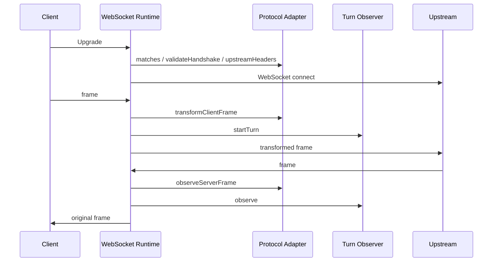

# Proxy Protocol / Transport 完整重构计划

## 1. 目标

在不增加数据库字段和管理界面配置的前提下，将代理实现拆分为正交的三层：

1. **Protocol Adapter**：理解业务协议、事件类型、请求改写、usage、TTFT 与 turn 关联；
2. **Transport Runtime**：理解 HTTP Upgrade、WebSocket 帧、连接、关闭、错误和 backpressure；
3. **Observation Runtime**：理解通用 request/attempt/turn 日志，但不理解任何具体协议事件。

HTTP/SSE 现有行为保持不变，本轮重点完成 WebSocket 链路的彻底解耦。

## 2. 最终模块边界

### `websocket.ts`

只负责：

- 注册和移除 Upgrade listener；
- 根据请求选择 WebSocket adapter；
- 解析 endpoint、创建上游连接；
- 双向帧中继；
- active socket、close/error 和连接字节统计；
- 调用 adapter 与 turn observer，不出现 Responses 事件常量。

### `websocket-adapters/types.ts`

定义稳定接口：

- 路径匹配和握手校验；
- 协议专属上游握手头；
- text/binary 帧验证与改写；
- 服务端事件观察；
- correlation key、usage、output、complete、failed。

### `websocket-adapters/openai-responses.ts`

唯一负责：

- `/v1/responses` 与 `/responses`；
- `responses_websockets=2026-02-06`；
- Responses 只接受文本 JSON 帧；
- `response.create` 和 model 改写；
- Responses 服务端事件、usage、TTFT 和完成状态；
- `stream_id` / `response.id` 关联键。

### `websocket-turn-observer.ts`

只负责通用 turn 持久化：

- 创建 request/attempt logger；
- 保存帧内容、usage 和 TTFT；
- 根据 adapter observation 完成或失败 turn；
- 管理 request ID 与 correlation key 索引；
- 连接关闭时统一收尾。

它只读取 `adapter.protocol` 和结构化 observation，不读取 Responses 事件类型。

### `router.ts` / `transport.ts`

- `Protocol` 保持语义协议枚举；
- `Transport` 保持网络承载枚举；
- 当前不增加 endpoint transport 配置；
- 已注册 `protocol + websocket` adapter 的 HTTP(S) endpoint 可兼容转换为 WS(S) URL；
- 未来增加数据库字段时，仅替换 capability resolver，不改 runtime/adapter。

## 3. 数据流

## 4. 实施顺序

1. 扩展 adapter 接口，使二进制策略和上游协议头归 adapter；
2. 提取通用 `WebSocketTurnObserver`；
3. 将 `websocket.ts` 改造成纯 transport runtime；
4. 修正 correlation key 首次绑定和帧顺序竞态；
5. 保留并验证 health、cleanup、HTTP endpoint WS 兼容转换；
6. 增加 adapter、turn observer、router/runtime 生命周期测试；
7. 运行 typecheck、server tests、lint。

## 5. 验收标准

- `websocket.ts` 中不出现 `response.create`、`response.completed`、OpenAI beta 值或硬编码 `openai-responses` 日志协议；
- OpenAI Responses 专属字符串只存在于 adapter 与其测试；
- runtime 不导入 Responses adapter 具体实现；
- turn observer 不判断任何协议事件类型；
- 同一连接上的帧按发送顺序创建 turn 后再发往上游；
- 有 correlation key 时精确匹配，无 key 时保持单 lane FIFO 兼容；
- 启动失败、stop、restart、双方 close/error 均清理资源并完成未结束 turn；
- 不增加数据库 migration、配置字段或管理 UI；
- model 请求字段使用 ProviderModel `modelId`，`modelName` 仅用于日志快照和需要上游名称的 HTTP 转换场景；
- 全部静态检查与服务器测试通过。

## 6. 本轮非目标

- 不重写 HTTP attempt executor；
- 不实现 WS↔HTTP/SSE 桥接；
- 不实现跨语义协议的 WebSocket 转换；
- 不新增 OpenAI Realtime、Anthropic 或 Gemini WebSocket adapter；
- 不引入 transport 配置界面。
