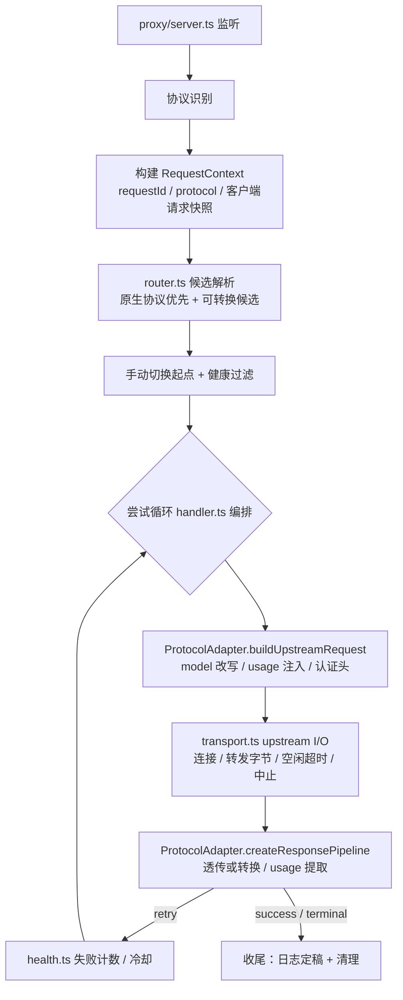

# 本地代理服务

## 代理管线架构

代理采用**协议适配器 + 共享骨架**的结构：协议差异进适配器，流程共性进骨架。

### 设计动机

协议差异（model 改写位置、usage 结构、认证头格式、流式结束标记等）如果以 if/else 形式散落在传输层，会随协议数量组合爆炸（协议 × 阶段），且"透传"与"转换"两种模式又叠加在协议维度上。因此每个协议独立实现为适配器，骨架只保留与协议无关的流程。

### 管线流程



### 分层职责

| 层 | 文件 | 职责 | 明确不做 |
| --- | --- | --- | --- |
| 入口 | `server.ts` | 监听、`/v1/models`、协议识别入口 | 不含业务逻辑 |
| 上下文 | `request-context.ts` | 一次请求的全部状态（requestId、protocol、快照、尝试记录） | — |
| 路由 | `router.ts` | 候选解析、手动切换起点、健康过滤 | 不做 I/O |
| 编排 | `handler.ts` | 尝试循环、结果分类后的分支决策、收尾（瘦身后约百行） | 不含协议细节、日志细节 |
| 传输 | `transport.ts` | 纯 HTTP I/O：连接、逐块转发、空闲超时、客户端中止检测，通过事件回调（onHeaders/onChunk/onEnd/onError）向外汇报 | 不含日志、usage、转换逻辑 |
| 协议 | `protocols/*.ts` | 每协议一个适配器（见下） | — |
| 观测 | `hooks/*.ts` | 日志写入、usage 提取、正文采集，订阅管线事件 | 不改传输行为 |

### ProtocolAdapter 接口契约

每个协议实现一个适配器：

```typescript
interface ProtocolAdapter {
  /** 请求方向：model 改写（body 或 URL）、usage 注入参数、认证头格式 */
  buildUpstreamRequest(input: ClientRequestSnapshot, target: ProviderModelTarget): BuiltRequest

  /** 响应方向：透传或转换管线、该协议自身的 usage 提取 */
  createResponsePipeline(ctx: ResponseContext): ResponsePipeline

  /** 可选：该协议特有的可重试错误判断（如 Anthropic overloaded_error） */
  classifyError?(statusCode: number, body: unknown): 'retry' | 'terminal'
}
```

- 透传模式：适配器直接转发字节；
- 转换模式：当客户端协议与 upstream 端点协议不同时，由 `protocols/conversions/` 中按 `(from, to)` 注册的转换器接管请求与响应（含流式 SSE）；
- usage 提取归属各适配器：每个协议自己知道 usage 字段结构，不再用统一字段名猜测。

### 目录结构

```text
proxy/
├── server.ts                 # 监听 + /v1/models
├── handler.ts                # 编排骨架（协议无关）
├── request-context.ts        # RequestContext
├── router.ts                 # 候选解析 + 手动切换 + 健康过滤
├── transport.ts              # 纯上游 I/O + 事件发射
├── response.ts               # 通用状态分类
├── health.ts
├── auth.ts
├── headers.ts
├── protocols/
│   ├── types.ts              # ProtocolAdapter 接口
│   ├── openai-completions.ts
│   ├── openai-responses.ts
│   ├── anthropic-messages.ts
│   ├── gemini.ts
│   └── conversions/          # 跨协议转换器，按 (from, to) 注册
└── hooks/
    ├── request-logger.ts     # 唯一日志写入点（request_logs / request_attempts）
    ├── usage-tracker.ts      # token / usage 提取
    └── content-capture.ts    # request_contents 正文采集
```

### 观测订阅原则

日志、usage、正文采集都是管线的订阅者，监听传输层事件：

- 新增观测能力 = 新增一个订阅者，不修改传输代码；
- 日志写入收敛到 `hooks/request-logger.ts` 单点，消除散落在编排各分支中的手写写入；
- 正文采集（MVP 待办）接入时只需实现 `content-capture.ts`。

### 实施说明

重构直接按目标结构落地，不保留旧结构兼容：

1. 新建 `transport.ts`，上游 HTTP 逻辑（连接、转发、空闲超时、中止）全部事件化；
2. 新建 `protocols/types.ts` 接口，请求改写、协议转换、usage 提取按协议归位到各适配器，`request.ts` / `conversion.ts` / `conversion-response.ts` 中的逻辑拆入后删除原文件；
3. 新建 `request-context.ts` 与 `hooks/request-logger.ts`，日志写入收敛单点；
4. `handler.ts` 重写为纯编排；
5. 每步完成后运行 `pnpm test:server` 与 `pnpm typecheck`。

## 服务基本信息

- 默认监听 `127.0.0.1` 的可配置端口，不暴露到局域网
- 客户端只需配置一个统一 Base URL（如 `http://127.0.0.1:port`），无需按协议区分
- 支持普通 HTTP 请求和 SSE 流式响应透传
- 支持 Responses API 的 WebSocket 传输（`/v1/responses` 的 `Upgrade: websocket` 握手），WS→WS 透传中继、上游不支持时回 426 由客户端降级 HTTP，详见 [websocket-transport.md](./websocket-transport.md)
- 不强制接管系统代理；推荐用户在 AI 工具中配置本地 Base URL

## 协议识别

代理根据请求 path 自动匹配协议类型：

| 协议 | 匹配路径 |
|------|----------|
| OpenAI | `/v1/chat/completions`、`/v1/completions`、`/v1/embeddings` |
| OpenAI Responses | `/v1/responses`（HTTP POST + SSE；带 `Upgrade: websocket` 握手时走 [WebSocket 传输](./websocket-transport.md)） |
| Anthropic | `/v1/messages` |
| Gemini | `/v1beta/models/*` |
| Custom | 用户自定义路径匹配规则 |

- 若 path 无法匹配任何已知协议，返回 404 并提示未识别的 API 路径
- `/v1/models` 是代理自身提供的本地服务接口，不透传到上游

## 本地服务接口

### `/v1/models`

返回 MVP 唯一启用的兜底逻辑模型 `default`，方便支持模型列表拉取的工具自动发现。客户端也可以继续使用自身配置的其他模型名，未匹配的名称仍由 `default` 处理。

响应格式兼容 OpenAI Models API：

```json
{
  "object": "list",
  "data": [
    {
      "id": "default",
      "object": "model",
      "created": 0,
      "owned_by": "one-switch"
    }
  ]
}
```

> MVP 中 `data` 数组只包含 `default` 一项，`id` 为逻辑模型名。模型发现结果不构成请求模型白名单；后续支持多逻辑模型时，再按启用状态返回多个逻辑模型。

## 路由策略

### 单队列模型

v0.3 MVP 只有兜底逻辑模型 `default`。ProviderModel 通过 `scheduling_policies` 绑定到逻辑模型；每个请求根据解析后的逻辑模型绑定关系和客户端协议动态计算一个**自动切换候选队列**。请求中的 `model` 字段必须是非空字符串，但不需要等于逻辑模型 ID；当前版本没有其他逻辑模型，因此任意模型名都解析到 `default`。转发时，客户端模型名会被替换为当前 ProviderModel 的 `modelName`。

- 所有未匹配请求只使用 `scheduling_policies` 中绑定到 `default` 的候选项；后续每个逻辑模型都可以维护自己的绑定集合和顺序
- 同一个 ProviderModel 可以绑定到多个逻辑模型，并在不同逻辑模型中拥有不同的优先级、权重和启用状态
- 候选队列中的每个 ProviderModel 都通过端点绑定获得 upstream 协议、有效 URL、upstream API 模型名和所属 Provider。
- 请求来时，自动根据协议过滤队列，按顺序尝试，失败自动切换到下一个
- 转发到上游时，`model` 字段会被替换为当前 ProviderModel 的 **modelName**
- 支持用户手动切换到队列中的某个 ProviderModel：新请求使用新模型，正在进行的请求不中断

> ProviderModel 是可复用的供应商模型实体，但调度资格和顺序由 `scheduling_policies(logicalModelId, providerModelId)` 决定；MVP 中只有绑定到 `default`、绑定启用且存在可用端点的 ProviderModel 才进入候选池。

### 路由步骤

1. **协议识别**：根据请求 path 自动匹配协议类型
2. **逻辑模型解析与队列过滤**：将未匹配的非空客户端模型名解析为 `default`，再从其自动切换队列中筛选出**协议匹配**且**可用**的 ProviderModel（未禁用、ProviderModel 未冷却、Provider 未冷却）
3. **确定起始位置**：如果用户手动指定了当前 ProviderModel，则从该模型开始；目标已禁用、冷却或协议不匹配时返回明确错误，不静默选择其他起始项；否则从队列头部开始
4. **顺序尝试**：按当前逻辑模型绑定行的 `priority ASC, weight DESC, createdTime ASC, providerModelId ASC` 稳定排序依次尝试；v0.3 `priority` 策略不使用权重做随机调度。不同逻辑模型分别读取自己的绑定行，因此可以拥有不同顺序
5. **模型名替换**：每个 ProviderModel 转发前，将请求体中的 model 替换为该模型的 `modelName`
6. **失败切换**：遇到可切换错误时，自动尝试队列中的下一个 ProviderModel

### 过滤规则

- 协议不匹配的 ProviderModel 跳过（例如 OpenAI 协议的请求不会尝试只有 Anthropic 端点的 ProviderModel）
- 被标记为冷却、禁用或达到手动额度阈值的 Provider 或 ProviderModel 跳过
- 如果过滤后队列为空，返回“当前协议下无可用 ProviderModel”的错误响应

### 自动切换规则

- 同一请求不在同一 ProviderModel 上重复重试
- 按队列顺序依次尝试，遇到可切换错误则切到下一个
- 所有候选都失败时，返回最后一个上游错误，并在日志中聚合所有尝试

### 手动切换（核心特性）

用户可以在控制台手动指定当前使用队列中的哪个 ProviderModel：

- **新请求立即生效**：切换后发起的新请求，从指定的 ProviderModel 开始尝试
- **进行中请求不中断**：已经在转发的请求（包括流式）继续使用原来的 ProviderModel，不受切换影响
- **自动切换仍有效**：手动指定的 ProviderModel 失败后，仍按队列顺序自动往下切换
- **手动切换不改变队列顺序**：优先级排序不变，只是设置一个「当前起始点」
- 手动切换是运行时状态，不持久化，重启后恢复为从队列头部开始

## 可切换错误分类

| 类型 | 行为 | 说明 |
|------|------|------|
| 网络错误、连接超时、空闲超时 | 自动切换 | 上游不可达或长时间无数据返回 |
| 408、429、5xx | 自动切换 | 上游明确不可用或限流 |
| 模型不存在 | 自动切换 | 该 Provider 配置的 `modelName` 可能配置错误 |
| 401 / 403 | 自动切换 + 告警 | 切换并标记该供应商配置可能错误 |
| 400 类请求格式错误 | 不切换 | 换供应商也不会成功 |

错误分类应可配置，MVP 提供合理默认值。

### 空闲超时说明

- 超时指的是**空闲超时**（idle timeout）：两次数据到达之间的最大时间间隔
- 连接建立后，如果远端在 Provider 配置的 `timeoutSeconds`（运行时换算为毫秒）内没有返回任何数据（包括响应头和响应体），触发超时
- 流式响应只要上游持续返回数据（SSE chunk、body chunk），即使总时长很长也不会超时
- 连接超时（建立 TCP 连接的时间）也受同一超时时间限制

## 流式请求切换边界

- **可以切换**：尚未收到上游响应头，或上游返回错误状态码且响应体尚未发给客户端时
- **不可切换**：一旦 200 响应头或 SSE 数据已经开始返回给客户端，不再切换，避免输出内容混杂
- 流式中途断开记录为供应商失败，但不向另一个供应商续传同一次请求

## 透传规则

- 保留客户端的原始方法和端到端请求头；移除 `connection`、`transfer-encoding` 等逐跳 header
- 移除客户端认证信息，注入 Provider 配置的认证头；`content-length` 按最终请求体重新计算
- OpenAI / Anthropic 使用有效 ProviderModel 端点绑定 URL，并将请求体 `model` 改写为 ProviderModel 的 `modelName`
- Gemini 保留原生请求体，通过 URL 替换模型 ID，并按客户端请求选择 `generateContent` 或 `streamGenerateContent`
- Gemini 会保留端点 URL 的查询参数，同时合并客户端的 `alt=sse` 等查询参数
- 响应状态码、端到端响应头和响应体逐块返回；逐跳响应 header 不向客户端转发
