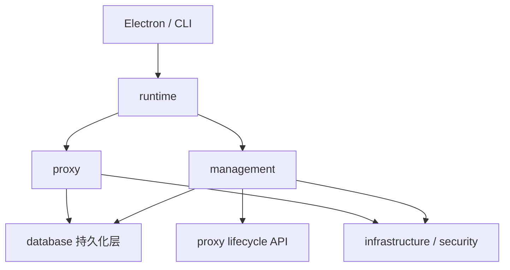
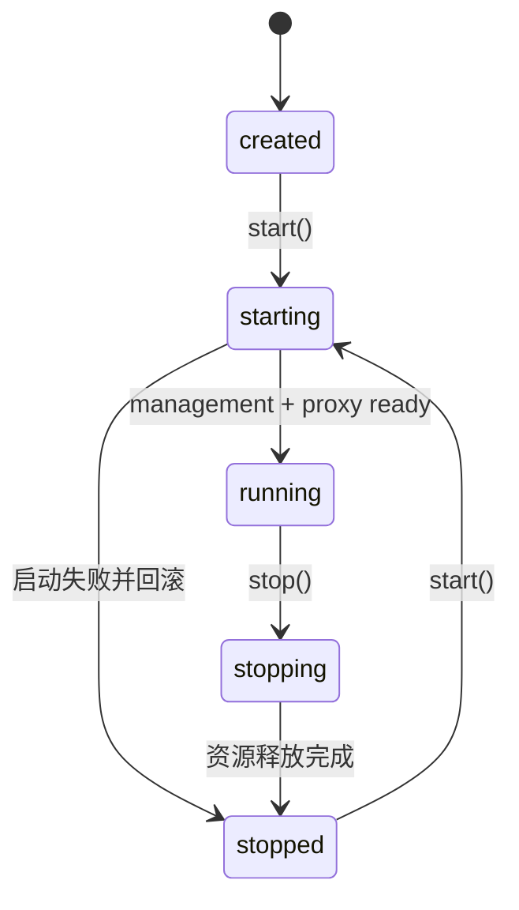

# Server 架构设计

## 设计目标

`packages/core/src` 是一个本地模块化服务，当前由 Electron 主进程使用，并服务于测试。它不依赖 Electron，之后作为核心包同时服务于 CLI 与 App，包边界与迁移阶段见 [packaging.md](./packaging.md)（S0 平移已完成）。当前阶段优先让代码按能力聚合、职责清楚，不为尚未出现的复杂度预设完整的领域驱动目录。

遵循四条规则：

1. 根目录只保留稳定入口，不放具体业务能力。
2. 代码先按能力归属，再按真实复杂度拆文件。
3. HTTP、SQLite、Keychain 等技术细节不主导业务目录。
4. 模块级可变状态逐步迁移到显式实例，由 Runtime 持有。

## 模块划分

Server 分为五块：

| 模块 | 职责 | 包含内容 |
| --- | --- | --- |
| `runtime` | 进程级组装与生命周期 | ServerRuntime、管理服务与代理服务的启动、停止和失败回滚 |
| `management` | 配置管理能力和管理 API | Provider、LogicalModel、ProviderModel、Endpoint、Settings 的管理入口 |
| `proxy` | 模型请求代理能力 | 协议识别、路由、转发、认证、健康冷却、重试和请求日志 |
| `database` | 持久化层 | SQLite、Drizzle schema、按领域拆分的 store |
| `infrastructure` / `security` | 系统技术适配 | Keychain、Host validation，以及未来可复用的系统适配器 |

健康冷却当前只服务于代理切换，因此属于 `proxy`，不单独建立 `reliability`。RequestLog 和 Attempt 由代理请求产生，也先归入 `proxy`。只有当它们形成独立生命周期或被多个能力共同使用时，才提升为一级模块。

## 当前实际目录

```text
packages/core/source/
├── index.ts
├── runtime/server-runtime.ts
├── management/
│   ├── server.ts / router.ts
│   ├── core/{request-body,response,error-handler,request-guards,environment-guard}.ts
│   ├── routes/                         # 管理 API，按域分组后由 index.ts 合并注册
│   │   ├── catalog/                    # Provider、ProviderModel、模型
│   │   ├── relations/                  # 绑定关系、请求重写规则
│   │   ├── operations/                 # 设置、代理生命周期、开发种子
│   │   ├── observability/              # 运行日志、请求日志、统计
│   │   ├── router/                     # 路由工作台图与试跑
│   │   └── diagnostics/                # 模型测试、协议发现、出站代理测试
│   └── provider-transfer/              # 供应商包导入导出
├── proxy/                              # 分层代理链路，分层契约见 proxy-engine.md
│   ├── contracts/                      # 层间接口与类型
│   ├── kernel/                         # 与协议无关的搬运内核
│   ├── request/ response/ upstream/    # 请求解析、响应产出、上游交互
│   ├── routing/ planners/ execution/   # 路由决策、尝试规划、尝试执行
│   ├── protocols/ adapters/ local/ transports/ # 协议描述、转换适配、本地端点、传输
│   ├── modifiers/ observers/           # 修改器链与观察者
│   ├── request-rewrite/ capabilities/  # 请求重写、能力探测
│   ├── observability/                  # 日志、用量与观测
│   └── runtime/                        # 代理服务装配与生命周期
├── database/                         # SQLite + Drizzle 持久化层
│   ├── index.ts / schema.ts
│   ├── provider-store.ts / model-store.ts / logical-model-store.ts
│   ├── settings-store.ts / health-store.ts / request-log-store.ts
│   └── analytics-store.ts / development-seed.ts
├── infrastructure/{secrets/,security/}
└── security/                          # Host validation 等安全适配
```

当前不存在 `proxy/handler.ts`、`packages/core/source/api/` 或 `infrastructure/database/`。`proxy/` 的分层目录与依赖方向由 `packages/core/scripts/check-proxy-layers.mjs` 在 `pnpm lint` 中强制断言，新增层级或跨层引用会直接失败。

## 依赖方向



依赖约束：

- `index.ts` 只暴露稳定 API，不包含资源初始化细节。
- `runtime` 可以组装所有模块，但不包含 Provider CRUD、路由和转发规则。
- `management` 可以调用代理公开的生命周期控制 API，不应 import 代理内部路由和 transport。
- `proxy` 不依赖 management；它只读取运行所需的配置和密钥。
- `infrastructure` 不反向依赖 runtime、management 或 proxy。
- 新增进程级状态时必须说明所有者，不能默认放进模块级变量。

## 关键调用链

### 创建 Provider

```text
POST /api/provider/create
  -> management/router.ts
  -> management/routes/catalog/providers.ts
  -> infrastructure/secrets/secret-store.ts
  -> database/provider-store.ts
  -> HTTP response
```

密钥写入与 Provider 保存的补偿逻辑属于 `management/routes/catalog/providers.ts`，不应留在通用 HTTP router 中。

### 转发模型请求

```text
Client request
  -> proxy/runtime/server.ts
  -> proxy/request/                     # 入口匹配、请求解析
  -> proxy/routing/ + planners/         # 路由决策、尝试规划
  -> proxy/execution/                   # 候选尝试编排与重试
  -> proxy/protocols/ + adapters/       # 协议描述与转换适配
  -> proxy/transports/http.ts           # 上游请求与响应帧
  -> proxy/response/                    # 帧到客户端响应的产出
  -> proxy/observability/ + database/request-log-store.ts
  -> Client response
```

`proxy/request/` 负责入口解析，`proxy/execution/` 负责编排候选尝试；协议注册、协议转换、传输、响应管线和观测分别由对应模块负责。当前协议范围以 `packages/contracts/source/protocols.ts` 为准，不包含 Gemini。

## 生命周期

`packages/core/source/index.ts` 是对外生命周期入口，仅负责持有和转交唯一的 `ServerRuntime` 实例；实际的数据库、management、proxy 启停顺序、失败回滚和资源释放由 `packages/core/source/runtime/server-runtime.ts` 编排。



- 代理停止或重启不影响管理服务。
- 启动失败必须关闭已经启动的监听器和数据库。
- 停止操作保持幂等。
- 两个监听器均为实例，由 `ServerRuntime` 持有，不使用模块级可变状态。

## 实施状态

1. [已完成] `runtime/server-runtime.ts` 持有管理服务、代理服务和数据库生命周期。
2. [已完成] 管理 API 按 Provider、LogicalModel、ProviderModel、关系、配置、日志、分析和运行时控制分域，统一由 `management/router.ts` 注册。
3. [已完成] 代理入口解析、路由决策、尝试规划与执行、协议描述与适配、传输、响应产出、修改器、请求重写和观测已拆为 `proxy/` 下的独立分层目录，分层契约见 [proxy-engine.md](./proxy-engine.md)。
4. [已完成] SQLite 代码保留在 `database/`，并按 Provider、Model、LogicalModel、Settings、Health、Request Log、Analytics 拆分 store；不使用 `infrastructure/database/store.ts`。
5. [已完成] Render 端通过 `api/*.ts`、`features/*`、页面 hooks 和 `infrastructure/polling-manager.ts` 分域；不保留单体 API 或 app-service 兼容出口。
6. [已完成] v0.3 不保留兼容 facade、re-export、旧 API 别名、旧领域名称或双读双写。
7. [已完成（源码/构建验证）] `typecheck`、`lint`、`test` 全部通过；Vite bundling 通过。`electron-builder` 在 Windows 当前用户缺少符号链接权限时失败，因此 UI 回归与发布包验证仍待人工完成。

验证命令以根目录 `package.json` 的 scripts 为准；文档更新不代替最终验证执行。
