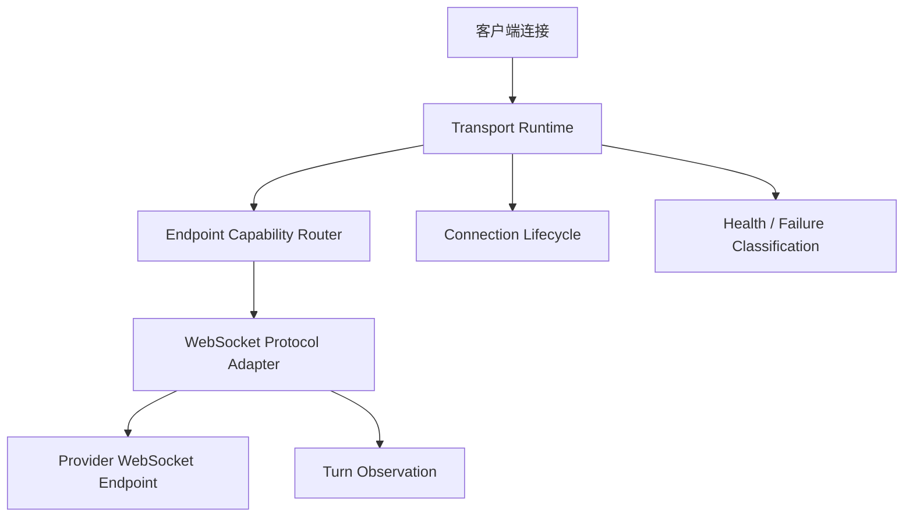

# Transport 与 WebSocket 协议适配器设计

## 1. 目标

将代理中的两个正交维度明确分离：

- **Protocol**：请求/响应的业务语义和消息 schema；
- **Transport**：承载协议消息的网络方式、连接模型和生命周期。

当前第一阶段只支持 `openai-responses + websocket`，不改变现有 HTTP 路径和协议转换矩阵。

## 2. 术语模型

```ts
type Protocol =
  | 'openai-completions'
  | 'openai-responses'
  | 'anthropic-messages'

type Transport =
  | 'http'
  | 'sse'
  | 'websocket'

interface EndpointCapability {
  protocol: Protocol
  transport: Transport
  streaming: boolean
}
```

`Protocol` 不包含 `websocket`。WebSocket 是传输方式；只有当消息语义、状态机和事件模型确实不同，例如 OpenAI Realtime 与 Responses，才新增新的协议值或协议变体。

## 3. 组合规则

| 语义协议 | HTTP | SSE | WebSocket |
| --- | --- | --- | --- |
| OpenAI Completions | 支持 | 支持 | 未实现 |
| OpenAI Responses | 支持 | 支持 | P1：原生 WS |
| Anthropic Messages | 支持 | 支持 | 未实现 |

组合能力不是自动推导的。每种 `protocol + transport` 必须由注册表显式声明，以避免把 HTTP endpoint 错当成 WS endpoint。

## 4. 分层架构



### 4.1 Transport Runtime

公共 WebSocket runtime 只负责：

- HTTP Upgrade 接入与拒绝；
- 选择并连接上游 endpoint；
- 上下游 text/binary frame 转发；
- close/error、超时、backpressure 和活动连接集合；
- 连接级日志；
- 调用 adapter，而不理解具体事件类型。

### 4.2 Protocol Adapter

每个 WS 协议 adapter 负责：

```ts
interface WebSocketProtocolAdapter {
  readonly protocol: Protocol
  matches(request: IncomingMessage): boolean
  validateHandshake(request: IncomingMessage): ProtocolError | null
  validateClientFrame(raw: Buffer, isBinary: boolean): FrameResult
  transformClientFrame(frame: unknown, targetModel: string): FrameResult
  observeServerFrame(raw: Buffer, state: TurnState): ObservationResult
}
```

`openai-responses-ws-adapter.ts` 负责 `/v1/responses`、`response.create`、Responses 事件、usage、TTFT 和 turn 完成语义。runtime 不应继续保留这些 Responses-specific 判断。

## 5. Endpoint capability

短期不直接修改数据库 schema。现有 `provider_endpoints.protocol` 表示语义协议；WebSocket 支持通过协议 adapter 对 endpoint URL 做 scheme/capability 校验：

- `ws://` / `wss://`：允许 WebSocket；
- `http://` / `https://`：仅允许 HTTP/SSE；
- 未注册的组合不进入 WS 候选。

中期若同一 Provider 需要为同一语义协议配置多个不同传输端点，再增加独立字段：

```text
provider_endpoints.protocol
provider_endpoints.transport
```

并将唯一约束从 `(providerId, protocol)` 调整为 `(providerId, protocol, transport)`。不应把 `openai-responses-websocket` 写入 `protocol` 字段。

## 6. 路由与故障边界

候选筛选使用二元组：

```text
(protocol = openai-responses, transport = websocket)
```

- 原生 WS 候选只从原生 Responses endpoint 中选择；
- WS handshake 失败发生在连接级，不在同一连接内切换上游；
- 客户端重连时重新选择候选；
- 426/404/网络失败继续使用既有 health classification；
- HTTP/SSE 降级是客户端重连行为，不是 WS transport 内部的协议转换。

## 7. 观测边界

连接日志和 turn 日志分离：

```text
WebSocket connection
├── connectionId / handshake / close / bytes
└── response.create turn
    ├── request_logs
    ├── request_attempts
    ├── request_contents
    ├── request_usages
    └── TTFT / completion status
```

adapter 产生结构化 observation，logging 层负责持久化；adapter 不直接操作数据库。

## 8. 迁移计划

1. 保留现有 `Protocol` 枚举和 HTTP 协议转换逻辑；
2. 新增 `Transport` 类型和 endpoint capability 查询接口；
3. 将 `websocket.ts` 中的 Responses-specific 代码迁移到 `protocols/websocket/openai-responses.ts`；
4. runtime 使用 adapter registry，按 path 和 transport 选择 adapter；
5. 为 adapter 增加独立协议测试，为 runtime 增加连接生命周期测试；
6. 后续新增 Anthropic WS、Gemini Live 或 OpenAI Realtime 时，只新增对应 adapter 和 capability，不复制 relay 核心。

## 9. 非目标

- 不把 WebSocket 加入 `ProtocolSchema`；
- 不把 Responses WS 转换为 Completions 或 Anthropic；
- 不在 WS runtime 中实现 WS↔HTTP/SSE 桥接；
- 不因为存在 WebSocket 就默认所有 Provider endpoint 支持 WebSocket。
