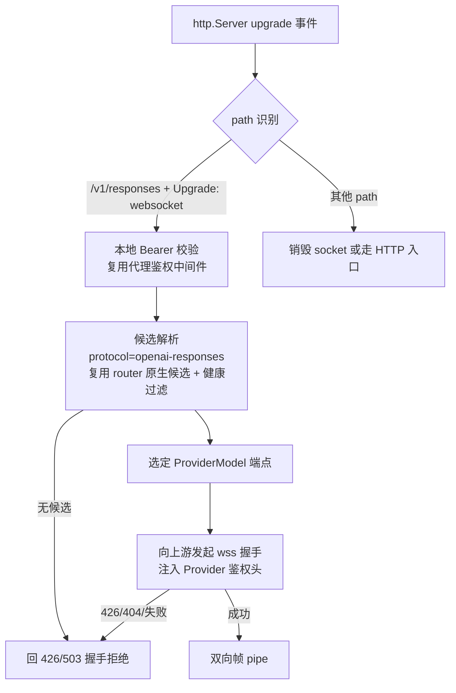

# Responses API WebSocket 传输

## 背景与定位

OpenAI Responses API 除 HTTP POST + SSE 外，还提供 **WebSocket mode**：客户端与 `/v1/responses` 建立一条长连接，每个 turn 发送一个 `response.create` 文本帧，服务端按现有 Responses 流式事件模型逐帧推送。Codex 在 provider 配置 `supports_websockets = true` 时优先使用该传输，在工具调用密集的长链路中可降低逐 turn 建连开销，官方数据为 20+ 工具调用场景端到端延迟降低约 40%。

参考资料：

- 官方指南：[WebSocket Mode](https://developers.openai.com/api/docs/guides/websocket-mode)
- 事件参考：[Responses WebSocket events](https://developers.openai.com/api/reference/resources/responses/websocket-events)
- Codex 配置：`model_providers.<id>.supports_websockets`（[Config Reference](https://learn.chatgpt.com/docs/config-file/config-reference)）

**定位：WebSocket 是 `openai-responses` 协议的一种传输方式，不是新协议，也不是独立功能。** 帧 payload 与 HTTP Responses 请求体 / SSE 事件是同一套 schema，不进入 [protocol-conversion.md](./protocol-conversion.md) 的转换矩阵，不新增 `Protocol` 枚举值。本文是 [proxy.md](./proxy.md)（本地代理服务）透传骨架的传输层补充，与协议兼容转换器有本质区别：转换器是**可选功能**——有开关、解析并改写报文、有转换矩阵与 UI 配置；WS 传输是**原生透传的传输扩展**——无开关、不解析帧语义、不改变任何报文，协议识别、候选队列、鉴权注入、健康冷却全部复用 proxy 主链路，本文只描述 WS 握手与帧中继相对 HTTP 透传的差异部分。

> 与 OpenAI Realtime API（`/v1/realtime`，语音双向音频会话）无关。Realtime 是独立的交互模型，不在本文范围。

## 协议事实

### 连接与握手

- 端点与 HTTP 同路径，仅替换 scheme：`wss://api.openai.com/v1/responses`（`https→wss`、`http→ws`）。
- 握手为标准 HTTP `Upgrade: websocket`，携带与 HTTP 请求相同的 `Authorization` 头；beta 能力头 `OpenAI-Beta: responses_websockets=2026-02-06`。
- 压缩：客户端默认协商 `permessage-deflate`。
- 连接最长存活 60 分钟，服务端以 `websocket_connection_limit_reached` 关闭，客户端需重连。

### 帧语义

- 客户端帧：`{"type":"response.create", "stream_id"?: string, ...Responses create body}`；`stream` / `background` 等传输相关字段不使用。
- `generate: false` 的 `response.create` 为预热帧，不产生模型输出，仅准备请求状态并返回 response ID。
- 续聊：后续帧带 `previous_response_id` + 仅新增的 `input` 项。**该链式状态保存在连接本地内存缓存中**（`store=false` / ZDR 下无持久化回退），缓存未命中返回 `previous_response_not_found`。
- 服务端帧：与 HTTP/SSE 完全一致的 Responses 流式事件（`response.created`、`response.output_text.delta`、`response.completed` …），命名 lane 的事件带 `stream_id`；另有连接级事件如 `codex.rate_limits`。

### 多路复用

- `stream_id` 命名一条连接上的有序 lane：同 lane 请求 FIFO 不重叠，不同 lane 可并发。
- 单连接最多 16 个在途响应、32 个不同命名 `stream_id`；超限分别返回排队 / `websocket_stream_limit_reached`。
- 可用新 `stream_id` + 已有 `previous_response_id` fork 会话；fork 依赖父响应仍在连接本地缓存中。

### 客户端降级行为（Codex）

- WS 握手返回 **426 Upgrade Required**（或连接失败）时，Codex 在本 session 内自动回退到 HTTP POST + SSE，并标记该 provider 后续不再尝试 WS。
- 因此代理对不支持 WS 的上游**无需自行桥接**，把握手失败如实回给客户端即可获得完整兼容。

## 设计原则

1. **透传不解析语义**：中继层不解析帧 JSON 内容，不感知 `stream_id`、`previous_response_id`、事件类型；帧（text/binary/ping/pong/close）原样双向转发。
2. **连接级路由**：一条客户端连接在握手时绑定一个 ProviderModel 端点，整条连接对应一条上游 WS 连接。不在帧之间分散路由——续聊缓存是连接本地状态，跨上游连接转发 `previous_response_id` 会破坏链式语义。
3. **自动切换在重连粒度发生**：连接内不做故障切换。上游连接失败/关闭时联动关闭客户端连接；客户端（Codex）重连或降级时代理重新走候选解析，从而自然落到下一个健康候选。
4. **能降级就不桥接**：上游不支持 WS 时回 426 让客户端走 HTTP 链路（含现有协议转换能力），桥接仅作为可选增强。

## 方案分层

| 阶段 | 能力 | 说明 |
| --- | --- | --- |
| P1 | WS → WS 透传中继 | 上游端点原生支持 WS 时，全双工帧中继；不支持时回 426，客户端降级 HTTP |
| P2（可选） | WS ↔ HTTP/SSE 桥接 | 客户端走 WS、上游走 HTTP Responses：`response.create` 帧转 POST，SSE 事件转帧；事件 1:1 映射 |
| 不做 | WS 与 completions / anthropic 互转 | 交互模型不匹配，且降级 HTTP 后已有协议转换覆盖 |

## P1：透传中继设计

### 入口与路由

- 在 `ProxyRuntime` 的 HTTP server 上注册 `server.on('upgrade')`；HTTP 请求入口保持不变。
- 握手阶段没有请求体，路由按逻辑模型 `default` 的候选队列选择当前最高优先级原生 `openai-responses` 候选（MVP 下所有非空模型名均由 `default` 处理，与 HTTP 路径一致）。手动切换、健康冷却规则与 HTTP 路径共用。
- 新增依赖 `ws`：服务端握手接受 + 上游 WS 客户端连接。Node 22（Electron 37）内置 WebSocket 为客户端能力，服务端升级握手仍需 `ws`。

### 帧中继

- 上游握手成功后，两侧 socket 全双工 pipe：text/binary 帧原样转发；ping/pong 由两侧 WS 实现各自处理（不跨接控制帧）；close 帧转发 code/reason 后联动关闭对端。
- `permessage-deflate` 在两侧握手时独立协商，代理不做跨侧扩展透传，避免"协商了扩展却不解压"的错误。
- `Authorization` 等客户端鉴权头不转发上游；上游握手头由现有认证注入逻辑生成（与 HTTP 路径一致）。`OpenAI-Beta` 等其余头按现有头处理规则透传。
- 不缓冲、不聚合帧；客户端中止（断开）立即销毁上游连接，反之亦然。

### 握手失败与降级

- 上游返回 426 / 404 / 非 101 响应：把该状态码与响应体作为 HTTP 拒绝响应回给客户端（`socket.write` HTTP 响应后销毁），客户端据此降级 HTTP。
- 上游网络不可达 / 超时 / TLS 失败：按现有错误分类计入 Provider / ProviderModel 健康与冷却，回 426（优先）或 503；客户端降级后 HTTP 链路会重新走完整候选队列。
- 路由无候选：回 426，使客户端降级到 HTTP 后返回"当前协议下无可用 ProviderModel"的既有错误。

### 生命周期

- 上游 60 分钟强制关闭、空闲超时（沿用 provider `stream_idle_timeout_ms` 语义）、任一端异常关闭：均联动关闭对端并记录断开原因。
- 代理重启 / 监听地址变更：所有 WS 连接随 HTTP server 关闭而销毁，客户端重连即可恢复。
- 连接对象纳入请求上下文生命周期管理，防止 socket 泄漏。

### 观测

- P1 记录**连接级**运行日志：连接 ID、客户端地址、绑定的 ProviderModel、上游 URL、握手结果、断开原因、连接时长、上下行字节数。
- 不解析帧内容，不产生 turn 级 `request_logs`；turn 级观测（按 `response.create` / `response.completed` 切分、usage 提取）留待 P2。
- 连接失败计入健康冷却，与 HTTP attempt 的失败分类口径一致。

### 修改规则

- P1 修改器不介入 WS 帧。规则引擎作用于 HTTP request/response body，WS 传输下不保证执行，UI 文档需明确。
- P2 如需支持，仅轻量读取帧的 `type` / `stream_id` / `response.id` 做归类与 header 级规则，不做全量 JSON 改写。

## P2（可选）：WS ↔ HTTP/SSE 桥接

让仅支持 HTTP Responses 的上游也能服务 WS 客户端：

- 接受客户端 WS 连接后，每个 `response.create` 帧转为一次 `POST /v1/responses`（`stream: true`），SSE 事件逐事件转为 WS 文本帧，并回填 `stream_id`。
- 需要处理 turn 生命周期：`response.completed` / `error` 结束本次桥接；同 lane FIFO；`generate: false` 预热帧转为普通请求或直接回合成事件。
- `previous_response_id` 链式语义在 HTTP 模式下由服务端持久化/ hydration 保证（`store=true`），`store=false` 下桥接无法复现连接本地缓存，需在文档注明限制。
- 桥接路径可复用协议适配器的 Responses 事件管线，故障切换语义回到 HTTP 既有规则（响应头前失败可切换）。

## 数据模型与 UI

- P1 无数据库 schema 变更；连接级日志先走运行日志，若需持久化再在 P2 随 turn 级观测一起设计。
- 接入配置页：Base URL 不变，WS 与 HTTP 共用同一监听地址和路径（`ws://127.0.0.1:port/v1/responses`），无需单独展示；可在协议说明中补充 WS 支持状态。
- 队列控制页 / 日志页 P1 无变化；P2 再考虑连接视图与 turn 级记录。
- Codex 侧配置：自定义 provider 指向本地 Base URL，并设置 `supports_websockets = true`、`wire_api = "responses"`。

## 验收标准

- [ ] Codex 配置 `supports_websockets = true` 且 Base URL 指向代理时，WS 握手成功，`response.create` 帧与响应事件双向透传正常
- [ ] 上游原生支持 WS 时，多 turn 续聊（`previous_response_id`）、多 `stream_id` 并发在同一连接上正常工作
- [ ] 上游不支持 WS（握手 426/404）时，客户端收到对应握手拒绝，Codex 自动降级为 HTTP POST + SSE 并正常完成请求
- [ ] 上游连接失败按现有错误分类计入健康冷却；客户端重连时路由到新的候选
- [ ] 任一端断开时对端连接立即释放，无 socket 泄漏；代理重启后客户端可重连恢复
- [ ] 客户端本地 Bearer Token 校验在 WS 握手时同样生效
- [ ] 上游鉴权头由代理注入，客户端原始 `Authorization` 不转发上游
- [ ] 连接级日志记录握手结果、时长、字节数与断开原因
- [ ] HTTP 路径（chat/completions、messages、responses over HTTP）行为与现状完全一致（回归）
