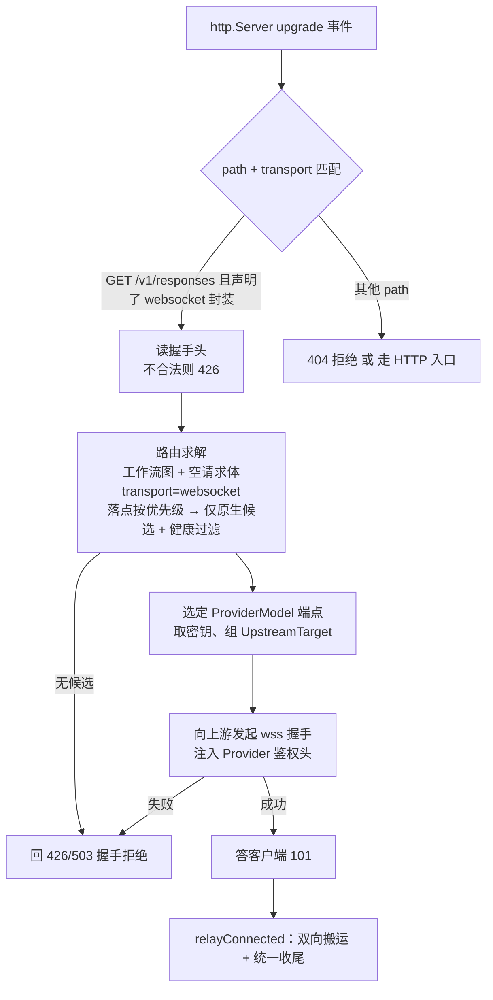

# Responses API WebSocket 传输

## 背景与定位

OpenAI Responses API 除 HTTP POST + SSE 外，还提供 **WebSocket mode**：客户端与 `/v1/responses` 建立一条长连接，每个 turn 发送一个 `response.create` 文本帧，服务端按现有 Responses 流式事件模型逐帧推送。Codex 在 provider 配置 `supports_websockets = true` 时优先使用该传输，在工具调用密集的长链路中可降低逐 turn 建连开销，官方数据为 20+ 工具调用场景端到端延迟降低约 40%。

参考资料：

- 官方指南：[WebSocket Mode](https://developers.openai.com/api/docs/guides/websocket-mode)
- 事件参考：[Responses WebSocket events](https://developers.openai.com/api/reference/resources/responses/websocket-events)
- Codex 配置：`model_providers.<id>.supports_websockets`（[Config Reference](https://learn.chatgpt.com/docs/config-file/config-reference)）

**定位：WebSocket 是 `openai-responses` 协议的一种传输方式，不是新协议，也不是独立功能。** 帧 payload 与 HTTP Responses 请求体 / SSE 事件是同一套 schema，不进入 [protocol-conversion.md](./protocol-conversion.md) 的转换矩阵，不新增 `Protocol` 枚举值。本文是 [proxy.md](./proxy.md)（本地代理服务）透传骨架的传输层补充——落地载体是 [proxy-engine.md](./proxy-engine.md) 的 `Transport` 抽象，WS 通过实现该接口接入，不复制 HTTP 执行器。与协议兼容转换器有本质区别：转换器是**可选功能**——有开关、解析并改写报文、有转换矩阵与 UI 配置；WS 传输是**原生透传的传输扩展**——无开关、不解析帧语义、不改变任何报文，协议识别、候选模型、鉴权注入、健康冷却全部复用 proxy 主链路，本文只描述 WS 握手与帧中继相对 HTTP 透传的差异部分。

> 与 OpenAI Realtime API（`/v1/realtime`，语音双向音频会话）无关。Realtime 是独立的交互模型，不在本文范围。

## 协议事实

### 连接与握手

- 端点与 HTTP 同路径，仅替换 scheme：`wss://api.openai.com/v1/responses`（`https→wss`、`http→ws`）。
- 握手为标准 HTTP `Upgrade: websocket`，携带与 HTTP 请求相同的 `Authorization` 头；beta 能力头 `OpenAI-Beta: responses_websockets=2026-02-06`。
- 压缩：客户端默认协商 `permessage-deflate`。
- 连接最长存活 60 分钟，服务端以 `websocket_connection_limit_reached` 关闭，客户端需重连。

### 帧语义

- 客户端帧：`{"type":"response.create", "stream_id"?: string, ...Responses create body}`；`stream` / `background` 等传输相关字段不使用。
- `generate: false` 的 `response.create` 为预热帧，不产生模型输出，仅准备请求状态并返回 response ID。
- 续聊：后续帧带 `previous_response_id` + 仅新增的 `input` 项。**该链式状态保存在连接本地内存缓存中**（`store=false` / ZDR 下无持久化回退），缓存未命中返回 `previous_response_not_found`。
- 服务端帧：与 HTTP/SSE 完全一致的 Responses 流式事件（`response.created`、`response.output_text.delta`、`response.completed` …），命名 lane 的事件带 `stream_id`；另有连接级事件如 `codex.rate_limits`。

### 多路复用

- `stream_id` 命名一条连接上的有序 lane：同 lane 请求 FIFO 不重叠，不同 lane 可并发。
- 单连接最多 16 个在途响应、32 个不同命名 `stream_id`；超限分别返回排队 / `websocket_stream_limit_reached`。
- 可用新 `stream_id` + 已有 `previous_response_id` fork 会话；fork 依赖父响应仍在连接本地缓存中。

### 客户端降级行为（Codex）

- WS 握手返回 **426 Upgrade Required**（或连接失败）时，Codex 在本 session 内自动回退到 HTTP POST + SSE，并标记该 provider 后续不再尝试 WS。
- 因此代理对不支持 WS 的上游**无需自行桥接**，把握手失败如实回给客户端即可获得完整兼容。

## 设计原则

1. **透传不解析语义**：中继层不解析帧 JSON 内容，不感知 `stream_id`、`previous_response_id`、事件类型；帧（text/binary/ping/pong/close）原样双向转发。
2. **连接级路由**：一条客户端连接在握手时绑定一个 ProviderModel 端点，整条连接对应一条上游 WS 连接。不在帧之间分散路由——续聊缓存是连接本地状态，跨上游连接转发 `previous_response_id` 会破坏链式语义。
3. **自动切换在重连粒度发生**：连接内不做故障切换。上游连接失败/关闭时联动关闭客户端连接；客户端（Codex）重连或降级时代理重新走候选解析，从而自然落到下一个健康候选。
4. **能降级就不桥接**：上游不支持 WS 时回 426 让客户端走 HTTP 链路（含现有协议转换能力），桥接仅作为可选增强。
5. **WS 不是第二个引擎，是第二根轴**：WS 只是一种 `Transport`（`outbound` 存在 ⇒ 双向），入口匹配与出口选择都走 `(protocol, transport)` 双轴（见 [proxy-engine.md](./proxy-engine.md) §2.3）。与 HTTP 唯一的结构差别是**编排者**不同：HTTP 是「候选序列上的单工尝试」，WS 是「一条连接上的双向交换」。

## 方案分层

| 阶段 | 能力 | 说明 |
| --- | --- | --- |
| P1 | WS → WS 透传中继 | 上游端点原生支持 WS 时，全双工帧中继；不支持时回 426，客户端降级 HTTP |
| P2（可选） | WS ↔ HTTP/SSE 桥接 | 客户端走 WS、上游走 HTTP Responses：`response.create` 帧转 POST，SSE 事件转帧；事件 1:1 映射 |
| 不做 | WS 与 completions / anthropic 互转 | 交互模型不匹配，且降级 HTTP 后已有协议转换覆盖 |

### WS 在「协议 × 传输」里的位置

| 关注点 | 实现形态 |
| --- | --- |
| 接口身份 | `/v1/responses` 的 HTTP 与 WS 是**同一个** `EndpointSpec`（`id: 'responses'`），同一声明里给出 `envelopes: { http, websocket }`；两条入口路由靠 `RouteMatcher.transport` 区分 |
| 入口匹配 | `matchProtocolEndpoint('GET', pathname, 'websocket')`——先匹配 `(method, path)`，再判该入口路由是否在 `websocket` 上有效。两步拆开让「路径不存在」与「该路径不支持 WS」能给出不同拒绝原因 |
| 出口选择 | 规划器收 `transport: 'websocket'`，只放行**原生**支持该协议的候选（「可转换候选」需要桥接，是 P2） |
| 传输实现 | `transports/websocket.ts` 的 `createWebSocketTransport()`，由 `transports/registry.ts` 按 `TransportKind` 取出 |
| 内核 | 零改动：`kernel/relay.ts` 里双向与否只等于「`connection.outbound` 存不存在」 |

## P1：透传中继设计

### 入口与路由

- 在 `ProxyRuntime` 的 HTTP server 上注册 `server.on('upgrade')`；HTTP 请求入口保持不变。
- **代理不校验客户端身份**：与 HTTP 入口一致，本地代理信任调用方（见 [security-privacy.md](./security-privacy.md)）。这里只有「路径 + 传输」匹配与握手合法性检查两件事。
- 握手阶段没有请求体，交给工作流图的 `request.body` 因此是空的：默认策略在这种情形下走「请求模型没命中」那条分支，即兜底落点。落点是一串按优先级排序的逻辑模型，规划器从前往后取第一个**原生** `openai-responses` 候选。手动切换、健康冷却规则与 HTTP 路径共用。
- 「原生」这条限定是刻意收紧的：规划器会把可转换候选也算进来，但可转换候选意味着 WS ↔ HTTP 桥接（P2），P1 的取舍是**没有原生候选就回 426 让客户端降级**，而不是悄悄桥接。
- **不新增依赖**：上游连接用 Node 22 内置的全局 `WebSocket`（undici）——它支持通过 init 参数注入握手头，正好承载注入后的鉴权头；服务端这一侧不引入 `ws`，握手应答与帧编解码由 `transports/websocket-server-socket.ts` 按 RFC 6455 自行实现（含长度编码、掩码解掩、控制帧约束、分片重组、8MB 消息上限）。这样整个传输层零依赖，也不受 `ws` 的 API 风格影响。
- 顺序上**先连上游、后答客户端**：一旦回了 101 就再也发不出 HTTP 拒绝了，而上游不支持 WS 时必须让客户端看到 426 才能触发降级。这也是内核要把 `relayAttempt`（自己建连）与 `relayConnected`（已建连）拆成两个入口的原因。

落地文件：

| 文件 | 职责 |
| --- | --- |
| `contracts/transport.ts` | `UpstreamConnection { frames; outbound?; abort }`——双向传输才提供 `outbound`。HTTP 不提供，因此「HTTP 单向」是类型事实而不是约定 |
| `contracts/frame.ts` | `data` 帧带 `binary` 标记，`DataFrame` 显式导出：WS 必须保住帧类型，HTTP 一律不标记 |
| `transports/websocket.ts` | 上游侧：`createWebSocketTransport()`，握手头注入、帧事件 → `Frame`、`Frame` → socket 写入 |
| `transports/websocket-server-socket.ts` | 客户端侧：`readWebSocketHandshake` / `acceptWebSocketUpgrade` / `refuseWebSocketUpgrade` |
| `transports/registry.ts` | `resolveTransport({ kind, ... })`：全仓唯一一处「传输种类 → 传输实现」映射 |
| `kernel/relay.ts` | 双向搬运与收尾：`relayConnected` 统一决定「谁先结束」（`firstEnded`）、反向摘要（`inbound`），并保证上游只被 `abort` 一次 |
| `request/websocket-entry.ts` | 升级入口与连接级编排：认路径、跑工作流图拿落点、连上游、调 `relayConnected`、连接级日志与健康记账 |
| `protocols/shared/websocket-envelope.ts` | WS 封装描述：报文仍是 JSON；`resolveDelivery` 恒为 `'stream'`（一条连接上事件到达的时刻就是它们的交付时刻） |
| `protocols/openai-responses/descriptor.ts` | `responses` **一个** endpoint，四条入口路由（`/v1/responses`、`/responses` 各 HTTP/WS），`envelopes: { http, websocket }` |

### 帧中继

- 上游握手成功后，两侧帧交给内核 `relayConnected`：正向 `connection.frames → client.sink`，反向 `client.frames → connection.outbound`。
- **两个方向都不挂修改器**。这不是「绕过内核」，恰恰相反：P1 不解析帧内容，因此「原样透传」就是「没有匹配的修改器」。
- **反向不挂观察者**：`Observer` 的逐帧回调契约说的是响应方向，反向数据流不属于它。这条规则由内核强制（`relayConnected` 只把 `observers` 交给正向管道），而不是靠调用方自觉。
- **收尾规则只有一处**：两个方向谁先结束用 `Promise.race` 判定（`firstEnded`），随后关闭客户端入站、断开上游、`allSettled` 等两侧收尾。反向摘要（`inbound`）刻意与正向结果分开：交付决策、故障切换、首字节判定都只看正向。
- **上游只断一次是内核不变式**：双向收尾时的主动断开与 `finally` 兜底可能同时成立（例如上游发了 `close` 但没发 `end`），因此内核用一次性 `abortUpstream()` 闭包吸收重复调用，而不是要求调用方自己数次数。
- text/binary 帧原样转发且保住帧类型（`binary` 标记）；ping/pong 由两侧 WS 实现各自处理（不跨接控制帧）；close 帧转发 code/reason 后联动关闭对端。
- `permessage-deflate` 在两侧握手时独立协商，代理不做跨侧扩展透传：服务端不应答任何 `Sec-WebSocket-Extensions`，避免"协商了扩展却不解压"这种更难的错。
- 收帧管道遇到带 RSV 位的帧直接按协议错误断开（不认识的扩展 = 无法解释的报文），而不是当作普通载荷转发。
- `Authorization` 等客户端鉴权头不转发上游；`Sec-WebSocket-Key`/`Version`/`Protocol`/`Extensions` 同样不转发（它们是与**代理**的逐跳约定，上游握手要重新协商）。`OpenAI-Beta` 等其余头按现有头处理规则透传。
- 不缓冲、不聚合帧；客户端中止（断开）立即销毁上游连接，反之亦然。

### 握手失败与降级

- 上游返回 426 / 404 / 非 101 响应：回 426 给客户端（错误码 `WEBSOCKET_UPSTREAM_UNAVAILABLE`），客户端据此降级 HTTP。P1 不回传上游原始状态码：上游的 404 是「你没有这个端点」，照抄给客户端会变成「代理的端点不存在」，反而让客户端放弃重试。
- 上游网络不可达 / 超时 / TLS 失败：按现有错误分类计入 Provider / ProviderModel 健康与冷却，回 426；客户端降级后 HTTP 链路会重新走完整候选列表。
- 路由无候选（含手动指定不可用）：回 426，使客户端降级到 HTTP 后返回"当前协议下无可用 ProviderModel"的既有错误。
- 路径不匹配（含 `Upgrade: h2c` 这类非 WS 升级）：回 404 / 426 的完整 HTTP 响应，不进入上游。每条拒绝路径都写成可解析的完整 HTTP 响应再销毁 socket——只销毁 socket 的话，客户端只会看到「连接失败」，区分不了「这个端点不存在」和「代理没起来」。

### 生命周期

- **已实现**：任一端正常关闭（close 帧）或异常断开都联动关闭对端；客户端 socket 出错时立刻中止已建起的上游连接（避免握手期/搬运期留下孤儿连接）。
- **已实现**：断开原因被归类为「客户端正常关闭 / 客户端中断 / 上游正常关闭 / 上游中断 / 出错」五种之一，写进连接日志。
- **未实现（P1 缺口）**：上游连接**没有**空闲超时，也没有 60 分钟强制关闭。WS 连接因此可能长时间静置而不被回收；`provider.stream_idle_timeout_ms` 目前只作用于 HTTP 传输。
- **未实现**：代理重启会销毁所有 WS 连接（随进程退出，socket 自然断开），但这里没有主动的「连接登记表」去逐个关闭——也就是说，监听地址变更这类**不断进程**的场景下旧连接不会被清理。

### 观测

- P1 记录**连接级**运行日志：连接 ID、客户端地址、绑定的 ProviderModel、上游 URL、握手结果与耗时、断开原因、上下行帧数与字节数。
- 断开原因由内核的两份摘要一起判定：错误优先，其次看 `firstEnded`（谁先结束）与 `ended`（是正常结束还是中断），因此 「客户端正常关闭 / 客户端中断 / 上游正常关闭 / 上游中断 / 出错」五种情形不靠调用方猜。
- **P1 不挂 `Observer`**：`relayConnected` 拿到的 `observers` 是空数组，因此 WS 连接不产生 `request_logs` / `attempt_logs`，在日志页不可见。这是已知的能力缺口，不是结构限制——内核正向管道已支持观察者，补上的入口是让连接级编排也能接入执行器的观测链。
- 不解析帧内容，因此没有 turn 级观测（按 `response.create` / `response.completed` 切分、usage 提取）——这属于 P2。
- 连接失败计入健康冷却，与 HTTP attempt 的失败分类口径一致（上游状态码拿不到，按未知状态分类到供应商级）。

### 请求重写规则

- P1 请求重写引擎不介入 WS 帧：入口传给 `relayConnected` 的 `modifiers` 是空数组。规则引擎作用于 HTTP request/response body，WS 传输下不保证执行，UI 文档需明确。
- 结构与「规则本身不支持」不同：修改器契约里每个规则都自带 `frameMode`，WS 下不适用的规则应当声明 `'skip'`（这是可被观察者如实记录的声明），而不是在内核里按传输特判。P1 之所以是空数组，是因为当前没有任何规则声明自己在 WS 上生效。
- P2 如需支持，仅轻量读取帧的 `type` / `stream_id` / `response.id` 做归类与 header 级规则，不做全量 JSON 改写。

## P2（可选）：WS ↔ HTTP/SSE 桥接

让仅支持 HTTP Responses 的上游也能服务 WS 客户端：

- 接受客户端 WS 连接后，每个 `response.create` 帧转为一次 `POST /v1/responses`（`stream: true`），SSE 事件逐事件转为 WS 文本帧，并回填 `stream_id`。
- 需要处理 turn 生命周期：`response.completed` / `error` 结束本次桥接；同 lane FIFO；`generate: false` 预热帧转为普通请求或直接回合成事件。
- `previous_response_id` 链式语义在 HTTP 模式下由服务端持久化/ hydration 保证（`store=true`），`store=false` 下桥接无法复现连接本地缓存，需在文档注明限制。
- 桥接路径可复用协议适配器的 Responses 事件管线，故障切换语义回到 HTTP 既有规则（响应头前失败可切换）。

## 数据模型与 UI

- P1 无数据库 schema 变更；连接级日志先走运行日志，若需持久化再在 P2 随 turn 级观测一起设计。
- 接入配置页：Base URL 不变，WS 与 HTTP 共用同一监听地址和路径（`ws://127.0.0.1:port/v1/responses`），无需单独展示；可在协议说明中补充 WS 支持状态。
- 逻辑模型页 / 日志页 P1 无变化；P2 再考虑连接视图与 turn 级记录。
- Codex 侧配置：自定义 provider 指向本地 Base URL，并设置 `supports_websockets = true`、`wire_api = "responses"`。

## 验收标准

> 标记含义：[x] 已由自动化测试覆盖；[ ] 需真实上游 / Codex 联调验证，代理侧代码已完成。

- [ ] Codex 配置 `supports_websockets = true` 且 Base URL 指向代理时，WS 握手成功，`response.create` 帧与响应事件双向透传正常（代理侧已交付，待真实环境联调）
- [ ] 上游原生支持 WS 时，多 turn 续聊（`previous_response_id`）、多 `stream_id` 并发在同一连接上正常工作（P1 不解析帧，透传即成立；待真实环境联调）
- [x] 上游不支持 WS（握手 426/404）时，客户端收到 426 握手拒绝与可解析错误体，可据此降级为 HTTP POST + SSE
- [x] 上游握手失败按现有错误分类计入健康冷却（`classifyHealthFailure(null)` → 供应商级）
- [x] 任一端断开时对端连接立即释放，无 socket 泄漏
- [x] WS 握手与传输的访问控制与 HTTP 路径一致（不校验本地 Bearer、不校验 Host：默认只监听回环，暴露与否由 `listenHost` 与系统防火墙决定；与 HTTP 路径无差别）
- [x] 上游鉴权头由代理注入，客户端原始 `Authorization` 与 `Sec-WebSocket-*` 逐跳头不转发上游
- [x] 同一接口的两个传输共用一份声明：`responses` 是唯一 endpoint，`/v1/responses`/`/responses` 各有 HTTP 与 WS 两条入口路由（`registry.test.ts`）
- [x] 传输是匹配条件：`GET /v1/responses` 在没有 `websocket` 封装时不会被命中，且拒绝原因与「路径不存在」可区分（`registry.test.ts`）
- [x] 双向交换复用内核收尾规则：谁先结束由 `firstEnded` 判定、反向摘要独立于正向结果、上游只被 `abort` 一次（`websocket-entry.test.ts` 断言 abort 次数为 1）
- [x] 传输实现由 `transports/registry.ts` 按 `TransportKind` 取出，WS 与 HTTP 各自不再写死对方的实现（`registry.test.ts`）
- [x] 连接级日志记录握手结果、绑定端点、时长、上下行帧数与字节数、断开原因
- [x] HTTP 路径（chat/completions、messages、responses over HTTP）行为与现状完全一致（`request-entry` 全量回归通过；`GET /v1/responses` 在 HTTP 上依旧不可识别）
