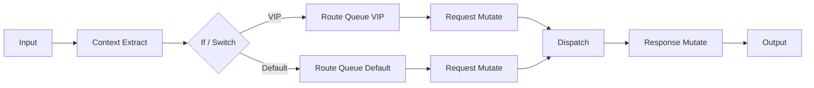

# 流程编排 v3 设计稿（面向 One Switch 场景）

## 1. 目标

- 支持基于 UA、路径、租户、地理区域、时间窗等条件分流到不同模型队列。
- 支持在同一条流程中对请求与响应分别进行结构化修改。
- 保持“可视化可调试”，执行轨迹可回放。
- 首期不接真实上游接口，先以本地模拟执行引擎验证语义。

## 2. 设计原则

- 协议边界清晰：请求修改发生在上游发送前，响应修改发生在返回客户端前。
- 节点职责单一：每个节点做一件事，避免“全能节点”。
- 失败语义确定：节点失败不静默，必须可配置阻断或回退。
- 可迁移到现有 Proxy：节点语义能映射到现有 routing/modification/protocols 管线。

## 3. 节点体系（v3-MVP）

### 3.1 必备 8 节点

1. Input（固定）
- 读取请求上下文：headers、path、query、body、client protocol。

2. Context Extract
- 从请求上下文提取变量，供后续条件判断。
- 例：uaFamily、isMobile、tenantId、region、hour。

3. If / Switch
- 多条件分支，支持 true/false 或多 case。

4. Route Queue
- 设置目标逻辑队列，如 queue-vip-cn、queue-default。

5. Request Mutate
- 修改上游请求（header、body、query、path 受限字段）。

6. Dispatch
- 触发“发送到目标队列/模型”的动作（原型阶段仅模拟）。

7. Response Mutate
- 修改客户端响应（status/header/body 受限字段）。

8. Output（固定）
- 结束流程并产出最终响应。

### 3.2 推荐增强 4 节点

1. Set Variable
- 设置中间变量，减少重复提取和重复条件。

2. Fallback Queue
- 主队列失败后切换备用队列。

3. Try/Catch
- 为子流程增加异常分支。

4. End Error
- 显式失败出口，便于观测统计。

## 4. 执行模型

## 4.1 双阶段执行

- 阶段 A（Request Phase）：Input -> Extract -> Branch -> Route -> Request Mutate -> Dispatch
- 阶段 B（Response Phase）：Response Mutate -> Output

## 4.2 上下文对象

执行期上下文建议统一为：

- request
- response
- vars
- route
- runtime
- trace

说明：
- request：原始请求与变更后的上游请求对象。
- response：上游响应与返回客户端前响应对象。
- vars：提取变量与中间变量。
- route：当前目标队列、候选与回退状态。
- runtime：时间、环境、随机种子、执行限制。
- trace：节点执行轨迹。

## 4.3 跳转规则

- 普通节点：next
- 条件节点：nextTrue / nextFalse 或 cases
- 异常分支：onError
- 最长步数限制：64（防止循环）。

## 5. 条件表达能力

首期建议支持结构化条件，避免脚本执行：

- eq / ne
- contains / notContains
- in / notIn
- regex
- gt / gte / lt / lte
- exists / notExists
- and / or（组合）

字段来源：
- headers.ua、headers.x-tenant
- request.path、request.query.*
- vars.*
- route.*

## 6. 请求与响应修改动作

## 6.1 Request Mutate（上游请求）

动作集：
- headerSet / headerAppend / headerRemove
- jsonSet / jsonDelete / jsonReplace
- querySet / queryRemove

保护规则：
- 禁止改 Authorization、Host、Content-Length、Connection 等托管头。

## 6.2 Response Mutate（客户端响应）

动作集：
- statusSet
- headerSet / headerRemove
- jsonSet / jsonDelete / jsonReplace
- redact（脱敏）

流式限制：
- MVP 仅支持非流式 JSON 响应修改。

## 7. 路由与回退语义

- Route Queue 只负责设定目标队列，不直接发送。
- Dispatch 负责一次发送动作。
- Fallback Queue（增强节点）在 Dispatch 失败时切备用目标。
- 队列策略显式配置：first-match 或 last-write。

## 8. 可视化交互规范（基于 React Flow）

- 固定 Input/Output 节点不可删除、不可禁用。
- 其他节点可通过顶部菜单与画布右键添加。
- 节点内联编辑配置（不依赖右侧面板）。
- 连线即配置：拖线直接更新 next/nextTrue/nextFalse。
- 节点支持状态色：normal、selected、running、error、disabled。
- 调试区保留：输入 payload、运行按钮、trace、输出 payload。

## 9. 与现有架构映射

- Route Queue -> proxy/routing 决策输入
- Request Mutate -> modification 规则执行层
- Dispatch -> proxy/upstream + protocols 发送层
- Response Mutate -> response 阶段修改器
- trace -> observability/request-log

这能保证流程引擎未来接入时，不会重写既有协议适配器。

## 10. 样例流程（覆盖你的两个目标）

1. Input
2. Context Extract：提取 uaFamily、tenantId
3. If：uaFamily in [mobile, ios, android]
4. True -> Route Queue: queue-mobile-priority
5. False -> Route Queue: queue-desktop-default
6. Request Mutate：
- headerSet X-Flow-Version=v3
- jsonSet metadata.clientClass=vars.uaFamily
7. Dispatch
8. Response Mutate：
- jsonSet metadata.routedQueue=route.targetQueue
- redact response.debug.providerApiKey
9. Output

## 11. v3 原型分期

### Phase 1（先做）

- 节点扩到 8 节点（含固定 Input/Output）。
- 条件表达、队列路由、请求/响应修改动作。
- 本地执行引擎和 trace。

### Phase 2

- Fallback Queue、Try/Catch、Set Variable。
- 节点级错误策略（abort / continue / goto）。

### Phase 3

- 接入真实 proxy runtime。
- 执行结果写入 request log 并支持回放。

## 12. MVP 验收标准

- 可以按 UA 和租户将请求分到不同队列。
- 可以同时修改 request 与 response。
- 流程图可视化展示分支与连线。
- 运行后可见完整 trace（每个节点的输入摘要、输出摘要、耗时、结果）。
- 配置保存/加载一致，重复执行结果稳定（同输入同输出）。
