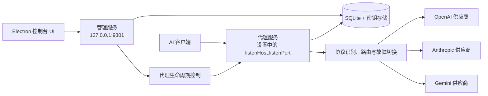

# 系统架构与核心概念

## 整体架构

管理服务与代理服务是两个独立的 HTTP 监听器。两者共享应用级配置和密钥存储，但代理可以单独启动、停止或重启，管理服务在此过程中持续可用。

## 核心概念

### Provider
一个模型服务渠道，包含名称、认证方式、密钥、默认超时、启用状态、冷却状态。

> Provider 不持有统一 Base URL，因为每个上游模型端点各自配置完整地址。

### Protocol
代理自动识别的 API 协议类型，根据请求 path 匹配判定，无需客户端区分 Base URL。

| 协议 | 特征路径 |
|------|----------|
| OpenAI | `/v1/chat/completions`、`/v1/completions`、`/v1/embeddings` |
| Anthropic | `/v1/messages` |
| Gemini | `/v1beta/models/*` |
| Custom | 用户自定义路径匹配规则 |

> `/v1/models` 不作为上游透传路径，而是代理自身提供的本地服务接口。

协议仅用于路由过滤，代理不解析任何协议的报文结构。

### Logical Model
对外暴露的统一模型名，例如 `auto`、`gpt-4o`、`claude-sonnet`。客户端通过请求体中的 model 字段（各协议自行携带）指定。

### Upstream Model
Provider 上的一个实际模型，可挂载多个协议端点，是路由的最小单元。所有启用的上游模型都会进入每个逻辑模型的候选队列，队列在请求路由时动态生成。

每个上游模型包含：
- 协议端点列表（每个端点含完整上游 URL）
- 所属 Provider
- 上游模型 ID
- 优先级
- 启用状态

### Route
一次请求的路由决策结果，包含协议、候选上游模型列表、尝试顺序、失败原因。

### Attempt
一次上游调用尝试，包含上游模型、耗时、HTTP 状态、错误类型、是否流式。

### Health State
Provider 级别的健康状态，包含连续失败次数、冷却截止时间、最近成功时间。

## 同协议最小转换原则

1. 不做 OpenAI、Anthropic、Gemini 之间的报文格式转换；响应体始终逐块透传。
2. 代理只做同协议路由所需的最小请求转换：
   - 根据请求 path 识别协议
   - OpenAI / Anthropic 将请求体中的 `model` 替换为上游模型 ID
   - Gemini 保留原生 body，在 URL 中替换模型 ID，并保留 `generateContent` / `streamGenerateContent` 动作及 `alt=sse` 等查询参数
   - 注入 Provider 认证头，并安全透传端到端 header
3. 每个上游模型端点配置的是该协议下的**完整上游地址**。OpenAI / Anthropic 直接使用该地址；Gemini 以该地址为基准替换模型和请求动作。
4. 路由过滤：请求通过某协议进入时，只考虑拥有该协议端点的上游模型。
5. 每个逻辑模型的候选队列可以同时包含 OpenAI 格式和 Anthropic 格式的上游模型，但它们各自只在对应协议的请求中被选用，之间永远不会互相转换。
