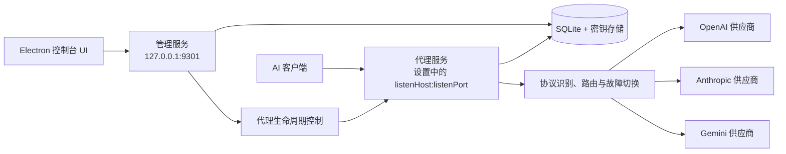

# 系统架构与核心概念

## 整体架构

管理服务与代理服务是两个独立的 HTTP 监听器。两者共享应用级配置和密钥存储，但代理可以单独启动、停止或重启，管理服务在此过程中持续可用。

## 核心概念

### Provider
一个模型服务渠道，负责稳定身份、生命周期和 Provider 级设置。

- `provider_endpoints`：Provider 的原生协议端点和默认 URL；
- `provider_settings`：Provider 级密钥引用、超时等设置；
- `provider_health`：Provider 聚合运行时健康状态。

ProviderModel 通过 `provider_model_endpoints` 绑定 ProviderEndpoint，并可为绑定配置模型专属 `url`。

### Protocol
代理自动识别的 API 协议类型，根据请求 path 匹配判定，无需客户端区分 Base URL。

| 协议 | 特征路径 |
|------|----------|
| OpenAI | `/v1/chat/completions`、`/v1/completions`、`/v1/embeddings` |
| Anthropic | `/v1/messages` |
| Gemini | `/v1beta/models/*` |
| Custom | 用户自定义路径匹配规则 |

> `/v1/models` 不作为上游透传路径，而是代理自身提供的本地服务接口。

协议仅用于路由过滤，代理不解析任何协议的报文结构。

### Logical Model
对外暴露的统一模型名，例如 `auto`、`gpt-4o`、`claude-sonnet`。客户端通过请求体中的 model 字段（各协议自行携带）指定。

### ProviderModel
Provider 上的一个实际模型，是路由的最小单元。ProviderModel 不直接拥有端点数组，而是通过 `provider_model_endpoints` 绑定一个或多个 ProviderEndpoint。

ProviderModel 包含：
- 所属 Provider；
- Provider API 模型名 `modelName`；
- 一个或多个端点绑定及可选模型专属 `url`；
- 逻辑模型与 ProviderModel 绑定中的候选队列优先级；
- 启用状态。

v0.3 MVP 只有一个逻辑模型 `auto`。ProviderModel 是可复用的供应商模型实体，是否参与某个逻辑模型的调度以及具体顺序由 `scheduling_policies` 绑定行决定。每个逻辑模型都可以绑定相同的 ProviderModel，但配置不同的优先级、权重和启用状态；多逻辑模型和独立绑定池属于后续版本。

### Route
一次请求的路由决策结果，包含协议、候选 Provider 模型列表、尝试顺序、失败原因。

### Attempt
一次上游调用尝试，包含 Provider 模型、耗时、HTTP 状态、错误类型、是否流式。

### Health State
Provider 级别的健康状态，包含连续失败次数、冷却截止时间、最近成功时间。

## 同协议最小转换原则

1. 不做 OpenAI、Anthropic、Gemini 之间的报文格式转换；响应体始终逐块透传。
2. 代理只做同协议路由所需的最小请求转换：
   - 根据请求 path 识别协议
   - OpenAI / Anthropic 将请求体中的 `model` 替换为 ProviderModel 的 `modelName`
   - Gemini 保留原生 body，在 URL 中替换模型 ID，并保留 `generateContent` / `streamGenerateContent` 动作及 `alt=sse` 等查询参数
   - 注入 Provider 认证头，并安全透传端到端 header
3. 每个 `provider_endpoints` 配置的是 Provider 按原生协议提供的默认 URL；`provider_model_endpoints.url` 非空时作为该 ProviderModel 绑定的 URL，否则回退到 ProviderEndpoint 的 `url`。OpenAI / Anthropic 直接使用该地址；Gemini 以该地址为基准替换模型和请求动作。
4. 路由过滤：请求通过某客户端协议进入时，只考虑当前逻辑模型已绑定且存在对应原生端点或已启用协议转换绑定的 ProviderModel。
5. 每个请求从当前 LogicalModel 的 `scheduling_policies` 绑定集合动态生成候选队列；OpenAI、Anthropic 等不同协议的 ProviderModel 可以同时存在，但只有当前逻辑模型中原生匹配或明确启用转换的绑定才会进入当前请求的候选。
