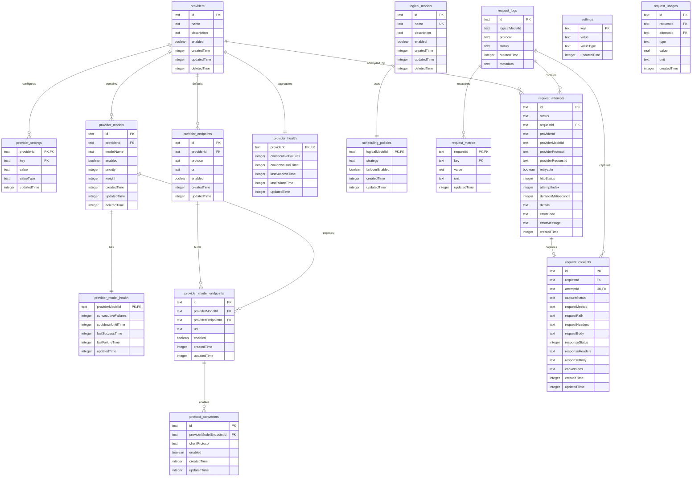

# One Switch v0.3 数据模型设计

> 本文是新大版本的目标数据库结构。
>
> **发布策略：不兼容旧版本数据库。** 新版本使用全新的数据库初始化结构，不读取、不迁移、不修补旧版本数据库。

## 1. 设计目标

One Switch 的配置内容会持续增加，尤其是供应商、模型端点、认证方式、路由策略和模型能力。因此本版本遵循以下原则：

1. **稳定身份、关系、枚举、开关、数值和查询字段使用独立列。**
2. **只有真正开放、低频、非路由的扩展数据才使用 JSON；JSON 不是标准字段的默认容器。**
3. **多值且具有独立生命周期的内容使用子表，不使用数组 JSON。**
4. **运行时状态与用户配置分离。**
5. **请求日志中的统计指标和常用快照使用独立列；协议私有且不稳定的原始详情才使用 JSON。**
6. **请求/响应正文与日志索引分离，正文按需记录并完整保留。**
7. **历史日志不依赖可变配置，不为日志快照增加外键。**
8. **配置文档使用 `schemaVersion`，配置结构变化通过文档升级解决。**
9. **数据库初始化结构由当前代码直接定义，不保留运行时兼容迁移逻辑。**
10. **所有时间戳字段均为 Unix 毫秒（`Date.now()`），不使用秒。**
11. **表名统一为 `settings`，不再引入 `app_config` 作为数据库表名。**

## 2. 数据库总览

新版本包含以下 16 张核心表（`audit_events` 延后到后续版本，不进入 v0.3 基线）：

| 表 | 用途 | 数据性质 |
| --- | --- | --- |
| `settings` | 全局应用配置 | 命名空间 KV 配置 |
| `providers` | 供应商稳定身份与生命周期 | 配置实体 |
| `provider_health` | Provider 聚合运行时健康状态 | 高频运行状态 |
| `provider_model_health` | ProviderModel 运行时健康状态 | 高频运行状态 |
| `provider_models` | Provider 上的真实模型与路由配置 | 配置实体 |
| `provider_settings` | Provider 级命名空间 KV 设置 | 配置实体 |
| `provider_endpoints` | Provider 按协议的默认端点 | 配置实体 |
| `provider_model_endpoints` | ProviderModel 到 Provider 端点的绑定 | 配置实体 |
| `protocol_converters` | ProviderModel 端点允许的客户端协议转换器 | 配置实体 |
| `logical_models` | 对外暴露的逻辑模型 | 配置实体 |
| `scheduling_policies` | 逻辑模型的调度策略 | 配置实体 |
| `request_logs` | 每次代理请求的汇总日志 | 历史观测数据 |
| `request_metrics` | 请求扩展指标 KV | 历史观测数据 |
| `request_usages` | 请求用量数值明细 | 历史观测数据 |
| `request_attempts` | 请求内每次远端尝试 | 历史观测数据 |
| `request_contents` | 请求/响应正文及每次尝试内容 | 可选历史观测数据 |

关系概览：



## 3. 表结构

以下 SQL 描述目标结构。实际实现使用 Drizzle schema 和运行时初始化 SQL，字段命名保持现有项目的 camelCase 约定。

### 3.1 `settings`

全局配置使用逐项存储：每个配置项一行，标准设置使用明确的 `valueType` 和 Schema；只有数组、对象等确实需要文档表达的设置才保存 JSON。这样既保留配置 key，又避免把端口、开关、超时等标准字段塞进 config。

```sql
CREATE TABLE settings (
  key TEXT PRIMARY KEY,
  value TEXT NOT NULL,
  valueType TEXT NOT NULL,
  updatedTime INTEGER NOT NULL
);

CREATE INDEX idx_settings_updated_time
  ON settings(updatedTime);
```

推荐的 key：

```text
proxy.listenHost
proxy.listenPort
proxy.idleTimeoutSeconds
routing.cooldownBaseSeconds
routing.cooldownMaxSeconds
routing.consecutiveFailureThreshold
logging.retentionCount
logging.retentionDays
logging.captureRequestContent
security.accessTokenReference
desktop.autoLaunch
ui.theme
ui.visibleColumns
```

示例记录：

| key | value | valueType |
| --- | --- | --- |
| `proxy.listenPort` | `9300` | `number` |
| `proxy.listenHost` | `"127.0.0.1"` | `string` |
| `desktop.autoLaunch` | `false` | `boolean` |
| `ui.visibleColumns` | `[...]` | `array` |

标量值按 `valueType` 编码保存：`string` 使用文本，`number` 使用十进制文本，`boolean` 使用 `0`/`1`；仅 `array` 和 `object` 使用 JSON。`valueType` 用于诊断和导出展示，真正的类型校验由对应的 Zod Schema 负责。

新增配置项只需要增加命名空间 key、默认值和 Schema，不需要修改数据库表。批量更新必须在一个事务中完成；读取时合并数据库已有值和默认值，并拒绝未知 key 或记录警告。

### 3.2 `providers`

Provider 只保存稳定身份和生命周期。连接超时、密钥引用等运行所需设置统一放入 `provider_settings`；认证方式由协议适配器根据端点协议决定，不作为 Provider 配置持久化。

```sql
CREATE TABLE providers (
  id TEXT PRIMARY KEY,
  name TEXT NOT NULL,
  description TEXT NOT NULL DEFAULT '',
  enabled INTEGER NOT NULL DEFAULT 1 CHECK (enabled IN (0, 1)),
  createdTime INTEGER NOT NULL,
  updatedTime INTEGER NOT NULL,
  deletedTime INTEGER
);

CREATE INDEX idx_providers_enabled ON providers(enabled);
CREATE INDEX idx_providers_deleted_time ON providers(deletedTime);
```

### 3.3 `provider_settings`

Provider 级设置采用与全局 `settings` 相同的命名空间 KV 结构，通过 `providerId` 区分不同 Provider。超时、密钥引用等设置不再固化为表列；标准 key 仍由 Schema、默认值和 `valueType` 约束。超时配置使用秒，运行时再转换为毫秒。

```sql
CREATE TABLE provider_settings (
  providerId TEXT NOT NULL REFERENCES providers(id),
  key TEXT NOT NULL,
  value TEXT NOT NULL,
  valueType TEXT NOT NULL,
  updatedTime INTEGER NOT NULL,
  PRIMARY KEY (providerId, key)
);

CREATE INDEX idx_provider_settings_key
  ON provider_settings(key);
```

推荐的 key：

```text
connection.timeoutSeconds
security.secretReference
```

### 3.4 `provider_endpoints`

Provider 按协议持有默认端点。ProviderModel 通常只引用默认端点；`provider_model_endpoints.url` 为空时使用默认端点的 `url`。

```sql
CREATE TABLE provider_endpoints (
  id TEXT PRIMARY KEY,
  providerId TEXT NOT NULL REFERENCES providers(id),
  protocol TEXT NOT NULL,
  url TEXT NOT NULL,
  enabled INTEGER NOT NULL DEFAULT 1 CHECK (enabled IN (0, 1)),
  createdTime INTEGER NOT NULL,
  updatedTime INTEGER NOT NULL,
  UNIQUE(providerId, protocol)
);

CREATE INDEX idx_provider_endpoints_protocol
  ON provider_endpoints(protocol, enabled);
```

密钥本身仍然不能进入数据库，只保存系统密钥环中的引用。

### 3.5 `logical_models`

逻辑模型只保存对外身份、展示字段和生命周期。调度行为统一由 `scheduling_policies` 管理。

```sql
CREATE TABLE logical_models (
  id TEXT PRIMARY KEY,
  name TEXT NOT NULL UNIQUE,
  description TEXT NOT NULL DEFAULT '',
  enabled INTEGER NOT NULL DEFAULT 1 CHECK (enabled IN (0, 1)),
  createdTime INTEGER NOT NULL,
  updatedTime INTEGER NOT NULL,
  deletedTime INTEGER
);

CREATE INDEX idx_logical_models_enabled ON logical_models(enabled);
CREATE INDEX idx_logical_models_deleted_time ON logical_models(deletedTime);
```

### 3.6 `scheduling_policies`

调度策略是逻辑模型的独立配置实体，避免将路由行为混入模型身份表。

```sql
CREATE TABLE scheduling_policies (
  logicalModelId TEXT PRIMARY KEY REFERENCES logical_models(id),
  strategy TEXT NOT NULL DEFAULT 'priority',
  failoverEnabled INTEGER NOT NULL DEFAULT 1 CHECK (failoverEnabled IN (0, 1)),
  createdTime INTEGER NOT NULL,
  updatedTime INTEGER NOT NULL
);
```

`strategy` 当前支持 `priority`；后续可扩展为 `weighted`、`latency` 等明确枚举。

`request_logs.logicalModelId` 保留请求发生时的逻辑模型标识，但不建立外键。逻辑模型删除后，历史日志仍然必须可读取。逻辑模型与 Provider 模型之间没有持久化关联；路由时从全局 Provider 模型池动态生成候选队列。

### 3.7 `provider_models`、`provider_model_endpoints` 与 `protocol_converters`

`provider_models` 是 Provider 上可被路由的真实模型配置。路由、启用和协议端点都是稳定且经常查询的字段，必须拆成列和子表，不再放进 JSON。ProviderModel 的 `modelName` 表示供应商 API 中的实际模型名；表自身的实体身份使用 `id`，其他表通过 `providerModelId` 引用。

```sql
CREATE TABLE provider_models (
  id TEXT PRIMARY KEY,
  providerId TEXT NOT NULL REFERENCES providers(id),
  modelName TEXT NOT NULL,
  enabled INTEGER NOT NULL DEFAULT 1 CHECK (enabled IN (0, 1)),
  priority INTEGER NOT NULL DEFAULT 0,
  weight INTEGER NOT NULL DEFAULT 100 CHECK (weight > 0),
  createdTime INTEGER NOT NULL,
  updatedTime INTEGER NOT NULL,
  deletedTime INTEGER
);

CREATE TABLE provider_model_endpoints (
  id TEXT PRIMARY KEY,
  providerModelId TEXT NOT NULL REFERENCES provider_models(id),
  providerEndpointId TEXT NOT NULL REFERENCES provider_endpoints(id),
  url TEXT,
  enabled INTEGER NOT NULL DEFAULT 1 CHECK (enabled IN (0, 1)),
  createdTime INTEGER NOT NULL,
  updatedTime INTEGER NOT NULL,
  UNIQUE(providerModelId, providerEndpointId)
);

CREATE TABLE protocol_converters (
  id TEXT PRIMARY KEY,
  providerModelEndpointId TEXT NOT NULL REFERENCES provider_model_endpoints(id),
  clientProtocol TEXT NOT NULL,
  enabled INTEGER NOT NULL DEFAULT 0 CHECK (enabled IN (0, 1)),
  createdTime INTEGER NOT NULL,
  updatedTime INTEGER NOT NULL,
  UNIQUE(providerModelEndpointId, clientProtocol)
);

CREATE UNIQUE INDEX idx_provider_models_provider_model_active
  ON provider_models(providerId, modelName) WHERE deletedTime IS NULL;
CREATE INDEX idx_provider_models_route
  ON provider_models(providerId, enabled, priority, weight);
CREATE INDEX idx_provider_model_endpoints_provider_endpoint
  ON provider_model_endpoints(providerEndpointId, enabled);
CREATE INDEX idx_protocol_converters_protocol
  ON protocol_converters(clientProtocol, enabled);
```

端点解析规则：优先使用 `provider_model_endpoints.url`，为空时使用其 `providerEndpointId` 对应的 `provider_endpoints.url`；协议始终来自 Provider 端点，不在端点绑定表重复保存。

只有低频、非路由且尚未形成稳定产品语义的扩展信息才允许进入后续专门的扩展表；核心模型能力不在 v0.3 虚构为 JSON 字段。候选条件为：ProviderModel 和 Provider 均启用、未软删除，且存在启用的 ProviderModel 端点。

### 3.8 `provider_health` 与 `provider_model_health`

Provider 聚合健康状态和 ProviderModel 独立健康状态都是运行时状态，必须与静态配置分离。ProviderModel 健康状态用于精确跳过单个故障模型；Provider 健康状态用于表示整个 Provider 的聚合可用性。

```sql
CREATE TABLE provider_health (
  providerId TEXT PRIMARY KEY,
  consecutiveFailures INTEGER NOT NULL DEFAULT 0,
  cooldownUntilTime INTEGER,
  lastSuccessTime INTEGER,
  lastFailureTime INTEGER,
  updatedTime INTEGER NOT NULL,

  FOREIGN KEY (providerId) REFERENCES providers(id)
);

CREATE TABLE provider_model_health (
  providerModelId TEXT PRIMARY KEY,
  consecutiveFailures INTEGER NOT NULL DEFAULT 0,
  cooldownUntilTime INTEGER,
  lastSuccessTime INTEGER,
  lastFailureTime INTEGER,
  updatedTime INTEGER NOT NULL,

  FOREIGN KEY (providerModelId) REFERENCES provider_models(id)
);
```

该表不保存用户配置，也不进入任何配置文档。健康状态更新需要支持原子更新和高频写入。

路由规则：候选 ProviderModel 必须同时满足 Provider 和 ProviderModel 未禁用、未软删除，且各自的 `cooldownUntilTime` 为空或已到期。Provider 级认证或网络故障更新 `provider_health`，单模型错误更新 `provider_model_health`；请求成功时更新两层的最近成功时间并按各自聚合范围重置失败计数。

生命周期约定：**创建 Provider 时在同一事务中插入 `provider_health` 初始行，创建 ProviderModel 时在同一事务中插入 `provider_model_health` 初始行**。删除 Provider 或 ProviderModel 时按第 8 节规则处理。路由层可以假定：存在配置实体即存在对应的 health 行，无需处理缺失分支。

### 3.9 `request_logs`

请求日志只保存请求身份、协议、状态和必要快照。可聚合的耗时、Token、缓存命中等数值指标不放入 `request_logs`，分别存入 `request_metrics` 和 `request_usages`，避免持续修改日志主表。

```sql
CREATE TABLE request_logs (
  id TEXT PRIMARY KEY,
  status TEXT NOT NULL CHECK (status IN ('pending', 'success', 'failed', 'cancelled')),
  protocol TEXT NOT NULL,
  logicalModelId TEXT NOT NULL,
  metadata TEXT,
  createdTime INTEGER NOT NULL
);

CREATE INDEX idx_request_logs_created_time
  ON request_logs(createdTime);

CREATE INDEX idx_request_logs_status
  ON request_logs(status);

CREATE INDEX idx_request_logs_logical_model
  ON request_logs(logicalModelId);
```

### 3.10 `request_metrics`

请求扩展指标采用 KV 结构，一条请求可以拥有多个可扩展指标。`request_metrics.value` 使用 REAL 数值列，适合范围过滤、排序和聚合；单位通过 `unit` 表示。Token、缓存等协议用量统一进入 `request_usages`，不再与通用指标混存。

```sql
CREATE TABLE request_metrics (
  requestId TEXT NOT NULL REFERENCES request_logs(id),
  key TEXT NOT NULL,
  value REAL NOT NULL,
  unit TEXT NOT NULL DEFAULT 'count',
  updatedTime INTEGER NOT NULL,
  PRIMARY KEY (requestId, key)
);

CREATE INDEX idx_request_metrics_key
  ON request_metrics(key);
```

`request_metrics.value` 使用 REAL，数据库可以直接执行数值范围过滤、排序和聚合；不再需要 `valueType` 或文本 CAST。非数值原始详情不属于 `request_metrics`，应存入对应的 JSON 详情字段。

推荐的 key：

```text
tokens.total
tokens.input
tokens.output
tokens.cachedInput
tokens.cacheCreationInput
timing.ttftMilliseconds
cache.hit
cache.promptHit
```

所有指标值都按 REAL 数值读取。指标查询通过 `(requestId, key)` 获取单请求指标；需要按用量类型、数值范围或时间聚合的查询通过 `request_usages` 完成。

### 3.11 `request_usages`

`request_usages` 是独立的关系表，而不是另一个数据库。每个数值用量保存为一行，便于按 `type`、时间和请求关联进行范围筛选、分组和汇总。`attemptId` 为空表示请求级/最终汇总用量；不为空表示某次远端尝试产生的用量。

```sql
CREATE TABLE request_usages (
  id TEXT PRIMARY KEY,
  requestId TEXT NOT NULL REFERENCES request_logs(id),
  attemptId TEXT REFERENCES request_attempts(id),
  type TEXT NOT NULL,
  value REAL NOT NULL,
  unit TEXT NOT NULL DEFAULT 'count',
  createdTime INTEGER NOT NULL
);

CREATE INDEX idx_request_usages_type_time
  ON request_usages(type, createdTime);
CREATE INDEX idx_request_usages_request
  ON request_usages(requestId);
CREATE INDEX idx_request_usages_attempt
  ON request_usages(attemptId);
```

`type` 表示标准用量名，例如 `inputTokens`、`outputTokens`、`cachedInputTokens`、`reasoningTokens`；`value` 使用 REAL，通常为非负整数。`unit` 默认是 `count`，可扩展为其他明确单位。`attemptId` 为空表示请求级汇总用量，不为空表示某次远端尝试的用量。统计时必须明确选择请求级或尝试级口径，避免重复计入。

原始协议 `usage` 不直接塞入 `request_usages`：可聚合字段拆成 `request_usages` 数值行，无法稳定建模的供应商私有字段保存在对应 `request_attempts.details` 的 JSON 中；若需要完整保留原始 usage，则放入对应的 `request_contents.conversions` 或扩展的正文 envelope，并通过 `schemaVersion` 版本化。

```json
{
  "streaming": true,
  "finishReason": "stop",
  "reasoningTokens": 48,
  "providerRegion": "us-east",
  "clientModelName": "glm-5.2",
  "logicalModelName": "auto",
  "providerId": "prov_123",
  "providerName": "OpenAI"
}
```

`clientModelName`、`logicalModelName`、`providerId`、`providerName` 均为请求发生时的快照，用于逻辑模型或供应商被删除后日志详情页仍能展示名称，以及追溯“客户端请求的模型名路由到了哪个逻辑模型”；快照属于日志自身数据，不构成对可变配置的依赖。

请求总耗时、TTFT、Token 和缓存命中等可聚合数值放入 `request_metrics` 或 `request_usages`，不放入 `request_logs`。`request_logs` 只保留请求身份、客户端协议、状态、逻辑模型快照和创建时间等稳定字段。

日志表的稳定查询字段为：

- `logicalModelId`；
- `protocol`；
- `status`；
- `createdTime`。

未来增加新的 Token 类型、缓存指标、计费信息或响应指标时，只需增加新的 `request_metrics.key`，不需要修改表结构。

### 3.12 `request_contents`

请求正文和响应正文属于大体积、可能包含敏感信息且变化频繁的数据，不直接塞入 `request_logs` 或 `request_attempts` 的宽表。`request_contents` 统一保存正文：客户端视角的请求/最终响应使用一行 `attemptId = NULL` 的记录；每次远端尝试的请求/响应使用一行带 `attemptId` 的记录，并直接关联 `request_attempts.id`。因此不需要额外的正文尝试表，也不需要把尝试正文塞进 JSON 数组。

内容记录区分客户端视角和上游视角：

- `requestHeader`：客户端请求头（脱敏后）；
- `requestBody`：客户端请求正文；
- `responseHeader`：返回给客户端的响应头（脱敏后）；
- `responseBody`：返回给客户端的响应正文；
- `request_contents.attemptId`：为空表示客户端视角正文，不为空表示对应 Provider 尝试的正文；
- `conversions`：当前正文记录的协议转换前后内容；未发生任何转换时为 `null`。

`captureStatus` 枚举定稿：

| 值 | 含义 |
| --- | --- |
| `captured` | 完整采集 |
| `partial` | 流式采集中断或部分丢失 |
| `disabled` | 未开启采集 |
| `failed` | 采集异常 |

日志详情页根据 `captureStatus` 展示不同状态，而不是猜测内容为空的原因。

建议首发结构如下：

```sql
CREATE TABLE request_contents (
  id TEXT PRIMARY KEY,
  requestId TEXT NOT NULL REFERENCES request_logs(id),
  attemptId TEXT REFERENCES request_attempts(id),
  captureStatus TEXT NOT NULL CHECK (captureStatus IN ('captured', 'partial', 'disabled', 'failed')),
  requestMethod TEXT NOT NULL,
  requestPath TEXT NOT NULL,
  requestHeaders TEXT,
  requestBody TEXT,
  responseStatus INTEGER,
  responseHeaders TEXT,
  responseBody TEXT,
  conversions TEXT,
  createdTime INTEGER NOT NULL,
  updatedTime INTEGER NOT NULL
);

CREATE UNIQUE INDEX idx_request_contents_request_level
  ON request_contents(requestId) WHERE attemptId IS NULL;
CREATE UNIQUE INDEX idx_request_contents_attempt
  ON request_contents(attemptId) WHERE attemptId IS NOT NULL;
```

正文列只保存脱敏后的原始内容或明确的正文 envelope；请求头、响应头和每次尝试使用独立的结构化列/子表。仅协议转换的前后正文仍使用 JSON 文档，因为其形状由协议决定且体积不稳定。

```json
{
  "schemaVersion": 1,
  "method": "POST",
  "path": "/v1/messages",
  "headers": {
    "content-type": "application/json"
  },
  "capturedAt": 1755643200000
}
```

正文 envelope 示例：

```json
{
  "schemaVersion": 1,
  "body": {
    "model": "client-model",
    "messages": []
  },
  "bodyText": null,
  "contentType": "application/json",
  "isStreaming": false,
  "capturedAt": 1755643200000
}
```

`body` 保存可解析的 JSON 正文；非 JSON 或二进制正文使用 `bodyText` 保存原文文本（二进制内容 base64 编码并标注 `contentType`）。

`conversions` 示例（当前正文记录的协议转换前后内容；正文记录通过 `request_contents.attemptId` 关联对应尝试）：

```json
[
  {
    "schemaVersion": 1,
    "attemptId": "att_01J...",
    "fromProtocol": "anthropic-messages",
    "toProtocol": "openai-completions",
    "requestBefore": {},
    "requestAfter": {},
    "responseBefore": {},
    "responseAfter": {},
    "streamEventsBefore": [],
    "streamEventsAfter": []
  }
]
```

同一请求多次尝试且各自发生协议转换时，每项转换独立保存，不会互相覆盖。

安全与容量约束：

- 默认关闭正文采集，只有用户在设置中显式开启后才记录；
- 日志清理支持按保留天数执行，并同时删除请求正文、正文中的尝试内容、尝试记录和请求汇总；
- API Key、Authorization、Cookie、Set-Cookie 等敏感请求头必须脱敏；
- 本地工具默认不限制正文大小；开启记录后完整保存已接收的请求和响应内容；
- 流式响应记录已接收的事件/文本片段，不阻塞代理转发，不因日志写入失败影响请求；
- 清理请求日志时，先删除 `request_contents` 和 `request_metrics`，再删除 `request_attempts` 和 `request_logs`；
- 导出日志必须明确包含正文和指标的开关，默认不导出正文但保留可选指标。

### 3.13 `request_attempts`

每次 Provider 尝试一行，保存故障转移顺序和统计所需字段。

```sql
CREATE TABLE request_attempts (
  id TEXT PRIMARY KEY,
  requestId TEXT NOT NULL,
  providerId TEXT NOT NULL,
  providerModelId TEXT NOT NULL,
  providerProtocol TEXT,
  attemptIndex INTEGER NOT NULL,
  status TEXT NOT NULL,
  httpStatus INTEGER,
  retryable INTEGER NOT NULL DEFAULT 0 CHECK (retryable IN (0, 1)),
  durationMilliseconds INTEGER NOT NULL,
  errorCode TEXT,
  errorMessage TEXT,
  providerRequestId TEXT,
  details TEXT,
  createdTime INTEGER NOT NULL,

  FOREIGN KEY (requestId) REFERENCES request_logs(id),
  UNIQUE (requestId, attemptIndex)
);

CREATE INDEX idx_request_attempts_provider_time
  ON request_attempts(providerId, createdTime);

CREATE INDEX idx_request_attempts_model_time
  ON request_attempts(providerModelId, createdTime);
```

`providerId` 不建立外键：历史尝试不依赖 Provider 的当前存在性（Provider 未来可能物理删除），`providerId` 仅作为快照标识，配合请求日志中的 Provider 名称快照展示。

`httpStatus`、`retryable` 和 `providerProtocol` 是稳定的观测字段，必须使用独立列；协议私有错误正文、原始 usage 和网络诊断信息才放入 `details` JSON。

保留独立列的字段：

- `requestId`；
- `providerId`；
- `providerModelId`；
- `attemptIndex`；
- `status`；
- `providerProtocol`；
- `durationMilliseconds`；
- `httpStatus`；
- `retryable`；
- `errorCode`；
- `createdTime`。

### 3.14 `audit_events`（延后，不在 v0.3 基线）

记录配置实体的变更前后内容。该表不参与代理核心链路，**v0.3 不实现**，待后续版本需要配置变更历史时再引入；届时需同步定义 `resourceType` 枚举和独立保留策略。

```sql
CREATE TABLE audit_events (
  id TEXT PRIMARY KEY,
  resourceType TEXT NOT NULL,
  resourceId TEXT NOT NULL,
  action TEXT NOT NULL,
  beforeData TEXT,
  afterData TEXT,
  createdTime INTEGER NOT NULL
);

CREATE INDEX idx_audit_events_resource
  ON audit_events(resourceType, resourceId, createdTime);

CREATE INDEX idx_audit_events_created_time
  ON audit_events(createdTime);
```

## 4. JSON 文档版本

仅以下 JSON 文档需要 `schemaVersion`：设置中的数组/对象值、协议私有详情、正文 envelope 和协议转换记录。Provider、LogicalModel、ProviderModel 及端点不再拥有 config JSON，因此不适用 config 文档版本。

```json
{
  "schemaVersion": 1
}
```

读取流程：

```text
数据库文本
  -> JSON.parse
  -> 根据 schemaVersion 升级文档
  -> 当前版本 Zod Schema 校验
  -> 返回领域对象
```

例如 Provider 配置可以演进为：

```text
ProviderConfigV1 -> ProviderConfigV2 -> ProviderConfigV3
```

字段重命名、配置嵌套调整和默认值增加通过文档升级完成，不通过数据库 ALTER TABLE 完成。

## 5. 字段存储决策

### 保留为关系型列

```text
id
providerId
requestId
providerModelId
logicalModelId
status
protocol
attemptIndex
createdTime
updatedTime
deletedTime
durationMilliseconds
```

原因：这些字段用于外键、JOIN、分页、排序、时间过滤、统计和生命周期管理。

### 存入 JSON（严格限制）

```text
settings.value（仅保留真正动态的扩展设置；标准设置必须有独立列）
协议私有且不稳定的原始 usage 字段（存入对应 `request_attempts.details` JSON；若开启正文采集，则同时保存在对应 `request_contents.responseBody` 的原始响应 envelope 中）
协议私有响应详情和未建模的错误响应
请求/响应正文 envelope（大体积、可选采集）
协议转换前后正文（可选采集）
```

以下内容明确禁止放入 JSON：

```text
Provider name / enabled / timeout / auth type
LogicalModel name / description / enabled / routing strategy
ProviderModel modelName / enabled / priority / weight
Provider protocol / URL / ProviderModel endpoint binding / conversion client protocol / enabled
日志 status / protocol / model IDs / provider ID
数值耗时、Token 用量和缓存用量 -> `request_metrics` 或 `request_usages`
健康计数、冷却时间和时间戳
```

这些字段要么是产品契约，要么参与路由、关联、排序、筛选或统计，必须由独立列或关系表承载。

## 6. 数据库初始化策略

由于本版本不考虑兼容旧版本，数据库初始化流程保持简单：

1. 创建独立的数据目录；
2. 打开 `one-switch.db`；
3. 启用 SQLite 外键；
4. 切换 WAL 模式；
5. 创建当前版本全部表和索引；
6. 按默认值批量插入 `settings` 配置项（使用 `INSERT OR IGNORE`，仅插入不存在的 key，永不覆盖已有值，保证幂等）；
7. 插入默认逻辑模型；
8. 初始化 Provider 健康状态。

`source/server/database/index.ts` 不再包含以下逻辑：

- 旧表检测；
- 旧字段迁移；
- `ensureColumn`；
- `dropColumn`；
- 旧 Provider 宽表转换；
- 旧 Settings 表转换；
- 运行时兼容修补。

旧版数据库由用户自行备份或删除。新版本遇到旧数据库文件时，应明确报错并要求重新初始化，而不是尝试隐式迁移。

## 7. Store 层边界

Store 层应分为两部分：

### 关系仓储

负责：

- 表记录的创建、查询、更新、删除；
- 外键关系；
- 时间和生命周期；
- 请求日志分页、指标读取和统计；
- `request_metrics` 的 KV 编解码与聚合查询。

### 文档仓储

负责：

- JSON 序列化和反序列化；
- `schemaVersion` 升级；
- Zod 校验；
- 默认配置合并；
- 文档级更新。

业务层不应直接调用 `JSON.stringify`、`JSON.parse` 或 `json_extract` 读取配置内容。

## 8. 删除与历史数据规则

### 配置实体

以下表使用软删除：

- `providers`；
- `logical_models`；
- `provider_models`。

### 运行状态

删除 Provider 时：

1. 将 Provider 标记为软删除；
2. 禁用或软删除其 Provider 模型；
3. 保留 `provider_health` 和各 ProviderModel 的 `provider_model_health`（便于恢复后观察历史健康状态）；若未来提供物理删除，则在同一事务中清理对应健康状态；
4. 保留历史请求日志和远端尝试记录。

### 请求日志

请求日志按保留策略物理删除：

1. 先删除 `request_contents` 和 `request_metrics`；
2. 再删除 `request_attempts`；
3. 最后删除 `request_logs`。

历史日志不依赖 `logical_models`、`provider_models` 的当前配置内容。逻辑模型队列是运行时根据当前逻辑模型和全局 Provider 模型池计算出来的，不单独持久化队列关系。

## 9. 本版本明确不采用的方案

### 不采用全局多态 `resources` 表

虽然可以减少表数量，但会导致：

- 关系类型不清晰；
- 外键难以表达；
- 查询条件复杂；
- 类型约束更多依赖应用代码；
- 统计 SQL 可读性变差。

### 不采用全量 EAV 属性表

`key/value` 只用于有明确命名空间、Schema 和默认值管理的全局应用配置，不扩展到所有业务实体。Provider、模型和路由核心配置仍使用经过 Schema 校验的 JSON 文档，避免用通用属性表承载复杂嵌套结构。

### 不把健康状态写进配置 JSON

健康状态更新频繁，且和用户配置的生命周期、事务边界、更新频率完全不同。

### 不把所有日志字段都放入 JSON

状态、协议、时间、耗时和关联标识需要被分页、过滤和聚合，必须保持为独立列。

## 10. 实施清单

本版本落地时需要同步修改：

1. `source/server/database/schema.ts`；
2. `source/server/database/index.ts`；
3. `source/server/database/store.ts`；
4. `source/common/schemas.ts`；
5. `source/server/database/development-seed.ts`；
6. `source/server/database/index.test.ts`；
7. `source/server/database/store.test.ts`；
8. 配置导入导出逻辑；
9. Provider、模型、路由和统计相关 SQL；
10. 删除旧版 Drizzle 迁移文件，生成新的首发基线。

## 11. 后续演进建议（评审补充）

以下建议尚未定稿，按优先级排列，供后续迭代评审时决策。已定稿的决策（表名统一为 `settings`、`audit_events` 延后、`captureStatus` 枚举、时间戳毫秒、日志快照冗余、`provider_health` 与 `provider_model_health` 清理时机、转换记录结构、`request_contents` 请求级和尝试级正文结构（通过可空 `attemptId` 关联）、`request_attempts` 去除 Provider 外键、唯一约束与 CHECK 约束、删除 `settings.version`）已落入正文各章。

### 11.1 待产品决策

**`request_contents` 的正文展示降级。**
正文不限制大小，但单个请求的尝试次数可能很多（重试风暴）。建议约定：按实际尝试次数完整保存数组项，但每次尝试的正文若超过某个“展示友好”阈值（如 1MB），可在 envelope 中降级为 `bodyPreview` + `bodyOmitted: true`，这不是存储限制，而是防止单行 JSON 过大导致 UI 无法渲染。

**按供应商筛选日志的实现方式。**
`request_logs.metadata` 已冗余 `providerId` 快照，但 JSON 字段无法直接建索引。若日志页需要高频按供应商筛选，两个选项：

- 接受 `request_attempts` JOIN 开销（当前方案）；
- 未来将 `providerId` 提升为 `request_logs` 独立列（需定义清楚是“最终成功供应商”还是“尝试过的供应商”）。

### 11.2 可延后但建议预留

**`request_contents` 独立分页查询。**
正文表体积远大于日志表。若未来提供“仅浏览有正文的日志”视图，`request_contents` 上的 `requestId IN (...)` 查询即可满足；暂不需要额外反向索引。

**JSON 文档升级函数的注册机制。**
第 4 节描述了 `V1 -> V2 -> V3` 升级链，建议实现时采用显式注册表（`{ 1: upgradeToV2, 2: upgradeToV3 }`）而非 if-else 链，便于测试每个升级步骤。

**数据库文件版本标记。**
虽然不兼容旧版，建议在 `settings` 中写入 `database.schemaBaseline = "v0.3"`，未来再发不兼容版本时可用于检测并提示用户，而不是静默打开结构不匹配的库。

**WAL checkpoint 与应用退出。**
本地桌面应用退出时建议执行 `PRAGMA wal_checkpoint(TRUNCATE)`，避免残留过大的 WAL 文件；这属于实现细节，但值得写入 desktop spec。

## 12. 最终结论

本版本的核心结构是：

```text
身份、关系、枚举、开关、数值和查询字段 -> 关系型列
多值且有独立生命周期的内容             -> 关系子表
全局标准配置                           -> settings 的明确列或明确 key
运行时状态                             -> 独立状态表
稳定日志维度与常用统计                 -> 关系型列
协议私有原始详情与大体积正文             -> JSON / TEXT
配置变更历史                           -> audit_events（延后，不在 v0.3 基线）
```

以后新增字段时，先判断它是否参与路由、查询、排序、关联、统计或产品展示：若是，新增明确列/子表；只有开放性扩展或协议原始数据才进入 JSON。JSON Schema 不能成为逃避数据库建模的理由。
