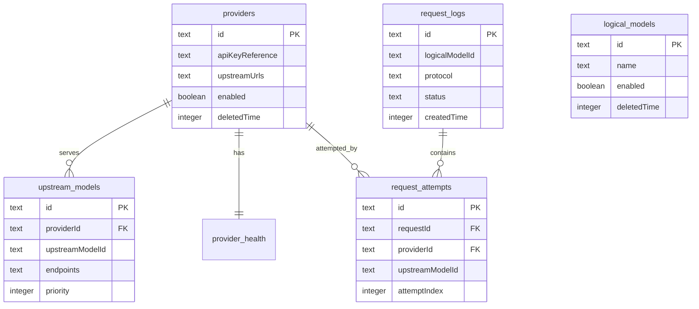

# 数据库设计

## 目标与边界

One Switch 使用 SQLite 保存配置、运行状态和请求观测数据，使用 Drizzle ORM
提供类型安全查询。API Key 和访问 Token 的明文不进入数据库，只保存系统密钥环中的引用。

数据库设计遵循以下规则：

- 配置实体使用软删除，避免历史日志因配置清理而失去上下文。
- 请求日志保存必要快照，不依赖可变的上游模型配置还原历史行为。
- 时间统一使用 Unix 毫秒时间戳，数据库类型为 `INTEGER`。
- SQLite 外键始终启用，写入边界同时使用 Zod 校验。
- `source/server/database/schema.ts` 是当前目标结构的权威定义。
- 正式版尚未发布时，`drizzle/` 只保留一份与目标结构一致的首发基线迁移。
- 首个正式版本发布后，数据库变更才通过只追加、不改写的版本迁移演进。

## 数据目录隔离

数据库文件名固定为 `one-switch.db`，密钥引用文件名为 `secrets.json`。两者必须位于
同一个 Electron `userData` 目录，以便环境整体隔离。

| 环境 | 数据目录 | 用途 |
| --- | --- | --- |
| 正式版 | `~/Library/Application Support/One Switch/`（macOS） | 用户日常使用的数据 |
| 开发版 | `~/Library/Application Support/One Switch Development/`（macOS） | `pnpm dev` 的独立测试数据 |
| 自动化测试 | 操作系统临时目录 | 每个测试独立创建并清理 |

目录名、代理端口、管理端口和管理 API 地址集中定义在
`source/common/runtime-profile.ts`。Electron 主进程、服务端和 renderer 读取同一份 profile，
不得通过散落的环境变量或调用点默认值分别配置。

开发版不会读取、修改或迁移正式版数据库。需要用正式数据调试时，应复制数据库及对应的
密钥引用环境，而不是让两个进程共享同一个 SQLite 文件。

## 关系概览

`request_logs.logicalModelId` 和 `request_attempts.upstreamModelId` 有意保存请求发生时的标识
快照，不建立到可软删除、可改名配置的外键。`request_attempts.providerId` 保留外键，因为
Provider 只做软删除，不会物理移除。

## 配置表

### providers

供应商和供应商级默认连接设置。

| 字段 | 约束 | 说明 |
| --- | --- | --- |
| `id` | PK | `prov_` 前缀 ID |
| `name` | NOT NULL | 显示名称 |
| `apiKeyReference` | NOT NULL | 系统密钥环引用 |
| `timeoutMilliseconds` | NOT NULL, DEFAULT 30000 | 上游空闲超时 |
| `enabled` | NOT NULL, DEFAULT true | 是否参与路由 |
| `upstreamUrls` | NOT NULL, DEFAULT `{}` | 按协议保存默认 URL 的 JSON 对象 |
| `createdTime` | NOT NULL | 创建时间 |
| `updatedTime` | NOT NULL | 最后修改时间 |
| `deletedTime` | NULL | 软删除时间 |

`upstreamUrls` 的结构由 `UpstreamUrlsSchema` 校验。它属于小型、整体更新的配置值，当前保留
为 JSON 可以避免为三个固定协议引入稀疏子表。若未来需要按端点独立查询、排序或携带更多
认证配置，再迁移为 `provider_endpoints` 表。

### logical_models

客户端请求使用的逻辑模型。名称是路由入口，描述和启用状态属于用户配置。

名称当前不设数据库唯一约束，因为软删除后允许重新创建同名模型；业务层必须保证活跃记录
中名称无歧义。若要下沉到数据库，应使用 `WHERE deletedTime IS NULL` 的部分唯一索引。

### upstream_models

路由队列中的最小单元，表示一个 Provider 上的一个实际模型，并可挂载多个协议端点。
上游模型**全局共享**：不隶属于任何逻辑模型，所有启用的上游模型自动进入全局自动切换队列。

| 字段 | 约束 | 说明 |
| --- | --- | --- |
| `providerId` | FK, NOT NULL | 所属供应商 |
| `upstreamModelId` | NOT NULL | 发送给上游的模型 ID |
| `endpoints` | NOT NULL, DEFAULT `[]` | `ProtocolEndpoint[]` JSON |
| `priority` | NOT NULL | 数字越小越优先 |
| `enabled` | NOT NULL, DEFAULT true | 是否参与路由 |
| 时间字段 | | 与其他配置表一致 |

`endpoints` 同样是整体读写的小型配置列表，由 `ProtocolEndpointSchema` 校验。端点是上游模型
的组成部分，而不是独立生命周期实体，因此当前不拆表。

队列顺序通过 `priority` 索引读取。priority 不设唯一约束，因为拖拽排序过程
可能短暂产生重复位置，最终顺序应由业务层一次性归一化。

## 运行状态表

### provider_health

每个 Provider 恰好一行，`providerId` 同时是主键和外键。保存连续失败次数、冷却截止时间、
最近成功/失败时间。它是可重建的运行状态，不属于用户配置。

### settings

单行全局设置，主键固定为 `singleton`。包含服务监听地址、端口、访问 Token 引用、日志保留
数量、冷却参数、空闲超时和开机自启状态。

应用层只通过固定 ID 读写此表。新数据库使用 CHECK 约束保证单例；历史数据库由应用层保持
这一不变量。

## 观测表

### request_logs

每个代理请求一行，保存最终状态、总耗时、Token 用量、首 Token 延迟和缓存命中情况。

主要索引：

- `idx_request_logs_created_time`：日志倒序列表、留存清理和时间窗口统计。
- `idx_request_logs_status`：按最终状态筛选。

### request_attempts

每次上游尝试一行，一个请求可有多次尝试。`upstreamModelId` 保存请求发生时使用的上游模型
名称快照，不指向 `upstream_models.id`。这是历史结构中已经修正过的重要边界。

主要索引：

- `idx_attempts_request_order(requestId, attemptIndex)`：按请求读取完整切换链路。
- `idx_attempts_provider(providerId)`：供应商维度聚合。
- `idx_attempts_created_time(createdTime)`：时间窗口统计和清理。

## 数据库基线与发布边界

首发前不承诺兼容开发数据库。结构变化时直接更新目标 schema、运行时建库 SQL 和测试，然后
重新生成唯一的 `initial_schema` Drizzle 基线；不得保留用于兼容内部迭代的中间迁移。

运行时初始化顺序如下：

1. 创建环境独立的数据目录并打开 SQLite。
2. 启用外键并切换 WAL 模式。
3. 幂等创建首发目标表和索引。
4. 任一建库语句失败时关闭连接并终止服务启动。

首个正式版本发布后，当前基线立即冻结。此后的结构变更必须追加版本迁移、在事务中执行，
并增加从上一正式版本升级且保留数据的回归测试；不得改写已经发布的基线或历史迁移。

## 后续演进原则

- JSON 字段只有在需要独立查询、部分更新或建立引用关系时才拆表。
- 配置表继续软删除；高容量日志按留存策略物理删除。
- 新增外键前先确认历史快照语义，日志字段通常不应引用可变配置。
- 新增唯一约束时必须考虑软删除，并优先使用部分唯一索引。
- 所有数值约束先在 Zod 写入边界执行；数据库 CHECK 用于稳定且可无损迁移的不变量。
