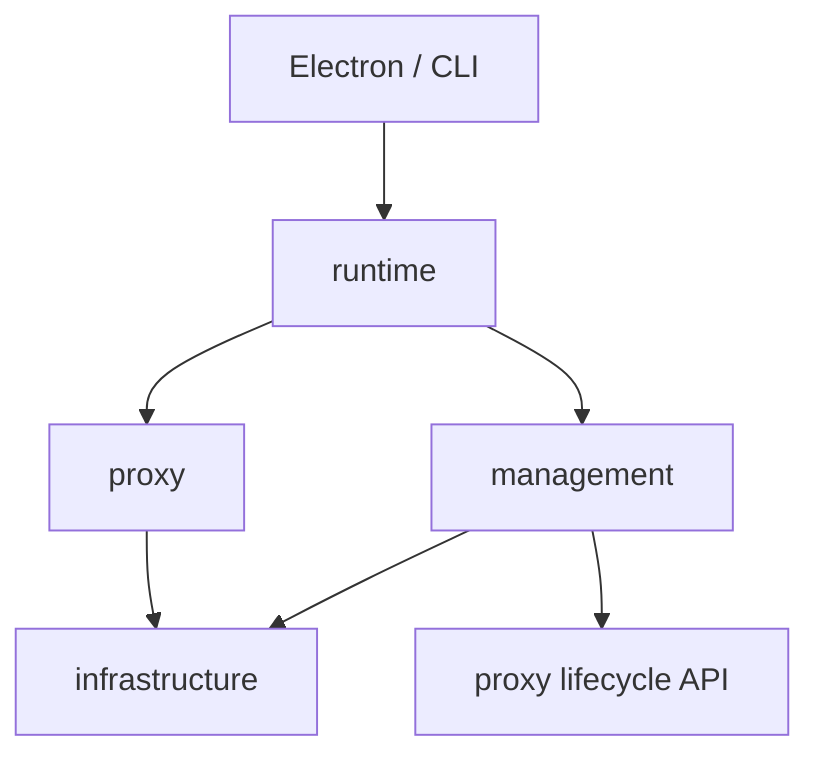
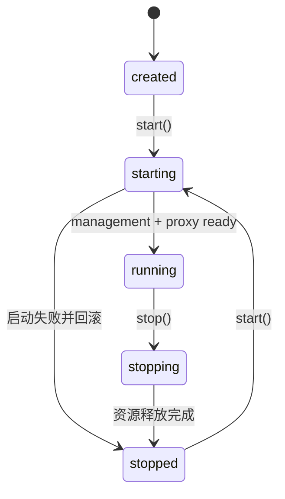

# Server 架构设计

## 设计目标

`source/server` 是一个本地模块化服务，同时服务于 Electron、CLI 和测试。当前阶段优先让代码按能力聚合、职责清楚，不为尚未出现的复杂度预设完整的领域驱动目录。

遵循四条规则：

1. 根目录只保留稳定入口，不放具体业务能力。
2. 代码先按能力归属，再按真实复杂度拆文件。
3. HTTP、SQLite、Keychain 等技术细节不主导业务目录。
4. 模块级可变状态逐步迁移到显式实例，由 Runtime 持有。

## 模块划分

Server 分为四块：

| 模块 | 职责 | 包含内容 |
| --- | --- | --- |
| `runtime` | 进程级组装与生命周期 | ServerRuntime、管理服务与代理服务的启动、停止和失败回滚 |
| `management` | 配置管理能力和管理 API | Provider、LogicalModel、ProviderModel、Endpoint、Settings 的管理入口 |
| `proxy` | 模型请求代理能力 | 协议识别、路由、转发、认证、健康冷却、重试和请求日志 |
| `infrastructure` | 共享技术实现 | SQLite、Keychain，以及未来可复用的系统适配器 |

健康冷却当前只服务于代理切换，因此属于 `proxy`，不单独建立 `reliability`。RequestLog 和 Attempt 由代理请求产生，也先归入 `proxy`。只有当它们形成独立生命周期或被多个能力共同使用时，才提升为一级模块。

## 目标目录

```text
source/server/
├── index.ts                         # 对 Electron / CLI 的稳定公开入口
├── runtime/
│   ├── server-runtime.ts            # 进程生命周期和资源回滚
│   └── server-runtime.test.ts
├── management/
│   ├── server.ts                    # 管理 HTTP 监听器
│   ├── router.ts                    # 管理 API 路由和通用请求处理
│   ├── providers.ts                 # Provider 管理与密钥协调
│   ├── models.ts                    # LogicalModel 管理
│   ├── provider-models.ts           # ProviderModel 管理
│   ├── settings.ts                  # 全局标准设置管理
├── proxy/
│   ├── server.ts                    # 代理监听器和 /v1/models
│   ├── handler.ts                   # 一次代理请求的流程编排
│   ├── router.ts                    # 当前逻辑模型的候选 ProviderModel 选择
│   ├── health.ts                    # 健康状态和冷却策略
│   ├── transport.ts                 # 远端请求和流式传输
│   ├── protocol.ts                  # 协议识别和请求改写规则
│   ├── logging.ts                   # RequestLog 和 Attempt
│   ├── auth.ts
│   └── headers.ts
└── infrastructure/
    ├── database/
    │   ├── index.ts                 # node:sqlite 连接、Drizzle migration 与 seed
    │   ├── schema.ts                # Drizzle 表定义
    │   └── store.ts                 # 数据访问层（Drizzle 查询）
    └── secrets/
        └── secret-store.ts          # Keychain 适配
```

这是演进目标，不要求提前创建空文件。当前职责仍然简单时保留单文件；只有出现第二个变化原因、文件明显过长或测试需要独立替换时再拆分。

## 依赖方向



依赖约束：

- `index.ts` 只暴露稳定 API，不包含资源初始化细节。
- `runtime` 可以组装所有模块，但不包含 Provider CRUD、路由和转发规则。
- `management` 可以调用代理公开的生命周期控制 API，不应 import 代理内部路由和 transport。
- `proxy` 不依赖 management；它只读取运行所需的配置和密钥。
- `infrastructure` 不反向依赖 runtime、management 或 proxy。
- 新增进程级状态时必须说明所有者，不能默认放进模块级变量。

## 关键调用链

### 创建 Provider

```text
POST /api/provider/create
  -> management/router.ts
  -> management/providers.ts
  -> infrastructure/secrets/secret-store.ts
  -> infrastructure/database/store.ts
  -> HTTP response
```

密钥写入与 Provider 保存的补偿逻辑属于 `management/providers.ts`，不应留在通用 HTTP router 中。

### 转发模型请求

```text
Client request
  -> proxy/server.ts
  -> proxy/handler.ts
  -> proxy/protocol.ts
  -> proxy/router.ts
  -> proxy/health.ts
  -> proxy/transport.ts
  -> proxy/logging.ts
  -> Client response
```

`handler.ts` 只编排步骤。协议判断、候选选择、冷却计算、上游 I/O 和日志写入分别由相邻文件拥有。

## 生命周期



- 代理停止或重启不影响管理服务。
- 启动失败必须关闭已经启动的监听器和数据库。
- 停止操作保持幂等。
- 两个监听器均为实例，由 `ServerRuntime` 持有，不使用模块级可变状态。

## 实施说明

重构直接按目标结构落地：

1. [已完成] 建立 `runtime` 目录。
2. [已完成] 健康逻辑和密钥实现归入 `proxy`、`infrastructure`。
3. [已完成] 管理 API 按 Provider、Model、ProviderModel、Settings 拆入 `management`。
4. 将 `proxy/handler.ts` 中的上游 HTTP 逻辑拆为 `transport.ts`（详见 [proxy.md](./proxy.md) 管线架构）。
5. SQLite 代码归入 `infrastructure/database`，按配置和请求日志拆 store。
6. ManagementServer、ProxyServer 实例化并交给 Runtime 持有。
7. 用依赖检查规则禁止跨模块访问内部实现。

每一步完成后运行 `pnpm test:server` 和 `pnpm typecheck`。
